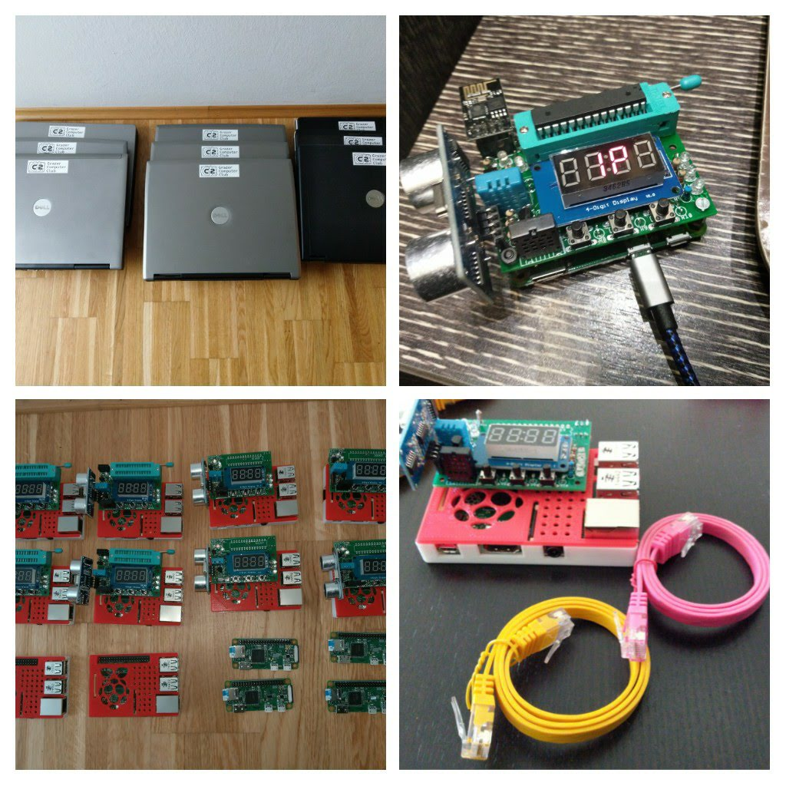

+++
showonlyimage = false
draft = false
image = "img/GC2_2019.png"
date = "2020-01-04"
title = "Rückblick 2019"
writer = "Martin Strohmayer"
categories = ["GC2"]
keywords = ["2019", "Raspjamming", "GLT" , "PW"]
weight = 1
+++

Am Anfang des neuen Jahres möchten wir einen Rückblick auf das vergangene Jahr machen...
<!--more-->

## Events 2019 ##

2019 waren wir erstmals auf zwei Events vertreten. Der erste war bei den Grazer Linuxtagen #glt19. Wie im Jahr davor haben wir den Raspjamming Event, also einen offenen Raspberry Pi Jam, dort veranstaltet. Diesmal hatten wir auch eine eigene deutschsprachige Distribution, die wir über Git-Hub verwalten und auch automatisch erzeugen konnten. Diese basierte damals noch auf Raspbian 9 Stretch. Neu war auch, dass wir eigene Laptops zusätzlich zu Raspberry Pi Zero's zum Ausleihen vorrätig hatten.  
Im Herbst waren wir bei der Privacy Week in Wien. Hier konnten wir zusammen mit den Besuchern Raspberry Pi Projekte umsetzen und spezifische Probleme lösen.
Für das eigens für diese Veranstaltung angepasste Privacy-Projekt "Sanitizer", konnten wir allerdings niemanden begeistern. Die Besucherzahlen blieben unter unseren Erwartungen. Auf der Raspberry Pi Event Seite konnten wir leider auch nicht werben, da hierfür ein kostenloser Eintritt als Bedingung gilt. In diesem Fall musste aber zumindest der Tageseintritt für die Privacy Week bezahlt werden. Wir stellten hingegen alles kostenlos zur Verfügung.  
Schlussendlich konnten wir zu wenige Menschen für unsere Themen begeistern und so werden wir bei diesem Event in Zukunft nicht mehr aktiv teilnehmen. 

 

## Raspjamming Distribution ##

Anfang des Jahres hatten wir bereits unsere Raspjamming Distribution im Einsatz. Mitte des Jahres kam aber Debian 10 Buster heraus. Die fehlerfreie Umsetzung aller unserer Anpassungen und Erweiterungen könnten wir nicht bis zur Privacy Week bewältigen. Am Ende des Jahres 2019 war es aber so weit. Endlich war eine neue Raspjamming Version verfügbar. Nun können wir auf eine stabile Betriebssystembasis für 2020 vertrauen.  
Es sind einige neue Features hinzugekommen. Besonders die Anbindung von Raspberry Pi B Platinen über LAN ist da zu nennen. Wir möchten nämlich auch weiterhin nicht auf ein funktionierendes WLAN beim Event angewiesen sein. Es soll alles offline bzw. direkt in Verbindung mit einem Laptop funktionieren.
Offen für 2020 ist noch ein funktionierendes Buildsystem mit Git-Hub Integration.

 

## Leihhardware ##

Anfang des Jahres besorgten wir uns mehrere alte Dell Laptops. Diese haben wir Mitte des Jahres noch aufgerüstet, repariert und gewartet. Damit stehen uns nun 10 Laptops mit AMD oder Intel Dual Core Prozessoren und mind. 2,5 GB RAM zur Verfügung.  
Durch einen glücklichen Zufall konnten wir 10 alte Raspberry Pi 2 und wenige 3-er Platinen erhalten. Die Raspberry Pi 2 Einplatinencomputer stellten sich als optimale Plattform heraus. Sie können direkt über den USB-Bus versorgt werden und so fällt eine zusätzliches Netzteil weg. Zuvor konnten wir ausschließlich auf langsame Raspberry Pi Zero Platinen arbeiten. 
Im Laufe des Jahres wurden weitere GC2-xHAT Platinen bestückt. Nun haben wir 4 vollbestückte und 4 teilbestückte (ohne ESP- und ATMEGA sockel) zum Ausleihen. Für 2020 sollten wir aber zumindest noch 2 weitere Platinen fertigstellen, um so 10 komplette Stationen anbieten zu können.  
Da wir für die GC2-xHAT Aufsatzplatinen ein speziell flaches Gehäuse benötigen, setzen wir nun ein zweiteiliges 3D-Druck Modell mit einer rot-weiss Farbkombination ein.

 

## Ausblick 2020 ##

Wir haben nun eine solide Basis, passende Leihhardware und eine optimales Betriebssystem für zukünftige Veranstaltungen. Unsere Elektronikprojekte und die dazugehörigen Anleitungen können weiter verwendet werden.  
Das Privacy-Projekt "Sanitizer" wird nicht weiter verfolgt und vermutlich wird es aus der Anleitung ausgegliedert.  
Das Gamingplattform-Projekt Pi-XO sollte eigentlich aufgegeben werden. Dennoch wird es noch ein Update für die Raspjamming Distribution geben, die dann das Projekt wiederhin unterstützt. Wie es hier weiter geht, ist noch nicht abschließend geklärt. Immerhin gibt es noch einige unbestückte Basisplatinen. Also mobile Gaming-Plattform wird es aber nicht weiterentwickelt werden.  

Sicher ist, dass wir uns für die Grazer Linuxtage 2020 bewerben, um wieder einen kostenlosen Raspjamming Event abhalten zu können. Allerdings überlegen wir ob wir hierfür einen neuen Namen verwenden. Es gibt nämlich die berechtigte Kritik, dass der Name für Anfänger einfach nicht verständlich ist. Namensvorschläge nehmen wir gerne entgegen.  

Ob es noch andere Events gibt, bei denen der GC2 anzutreffen ist, ist noch nicht sicher. Ideen gebe es schon...
