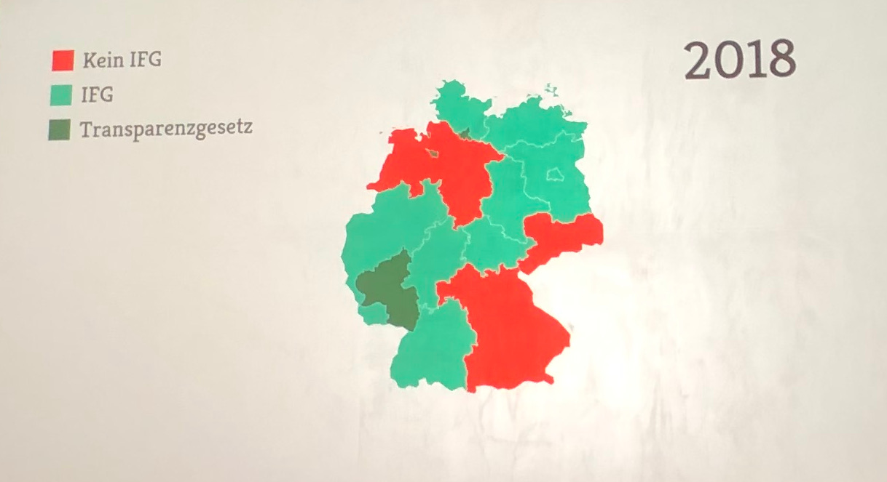

+++
showonlyimage = false
draft = false
image = "img/35C3_Day3.jpg"
date = "2018-12-29"
title = "GC²@35C3 - Day 3"
writer = "Christof Hirndler"
categories = ["35C3"]
keywords = ["CCC", "35C3"]
weight = 1
+++

Auch wenn wir nach ein paar Tschunks erst gegen halb vier ins Bett gefallen sind,
sind wir am Tag 3 bereits um elf wieder am Start.

Jedoch - wie wir vom CERT erfahren haben - muss aber eh immer nur eine Person
nüchtern sein - what could possibly go wrong?
<!--more-->

Als nun schon obligatorisches Statusupdate:

* Distanz: 17951 Schritte / 13.1 km
* Uhrzeit: 1:03

### Chaos West ###

Heute haben wir uns das erste Mal einen Vortrag bei der Chaos West Bühne gegönnt.
Es wurde uns gezeigt, wie man ein LVM-System mit zwei unterschiedlichen Keys
betreiben kann. Quasi ein *guter* und ein *schlechter* Key. Verwendet man den 
*schlechten* Key, so werden die Metainformationen der LVM-Partition gelöscht und
die Partition kann dadurch nie mehr entschlüsselt werden.

### Treiber im User-Space ###

Ein Treiber muss nicht unbedingt im Kernel-Space implementieren sein. Schreibt
man die Treiber im User-Space so können auch andere Programmiersprachen wie
Rust verwendet werden. In diesem Talk wurde uns gezeigt, dass Treiber im
User-Space durchaus performant sein können. Dies gelingt natürlich nicht mit
allen Programmiersprachen - Swift *hust*. 

Neben C performten Rust und Go am Besten, jedoch waren sie immer noch ein wenig
langsamer als die C Referenzimplementierung. Dem gegenüber steht aber eine
modernere Sprache, welche schon viele Fehler (bspw. Speicherüberschreiber)
beim Kompilieren aufdeckt. Trotzdem muss einem immer klar sein, dass man
seine bevorzugte High-Level Sprache sehr gute kennen muss um keine Fehler zu
begehen (garbage collection, ...)

Das Ranking bzgl. Performance:

1. C
2. Rust
3. Go
4. C#
5. Swift

[Source](https://github.com/ixy-languages/ixy-languages)

### Best of *IFG* ###

In diesem Talk ging es um kleine Anekdoten bzgl. dem IFG. Es war sehr erheiternd,
wie manche Behörden in Deutschland bei IFG-Anfragen agieren. Auszug aus einer
Verweigerung der Berliner Polizei: '... staatliche Organe müssen unvorhersehbar 
agieren ...'. Natürlich hielt dies einer IFG-Klage nicht stand.

Das Informationsfreiheitsgesetz - welches in Österreich nicht existiert - kann
die Demokratie bestärken. Man muss jedoch ausreichend Durchhaltevermögen aufweisen.
Wir Österreicher haben hier noch einiges zu tun.

</img>

### Amazon's Daten ###

Sehr guter Talk von @kattascha und @Lettebowskie. Hier wurden die Daten auf
Basis der DSGVO angefragt und dann analysiert. Anhand dieser konnten
Bewegungsprofile, vermeintliche gesundheitliche Probleme aber auch die
zukünftige Lebensplanung vorhergesagt werden. Die Message ist wohl, dass wir
uns alle genau überlegen sollten ob wir bei einer riesigen Datenkrake wie
Amazon all unsere Daten liegen haben wollen. Man denke an den Amazon Shop,
Amazon Cloud, Amazon Video, Amazon Echo, ...

### Cross-Site Scripting ###

Wir sahen auch einen kurze Einführung wie Cross-Site Scripting funktioniert 
und wie einfach es wäre dies zu verhindern. Vielen ist es klar, aber hier noch
einmal erwähnt:

Man darf User-Input nicht ungefiltert ausführen (in HTML-Sites packen).

### Mars Rover ###

Wir hörten einen spannenden Talk über die Hardware der bisherigen Mars Rovers.
Grundsätzlich besteht die Hardware aus einem gespiegelten System. D.h. alles
ist doppelt vorhanden. Natürlich mit Komponenten die ein wenig besser gegen die
Strahlung geschützt sind.

... und welche Taktung hat nun so ein Mars Rover?

Curiosity läuft mit lockeren 133MHz.

### Hacken ###

Natürlich kann man alles Hacken, jedoch sollte man sich dabei nicht erwischen
lassen. Darüber gab es einen witzigen Talk, wie man es nicht machen sollte bzw.
wie es besser gehen könnte. An OPSec zu denken, wenn schon ein kleines *Upps* 
- wie unbeabsichtigt Sonderzeichen in ein Input-Feld einzugeben - passiert ist,
ist leider schon zu spät. Tor sollte man schon beim *Upps* verwendet haben.
Grundsätzlich sollte man sich auch die Hackerethik ins Gedächtnis rufen,
möglichst anonym bleiben und auf der richtigen Seite der Macht stehen.

### Politik in Österreich ###

epicenter.works hat wie immer erstklassige Arbeit im Jahr 2018 geleistet z.B.
Verhinderung der Vorratsdatenspeicherung. Österreich hat mit dem EU Ratsvorsitz
nicht geglänzt wichtige Dinge wie die ePrivacy Verordnung vernachlässigt. Die
jetzige Regierung bringt uns einen Staatstrojaner, keine anonymen Wertkarten
und plant erneut eine Vorratsdatenspeicherung 2.0 - danke FPÖ und ÖVP.

</img>

