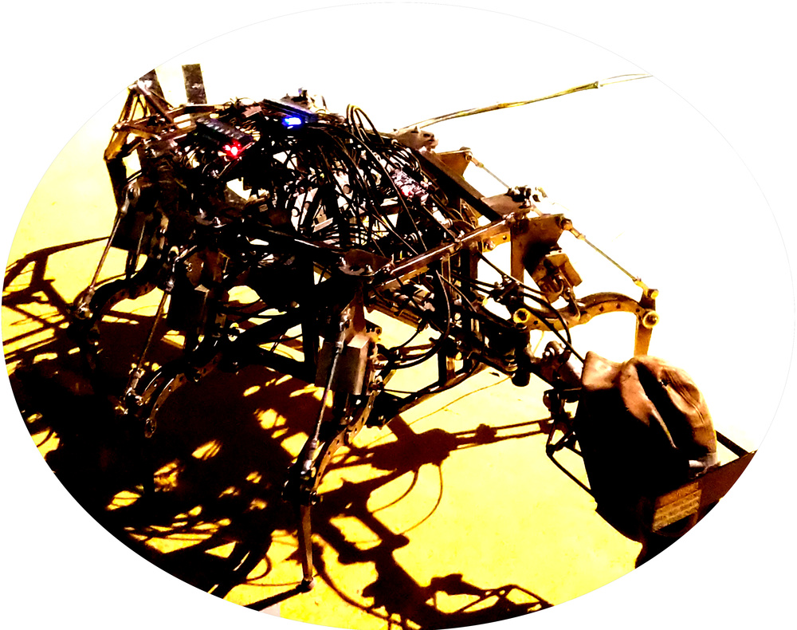

+++
showonlyimage = false
draft = false
image = "img/35C3_Day4.jpg"
date = "2018-12-30"
title = "GC²@35C3 - The End"
writer = "Christoph Woergoetter"
categories = ["35C3"]
keywords = ["CCC", "35C3"]
weight = 1
+++

Vier Tage voller bunter Dinger und verrückter Menschen geht zu Ende. Der 35C3
ist vorbei. Dementsprechend ist dies unser letzer Erfahrungsbericht aus Leipzig.
<!--more-->

Statusupdate:

* Distanz: 8679 Schritte / 6.4 km
* Uhrzeit: 18:31

### CTF @ 35C3 ###
Unser letzter Tag begann mit einem Einführungstalk über CTF und wie es am 
35C3 lief. CTF steht für *Capture the Flag* und kann als ganz legales Hacking 
angesehen werden. Hierbei werden Aufgaben zum Hacken gestellt weche andere Teams
lösen müssen.

### Netzpolitik 2018 kompakt ###

Nach dem sehr guten Vortrag über die Funktionsweise von CTF haben wir uns zwei
Talks über die Netzpolitik gegönnt. Im ersten Vortrag ging es primär um den 
Datenskandal von Facebook und Cambrige Analytica. Es wurde auch die Funktionsweise 
von Microtargeting bei Wahlen beleuchtet. Das grundsätzliche Problem - welches 
auch im Schlusssatz noch einmal manifestiert wurde - liegt darin, dass Google und
Facebook zu groß geworden sind und wieder zerschlagen werden müssen um die digitale
Freiheit zu schützen.

Im zweiten Talk wurde uns quasi der Jahresabschlussbericht von
[Netzpolitik.org](https://netzpolitik.org) im Jahre 2018 präsentiert. Es gab
nicht nur positive sondern auch negative Aspekte der Jahres 2018. Bspws. hat
der Ratsvorsitz Österreichs dazu geführt, dass die ePrivacy Verordnung nicht
behandelt wurde.

### So Long, and Thanks for All the Fish ###

</img>

