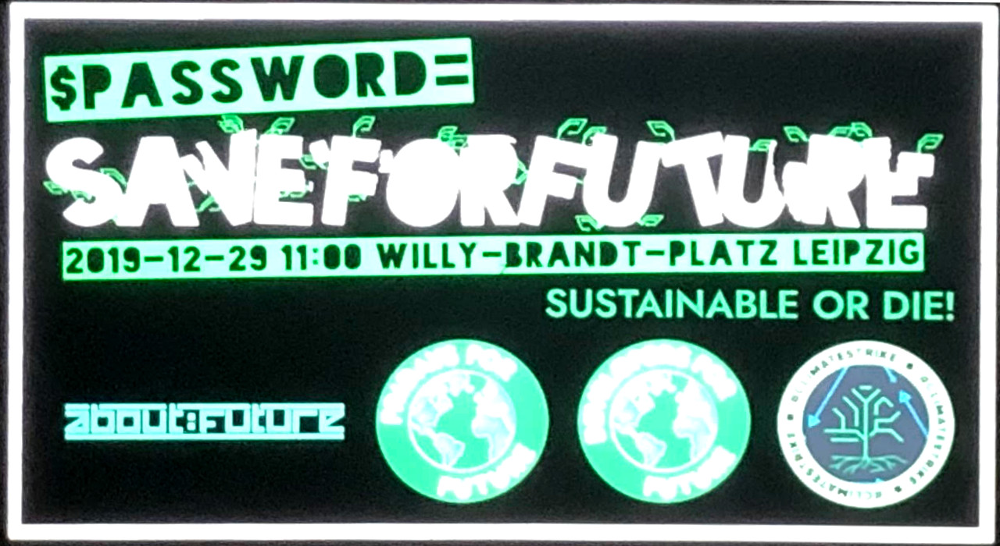

+++
showonlyimage = false
draft = false
image = "img/36C3_Day1.jpg" 
date = "2019-12-27"
title = "GC²@36C3"
writer = "Christof Hirndler"
categories = ["CCC"]
keywords = ["CCC", "C3", "36C3"]
weight = 1
+++
<!-- title-img should have a width of 100px -->

Es ist wieder soweit. Der GC² ist wieder am C3! 36C3 wir kommen. Und wie wir es
bereits letztes Jahr gemacht haben, werden wir wieder über unsere Erfahrungen
berichten.

Distanz: 15723 Schritte / 12.2 km 
Uhrzeit: 3:24

<!--more-->

## Tag 1 - The Day Will Never End ##

Wir starteten um 9 Uhr am Flughafen Graz um schließlich um 16 Uhr in der Messe
Leipzig aufzuschlagen. Außer unser Gepäck hatten wir auch einen prominenten
Informatiker aus Graz dabei welcher zeitnah einen Vortrag halten musste. Nach
15.723 Schritten und einer zurückgelegten Distanz von 12,2 km ist Tag 1 um
03:24 zu Ende gegangen.

### Plundervolt: Flipping Bits from Software without Rowhammer

Aufs neue zeigten uns die Vortragenden, dass CPUs angreifbar sind. Mit
Spannungsreduzierung können Bitflips provoziert werden. Damit ist es
beispielsweise möglich SGX zu umgehen und die CPU dazu zu bringen, private
Daten in unverschlüsselte Bereiche zu schreiben. Unserer Meinung nach sind die
Angriffe zwar schwer in der Praxis umzusetzen jedoch sicher nicht unmöglich.
Anmerkung der Redaktion: Den Namen 'Kit' kann auch eine weibliche Person tragen –
nicht nur Autos aus der Zukunft. :)

### Geheimdienstliche Massenüberwachung vs. Menschenrechte

Constanze gab uns einen Überblick über die britischen und schwedischen
Massenüberwachungsgesetze. Sie zeigte aufs neue auf, wie drastisch die
Maßnahmen - in welcher vor allem die Briten mit der Institution GCHQ
Menschenrechte verletzen - sind. Im laufenden Verfahren gegen den BND wird es im
Januar eine Anhörung geben. Generell ist Constanze positiv gestimmt die
Verfahren gewinnen zu können, wobei immer wieder betont wurde, dass Prognosen
immer schwer zu treffen sind.

### Digitalisierte Migrationskontrolle

Im Zuge von Asylverfahren werden in Deutschland (in Österreich ist dies auch 
möglich) Mobiltelefone von Geflüchteten ausgelesen, wenn diese Ihre
Herkunft nicht mit einem Pass belegen können. Im Anlassfall wird die
Kommunikation der Telefone ausgelesen um zu bestimmen von wo eine Person kommt.
Es ist nicht klar, welche Faktoren genau für die Analyse herangezogen werden -
diese bleiben geheim. Es gibt auch keinerlei Gutachten welche diesen
Algorithmus unter die Lupe nehmen. Profitipp für die Migrationskontrolle:
Mobiltelefon vorsorglich entsorgen, oder zum Amt nicht mitnehmen.

### SIM card technology from A-Z

Der Titel des Vortrags ist meiner Meinung nach auch gleichzeitig die
Zusammenfassung dessen. Wir sind von der Steinzeit der SIM in die moderne
gegangen und haben den einen oder anderen ISO Spezifizierung-Unfall beobachten
können.

### Hacker Jeopardy

Mittlerweile findet alle zwei Jahre ein Hack Jeopardy statt. Auch dieses mal
war es wieder lustig und erstaunlich was Leute ad-hock für ein Wissen haben. In
vier Runden wurde der beste Hacker gekürt und mit einem Kardio Batch belohnt.
Wenn die beteiligten am Podium die richtige Antwort nicht parat hatten, wurde
das Publikum mit USB-C Kabel im großen Stil belohnt.

</img>

