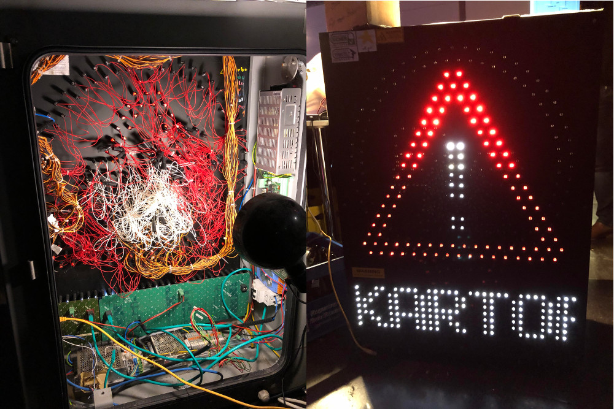

+++
showonlyimage = false
draft = false
image = "img/36C3_Day2.jpg" 
date = "2019-12-28"
title = "GC²@36C3 - Day 2"
writer = "Christof Hirndler"
categories = ["CCC"]
keywords = ["CCC", "C3", "36C3"]
weight = 1
+++
<!-- title-img should have a width of 100px -->

Tag 2 und nach einem erhohlsamen Schlaf im Doppelbett begeben wir uns wieder 
in das 36C3 getümmel...

Distanz: 16889 Schritte / 12.9 km 
Uhrzeit: 1:13

<!--more-->

## Tag 2 - Climate Change Is Real ##
Wir starteten nach einem „Frühstück“ beim Burgerladen unseres Vertrauens um 12
Uhr in den Tag 2. 

### Reducing Carbon in the Digital Realm

Chris zeigte das Problem von Digitalisierung im Kontext des Umweltschutzes auf.
Als Betreiber von digitaler Infrastruktur sollte unter anderem darauf geachtet
werden, in welchem Rechenzentrum die Anwendungen gehostet wird. Denn es macht
einen deutlichen Unterschied ob die Region primär aus erneuerbaren
Energiequellen oder z.B. aus Atomkraftwerken gespeist wird. Zudem probierten
wir in diesem Vortrag das erste mal die Simultanübersetzung aus. Dies ist ein
tolles Angebot für Menschen mit schlechten Englischkenntnissen. Dennoch haben
wir das Gefühl, dass durch die Live-Übersetzung viele Info verloren geht.

### Das nützlich-unbedenklich Spektrum

Dieser Vortrag zeigt wieder aufs neue auf, dass es für Unternehmen aber genauso
für Open Source Projekte drastische Probleme geben kann, wenn externe
Dependencies in Projekte gezogen werden. Weder die Qualität noch das
Wartungsintervall der Quellen können gesichert bestimmt werden. Fefe versucht
über eine neuartige Kennzeichnung von Software Entwicklern (Hint: Geek-Speech)
eine leichter (jedoch subjektive) Beurteilung zu ermöglichen.

### Friday for Future & Extinction Rebellion

Das Klimathema ist derzeit in aller Munde. Am frühen Nachmittag informierten wir
uns aus erster Hand bei zwei Vorträgen wie es um die aktuelle Entwicklung steht.
Positiv hervorheben kann man, dass die Bewegung richtig an Fahrt gewonnen hat,
jedoch wird sich vermutlich an der (Deutschen)-Klimapolitik in naher Zukunft
dennoch nichts ändern. Die Förderung der Fossilien-Rohstoffindustrie wird vom 
Staat weiterhin forciert. Die Klimaziele zu erreichen rückt in weite Ferne.

Hier noch ein kleiner Buchhinweis für alle die aktiv werden wollen:
978-3103970036

### Megatons to Megawatts

In diesem Vortrag erfuhren wir, wie wir hoch angereichertes Uran (d.h. 
waffenfähiges Uran) sinnvoll für die Zivilgesellschaft verwendet werden könnte.
Wenn der politische Wille vorhanden wäre, so könnte man mit dem derzeitigen 
verfügbaren waffenfähigen Uran 4000 Jahre lang 1 GW Strom erzeugen. Das Problem
dabei ist, dass mit derzeitigen Reaktormodellen als Nebenprodukt waffenfähiges
Plutonium entstehen würde. Hierfür müsste man Flüssig-Salz-Reaktoren bauen 
welche auf einem anderen Prinzip beruhen.

Die Frage der Lagerung das abgebrannten Atommülls wurde im Vortrag nicht 
behandelt.

### ZombieLoad

In diesem Vortrag erfuhren wir - wie am Tag zuvor - dass unsere
Hardware-Architektur weiterhin unsicher ist. Nachdem bei den CPUs nachgebessert
wurde, dachten wir dass Meltdown Geschichte wäre. Jedoch erhob sich der Bug 
wie der Phönix aus der Asche - ZombieLoad war geboren. Mithilfe von ZombieLoad
kann man wie auch schon bei Meltdown kritische Daten, wie etwa Passwörter 
relativ 'einfach' vom System abgreifen.

</img>

