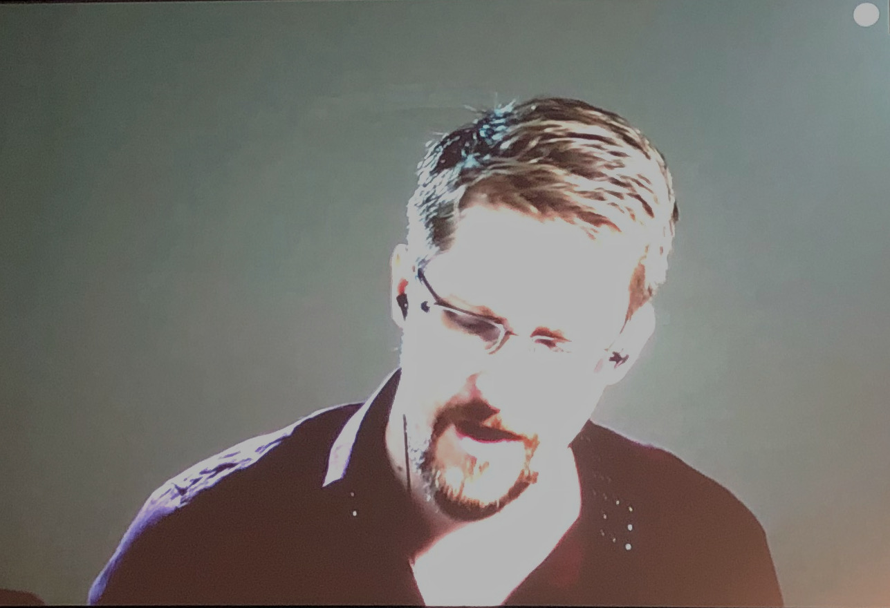

+++
showonlyimage = false
draft = false
image = "img/36C3_Day3.jpg" 
date = "2019-12-29"
title = "GC²@36C3 - Day 3"
writer = "Christoph Woergoetter"
categories = ["CCC"]
keywords = ["CCC", "C3", "36C3"]
weight = 1
+++
<!-- title-img should have a width of 100px -->

Nach einer Kuscheleinheit im NH Leipzig – welche Christo(f)(ph) dringend
notwendig hatten - starteten wir gegen 11:30 Uhr los.

Distanz: 14067 Schritte / 10.8 km 
Uhrzeit: 0:47

<!--more-->

## Tag 3 - Ethics, Society & Politics mit einem Hauch von Technik

Wir sind bereits jetzt voll in der Kongress Zeitrechnung angekommen. Das
Frühstück um 11:45 Uhr fühlte sich doch noch etwas früh an. Nach einem veganen
Burger und 3 – in Worten drei – Burgen mit Fleischpatty sind alle Beteiligten
gerüstet für den Tag.

### Build your own Quantum Computer @ Home

Unser persönliches Fazit: Mit dem Einsatz von ca. 15.000 € kann man einen Teil
eines vielleicht nie funktionierenden Quantencomputers selbst bauen. Yann zeigte
uns seine Versuche wie er mit 3D gedruckten Teilen und schließlich aus Keramik
die ersten Quanten in (super) Position gebracht hat. Zum Validieren, ob er noch
auf dem richtigen Weg war, ging er in das Museum des GCHQ, wo ein Prototyp eines
Quantencomputers steht. Dieser ist von der Architektur wie man die Ionen für die 
QuBits fängt sehr ähnlich zu seinem. Ein noch bestehendes Problem ist der Laser
welcher sich als extrem teuer erweist. Aktuell recherchiert Yann noch, wie er
am günstigsten einen hackerstyle Laser auf den Weg bringen kann.

### Geflüchtete schmuggeln, Nazis Torten, Pässe fälschen

Der Vortrag war ein durchaus lustiger Rückblick über die Aktionen des Peng
Kollektivs. Aktionen von „Artikel 26“ - welche ein Versuch war, Waffenhändlern
einen fingierten Friedenspreis zu überreichen - bis „Deutschland geht klauen“ - in
der vorgeschlagen wird, Einzelhandelsketten zu beklauen und den gestohlenen
Wert direkt an die jeweiligen Fabrikanten zu erstatten - waren dabei. Eine
besonders medienwirksame Idee war die „Cop Map“ in welcher aktuell im Einsatz
befindliche Gesetzeshüter eingetragen werden sollen. Spenden sind immer gerne
gesehen. Näheres auf https://pen.gg

### FinFisher, See You in Court!

Hier versuchte der CCC für GFF nachzuweisen, dass der in der Türkei eingesetzte
Trojaner gegen Oppositionelle von dem deutschen Unternehmen FinFisher ohne
gültige Rechtsgrundlage verkauft wurde. Es wurden Android APKs der letzten
Jahre seziert und nach ähnlichen Codefragmenten oder Zertifikaten gesucht. Das
wohl größte Indiz ist eine verwendete SQLite Library welche erst veröffentlicht
wurde nachdem bereits ein Gesetzt in Kraft trat, dass den Verkauf von Cyberwaffen
untersagt bzw. genehmigungspflichtig machte.

### Snowden
Am späten Nachmittag - bzw. in Kongress-Zeit mittags - haben wir Snowden im
Live-Stream erlebt. Zuvor erzählte sein Anwalt welch gravierende Verstöße gegen
die Menschenrechtscharta in letzter Zeit passierte. Allen von uns ist Hong Kong,
und Myanmar (Rohingya) noch ein Begriff. Was weniger in der Öffentlichkeit 
ankam war, dass der Kampf für die Personen die Snowden in Hong Kong Unterschlupf
gewährten einen 7 1/2 Jahre langen Kampf hatten um in Kanada Asyl zu bekommen.
Auch nach den vielen Jahren konnte noch immer nicht die gesamte Familie Asyl
in Kanada erhalten sondern nur die Mutter und eines der drei Kinder. Snowden 
appellierte an uns und an alle, dass wir aufstehen und versuchen das System zu
ändern. Es ist schwer, aber wenn man nicht versucht etwas zu ändern, so wird sich
nie etwas ändern. Und jeder kleine Schritt bewirkt auf lange Sicht etwas. 

</img>

### Boeing 737MAX: Automated Crashes

Der Talk handelte davon warum die Boeing 737MAX Maschinen abgestürzt sind.
Grund sind fehlerhafte Daten eines der Anstellwinkelsensors welche zur
automatischen Nose-Down-Trimmbewegungen führten. Die Flugbesatzung war dem
System hilflos ausgeliefert. Das MCAS
(Manövrierungscharakteristik-Augmentationssystem) nutzte für die Berechnungen
nur einen Sensor, obwohl zwei zur Verfügung gestanden hätten. Zumindest wird
bei einem Absturz vermutet, dass ein fehlerhafter Einbau des Sensors die
Ursache war. Bernd stellte deshalb die naheliegende Frage, ob die
Zulassungsprozesse in den USA aber auch in Europa ausführlich genug handeln.
Eines ist jedoch gewiss. Beim 737MAX wird Europa wie auch Asien der Zertifizierung
der FAA nicht folgen und selbst zertifizieren.

</img>

### Jahresrückblick beim CCC
Im netzpolitischen Jahresrückblick wurde uns wieder vor Augen geführt, was
passieren würde wenn keiner aufstehen würde. Es darf nicht nichts getan werden!
Grundrechte wie Meinungsfreiheit werden sukzessive eingeschränkt. Staatstrojanern
werden von Gesetzesentwurf zu Gesetzesentwurf mehr rechte eingeräumt. Der einzige
Unterschied: Die kritisierten Schlagwörter entfallen und sodass es besser der 
gemeinen Bevölkerung verkauft werden kann. Jedoch kämpfen viele - wie auch 
Netzpolitik.org - dafür, dass wir noch in Freiheit leben können.

### Hirne Hacken

Das Problem Mensch wird in der IT-Sicherheit nach wie vor noch nicht gut
beachtet. Theoretisch haben wir alle Sicherheitsprobleme in der IT gelöst – in
der Praxis hilft dies leider wenig. Faktisch verwenden die meisten Menschen nur
ein Passwort und inkrementieren dieses je nach Unternehmensrichtlinie einmal
alle drei Monate. Linus beweist aufgrund von Praxistests, dass Menschen
speziell dann anfällig sind, wenn Phishing-Attacken möglichst persönlich bzw.
auf das Unternehmen angepasst verfasst wurden. Er spricht von Erfolgsquoten von
bis zu 55%. Die Lösung wäre aber so einfach: Passwortmanager und etwas
Sicherheitstraining können die Quote deutlich senken.

