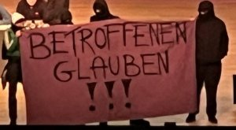
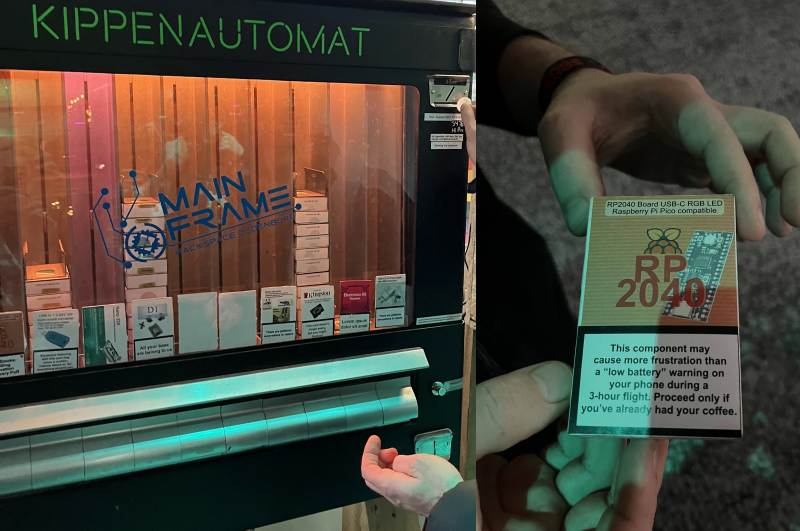

+++
showonlyimage = false
draft = false
image = "img/38C3.jpg" 
date = "2025-01-03"
title = "GC2@38C3"
writer = "Martin Strohmayer"
categories = ["CCC"]
keywords = ["CCC", "C3", "38C3"]
weight = 1
+++
<!-- title-img should have a width of 100px -->

Nach längerer Pause ist der GC2 endlich wieder am C3, genauer gesagt am 38C3 in Hamburg. 

<!--more-->

## 38C3: Ein Paradies für Hacker und Technikbegeisterte

Vor ein paar Tagen hatte ich und ein paar Kollegen das großartige Vergnügen, am 38C3-Event teilzunehmen. Danke an den [Realraum](https://wp.realraum.at/) in Graz für die Unterstützung!

Die Konferenz war ein bunter Mix aus Vorträgen zu Kunst, Ethik, Politik, Hardware und Security – definitiv ein Eldorado für technikaffine Gemüter und kreative Köpfe.

## Tag 1 

Ein Highlight am ersten Tag war der Talk "Hacking the RP2350". Der Referent erläuterte ausführlich, wie hardwarebasiertes Hacking funktioniert. Es war faszinierend zu sehen, wie man durch geschickte Manipulationen eines Versorgungspins tief in die Funktionsweise der Hardware eingreifen kann. Die technischen Details und Herausforderungen machten diesen Vortrag zu einem echten Leckerbissen für technikinteressierte Raspberry Pi Fans.

Überrascht hat mich besonders der Vortrag "KLARHEIT ALS WAFFE". Diese Art von Internet- und Computerkunst war mir bisher völlig neu. Durch die Präsentation konnte ich meinen Horizont erweitern und neue Perspektiven auf die Nutzung von Technologie als Kunstform gewinnen.

Ein weiterer bemerkenswerter Vortrag, war "BioTerrorism Will Save Your Life with the 4 Thieves Vinegar Collective". Das Thema Medikamente selbst herstellen und prüfen war faszinierend und zeigte den Hacking-Ansatz in einem ganz neuen Bereich, den man vielleicht nicht auf dem Radar hatte. Gut, dass die Arzneimittelpreise bei uns weit weniger astronomisch sind als in den USA, aber die Idee, den Zugang zu essenziellen Medikamenten für alle zu erleichtern, ist äußerst spannend aber auch beängstigend.

## Tag 2 

Der zweite Tag des 38C3 startete naturgemäß am späten Vormittag mit Lightning Talks im 5-Minuten-Takt. Als Österreicher konnte ich die Probleme bei der Deutschen Bahn zunächst nicht nachvollziehen, aber das Thema zog viele Interessierte an. Der Vortrag "Wann klappt der Anschluss, wann nicht und wie sagt man Chaos vorher?" behandelte die Kunst, aus dem offensichtlichen Chaos Vorhersagen abzuleiten und das Beste aus der Deutschen Bahn herauszuholen, wenn kurzfristig keine substanzielle Verbesserung möglich ist. Im Grunde ging es um also um Big Data Analyse um Verspätungen vorauszusagen.

Ein weiterer spannender Vortrag war "Digitalisierung mit der Brechstange". Hier ging es darum, wie man Menschen, die nicht internet- und technikaffin sind, nicht durch eine Digital-Only-Gesellschaft ausschließt.

Besonders aufregend war der "CCC-Jahresrückblick" im vollbesetzten riesigen Saal 1, bei dem es zu einer Störaktion kam. Eine Gruppe von Vermummten mit dem Plakat „BETROFFENEN GLAUBEN!!!“ unterbrach den Vortrag und musste von der Security entfernt werden.

Der Vortrag „Fake-Shops von der Stange: BogusBazaar“ zeigte eindrucksvoll, wie einfach und hochskaliert betrügerische Fake-Shops im Internet erstellt werden können. Am meisten schockierte jedoch "Erpressung aus dem Internet - auf den Spuren der Cybermafia". Hier wurde deutlich, dass neben den Opfern auch die Täter/Aktöre hart getroffen werden. Sie wurden entführt und in fremde Länder verschleppt – fast ohne Aussicht auf Flucht.

Spät in der Nacht wurde es kurios und lustig mit dem Vortrag "KI-Karma next Level: Spiritueller IT-Vertrieb". Hier gab es Live-Software-Wunderheilungen und ein 42-Stufen-Programm für feinstoffliche IT. Hier wurde auch klar, dass uns definitiv noch ein Vereinslied fehlt, das uns zusammenschweißt – so wie die Zensurbehörde in China.

https://www.youtube.com/watch?v=-QlNjvWlWZk

zu Abschluss gabs ab 1 Uhr nachts "0, 1 oder 2 - Hackerei und Cyberbrei". Dies war die CCC-Version von "1, 2 oder 3" mit CCC-Stargästen, einem Live-Faxgerät und passenden Werbungen aus den frühen ISDN-Tagen.

https://www.youtube.com/watch?v=r1LOL9pxHwg
 

## Overall

Der 38C3 hatte weit mehr zu bieten als spannende Vorträge. Die Location selbst war beeindruckend – der Eingangsbereich mit der Rakete und den Lichtstrahlen brachte eine fantastische Atmosphäre. Die vielen Assemblies, also Stände, waren Treffpunkte für Gleichgesinnte und boten eine Plattform für regen Austausch.

Ein besonderes Highlight war der Kippenautomat mit Elektronik zum Herausziehen. Wir zogen uns einen Lötsatz und eine RP2040-Platine, natürlich mit den entsprechenden Warnhinweisen ;-).

Die Lock-Picking-Station, bei der man lernen konnte, wie man mit einer Plastikkarte eine Tür öffnet, war informativ und nützlich zugleich.

Nicht zu vergessen die CCC-Poststation, mit Briefmarken und Postkarten, die muss man auf jeden Fall gesehen haben muss. Ein paar Tage nachdem ich zuhause war kam die Karte auch an.

**Danke an den CCC für den tollen Event. Wir freue uns schon auf das nächste Mal!**