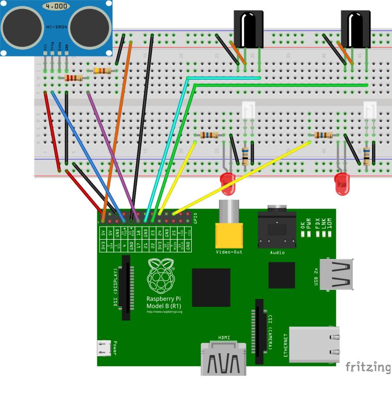

+++
showonlyimage = false
draft = false
image = "img/fortbildungE_demo.jpg"
date = "2018-12-18"
title = "Geschwindigkeitsmessung mit Raspberry Pi"
writer = "Manfred Wallner"
categories = ["Raspberry Pi"]
keywords = ["Raspberry", "messen", "steuern", "C", "Geschwindigkeitsmessung", "IR", "seminar"]
weight = 1
+++

Der Grazer Computer Club war auch schon vor 2018 tätig, auch wenn noch nicht offiziell unter diesem Namen.
So waren wir beim Software Freedom Day, zahlreichen Grazer Linuxtagen und diversen anderen Veranstaltungen zugegen. Bei einem Bundesseminar für Elektrotechnik im Jahr 2016 haben wir ein Demo-Setup zur Geschwindigkeitsmessung inklusive Programmierung vorgestellt.

<!--more-->

Beim Bundesseminar für Elektro,­ Elektrotechnik vom 24. bis 26.02.2016 in der Landesberufsschule Voitsberg wurden drei aufeinander Aufbauende Versuche zum Thema Geschwindigkeitsmessung vorgestellt.
Es wurde mit Lichtschranken und Ultraschallsensor gemessen, sowie eine kombinierte Variante mit Differenz-Auswertung implementiert.
Die dabei erstellten Programme wurden in C, mit der [wiringPi](http://wiringpi.com/) Bibliothek umgesetzt.

## Schaltbild / Übersicht

### Materialen - Aufgabe 1

* 2x IR­Empfänger OPN6042­36­CUT
* 2x IR­Sendediode 1.3 ... 1.7 V ~ 100mA
* 2x 68 Ω Widerstand
* 2x 160 Ω Widerstand
* 2x Standard LED 10­20mA

### Materialen - Aufgabe 2

* 1x HC­SR04 Ultraschallsensor
* 1x 220 Ω Widerstand
* 1x 430 Ω Widerstand

### Materialen - Aufgabe 3

* Kabelkanal (ca. 1m)
* Heißkleber
* **Matchboxautos**

## Unterrichtsmaterialen

[PDF - vollständige Anleitung zum herunterladen](https://github.com/GrazerComputerClub/Talk/blob/master/FortbildungE_Geschwindigkeitsmessung_001.pdf)
