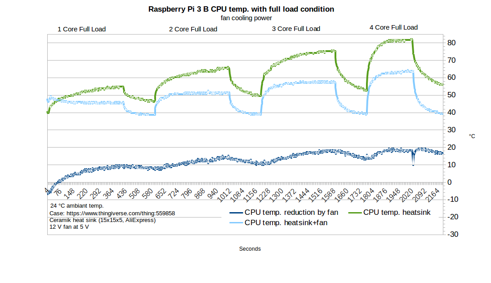

+++
showonlyimage = false
draft = false
image = "img/fan.png"
date = "2020-09-14"
title = "Raspberry Pi CPU Kühlung"
writer = "Martin Strohmayer"
categories = ["Raspberry Pi", "GC2"]
keywords = ["Lüfter", "Aktive Kühlung", "Kühlkörper", "CPU", "SoC"]
weight = 1
+++

Raspberry Pi Zero und Pi 2 kommen noch gut ohne Kühlkörper und Lüfter aus. Aber wie sieht es bei den anderen Modellen aus? Vorweg ab der Raspberry Pi 3 ist eine aktive Kühlung bei leitungsintensiven Anwendungen pflicht. Die bedarfsabhängige Lüftersteuerung kann sehr einfach aktiviert werden. 
<!--more-->

## Beschreibung ##

Wann eine Kühlung des SoC bzw. des Prozessor der Raspberry Pi nötig ist hängt von vielen Faktoren ab. Die Raspberry Pi Type, Umgebungstemperatur und das Gehäuse sind die wichtigsten. Um genau fest zu stellen unter welchen Bedingungen eine Kühlung notwendig ist, wurde mit dem GC2 3D-Druck-Gehäuse mehrere Leistungstest durchgeführt. Dazu wurde die Raspberry Pi 3 benutzt, sie besitzt keine Heatspreader. Zum Aufzeichnen der ARM Frequenz und der Prozessor-Temperatur wurde das Python Programm [bcmstat](https://github.com/MilhouseVH/bcmstat) verwendet. Bei GC2 Raspjamming OS ist das Programm bereits vorinstalliert. Die CPU-Last wurde mit dem Programm "stress" erzeugt.  
Beim Testl wurde folgendes Shell-Script verwendet

```bash
bcmstat.sh > rpi_$1.txt &
PID=$!
sleep 10
stress --cpu 1 --timeout 420s
sleep 180
stress --cpu 2 --timeout 420s
sleep 180
stress --cpu 3 --timeout 420s
sleep 180
stress --cpu 4 --timeout 420s
sleep 180
echo kill $PID
kill -KILL $PID
echo finished!
```

Der Test wurde bei einer typischen Umgebungstemperatur von 24 °C durchgeführt. Das verwendetet [Gehäuse](https://www.thingiverse.com/thing:559858) kann man sich mit einem 3D Drucker selbst herstellen. 

## Analyse Temperaturen


Es zeigte sich, dass die Raspberry Pi 3 an ihre Temperaturgrenze stößt spätestens wenn alle 4 Kerne ausgelastet sind. dann wird vom System automatisch die Taktrate der CPU reduziert um eine überhitzung von mehr als 82 °C zu vermeiden.  
Auch wenn man einen Kühlkörper auf den SoC befestigt, wird damit der Temperatur nur geringfügig reduziert. Erst wenn man den Kühlkörper mit einem langsam drehenden Lüfter anbläst, wird die Temperatur massiv reduziert und die volle Taktrate steht zur Verfügung.
 


Sieht man sich die Kühlleistung des Lüfters genauer an, so erreicht man eine Reduzierung um etwas weniger als 20 °C. Dabei war der Lüfter direkt an die 5 V Versorgung gesteckt worden und lief somit immer. Bei dem 12 V Typ war dann aber nicht gesicher das er bei 5 V immer anläuft. Hier sollte man eher einen 5V Typ einsetzen.  

## Lüftersteuerung

Da man nun weis, dass eine aktive Kühlung notwendig und sinnvoll ist, stellt sich nun die Frage, benötigt man den Lüfter immer bzw. muss der Lüfter ständig laufen?
Man könnte den Lüfter ja nur aktivieren wenn er wirklich gebraucht wird also wenn die Prozessortemperatur zu hoch ist. Tatsächlich ist so eine Funktion bereits im Kernel verfügbar. Der Devicetree gpio-fan ist genau für diese Funktion gemacht worden. 

```
Name:   gpio-fan
Info:   Configure a GPIO pin to control a cooling fan.
Load:   dtoverlay=gpio-fan,<param>=<val>
Params: gpiopin                 GPIO used to control the fan (default 12)
        temp                    Temperature at which the fan switches on, in
                                millicelcius (default 55000)
``` 

Als Parameter kann man den GPIO und die Einschalttemperatur angeben. Die Hysterese ist leider fix mit 10 °C hinterlegt.
In der Standard-Konfiguration wird der Lüfter also mit GPIO 12, ab 55 °C aktiviert und bei 45 °C deaktiviert. 

## Schaltung ##

Mit dem GPIO darf natürlich nicht direkt an den Lüfter geschlossen werden. Die Stromaufnahme eines Lüfters liegt bei ca. 80-150 mA. Man muss also eine Transistor- oder FET-Schaltung verwenden. 


Bei der Transistorschaltung wird der leistungsfähige BC337 Typ verwendet. Er ist ein NPN-Transistor mit 800 mA Maximalstrom und mehr als 600 mW möglicher Verlustleistung. Beim Basis-Vorwiderstand wird 4700 KOhm verwendet, um den Ausgang möglist wenig zu belasten. Der Transistor wird hier als Schalter eingesetz.

## Aktivierung Lüftersteuerung


In die Datei config.txt muss lediglich der Devicetree geladen und parametriert werden. In diesem Fall wird GPIO 21 verwendet.

```
dtoverlay=gpio-fan,gpiopin=21,temp=55000
```


