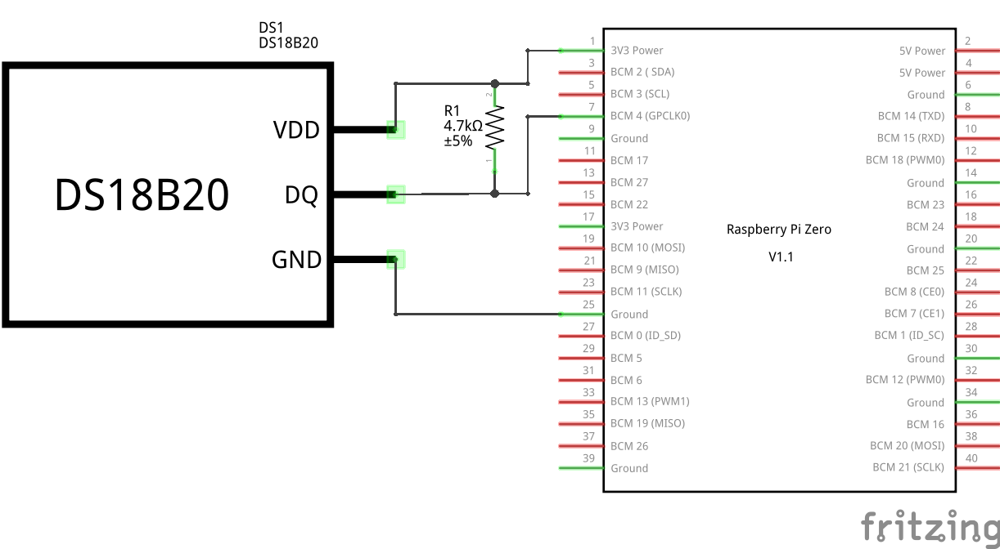
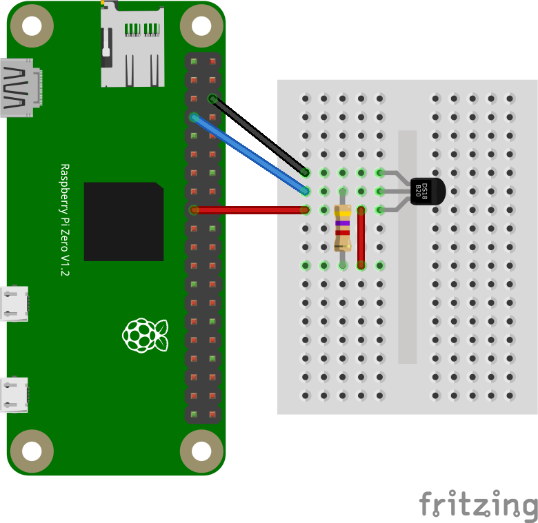

+++
showonlyimage = false
draft = false
image = "img/18B20.jpg"
date = "2019-03-26"
title = "Temperatursensor DS18B20"
writer = "Martin Strohmayer"
categories = ["Raspberry Pi"]
keywords = ["Temperatursensor", "18B20", "18S20", "1-Wire", "w1"]
weight = 1
+++

Mit dem günstigen Sensor DS18B20 und einem Widerstand kann ganz einfach über einen GPIO Pin die Umgebungstemperatur ausgelesen werden. Dazu wird noch nicht mal eine Library oder ein Programm benötigt. Alles Nötige ist im Linux-Kernel integriert.
<!--more-->

## Beschreibung ##

Mit dem 1-Wire Sensor DS18B20 von Dallas oder einen eine kompatiblen Sensor, kann ganz einfach die Umgebungstemperatur gemessen werden. Man benötigt lediglich den Sensor einen Pull-up Widerstand und einen Device Tree Eintrag in der Konfigurationsdatei. Dann steht der Temperaturwert über das virtuelle Filesystem zur Verfügung. Eine extra Software oder Library ist nicht nötig.

## Anschluss ##

Der 1-Wire Sensor wird mit 3,3 V versorgt und über den GPIO-Pin 4 erfolgt die standardisierte Kommunikation. Lediglich einen zusätzlichen Pull-up Widerstand mit 4,7 KOhm muss man noch hinzuschalten.

 

 


## Konfiguration ##

Es muss lediglich der 1-Wire-Bus über einen Device Tree Eintrag in der Konfigurationsdatei "config.txt" parametriert werden. Dadurch werden automatisch beim Starten die entsprechenden Kernel-Module (w1_gpio, w1_therm und wire) geladen. 

```
dtoverlay=w1-gpio,gpiopin=4,pullup=on
```

Im Betrieb kann das Kernelmodul mit folgendem Aufruf geladen werden:

```
sudo dtoverlay w1-gpio gpiopin=4 pullup=on
```


## Zugriff ##

Nach einem Neustart ist bereits alles geladen und der Sensor über das virtuelle Dateisystem auslesbar. Die Identifizierung aller Sensoren erfolgt über eine eindeutige ID-Nummer, die in der Datei "w1_master_slaves" aufgelistet sind.

```
ls  /sys/bus/w1/devices/
```
```
28-03089779799c  w1_bus_master1
```
```
cat /sys/bus/w1/devices/w1_bus_master1/w1_master_slaves
```
```
28-03089779799c
```
```
cat  /sys/bus/w1/devices/28-03089779799c/w1_slave
```

```
8d 01 55 05 7f a5 a5 66 9c : crc=9c YES
8d 01 55 05 7f a5 a5 66 9c t=24812
```

Der ausgelesene Wert t muss noch durch 1000 dividiert werden um auf °C zu kommen.
Diese Aufgabe kann man auch mit einem kleinen Python Programm '/usr/local/bin/w1-temp.py' umsetzen.


```python
#!/usr/bin/python
# -*- coding: utf-8 -*-

# read slave list from master 1
file = open('/sys/devices/w1_bus_master1/w1_master_slaves')
w1_slaves = file.readlines()
file.close()

# for each slave
for line in w1_slaves:
  # get slave id
  w1_slave = line.split("\n")[0]
  # read temp from slave id
  file = open('/sys/bus/w1/devices/' + str(w1_slave) + '/w1_slave')
  filecontent = file.read()
  file.close()
  # calc and show temp
  stringvalue = filecontent.split("\n")[1].split(" ")[9]
  temperature = float(stringvalue[2:]) / 1000

  print('%4.1f °C' % temperature)
```

```
python3 /usr/local/bin/w1-temp.py
```

```
26.2 °C
```
