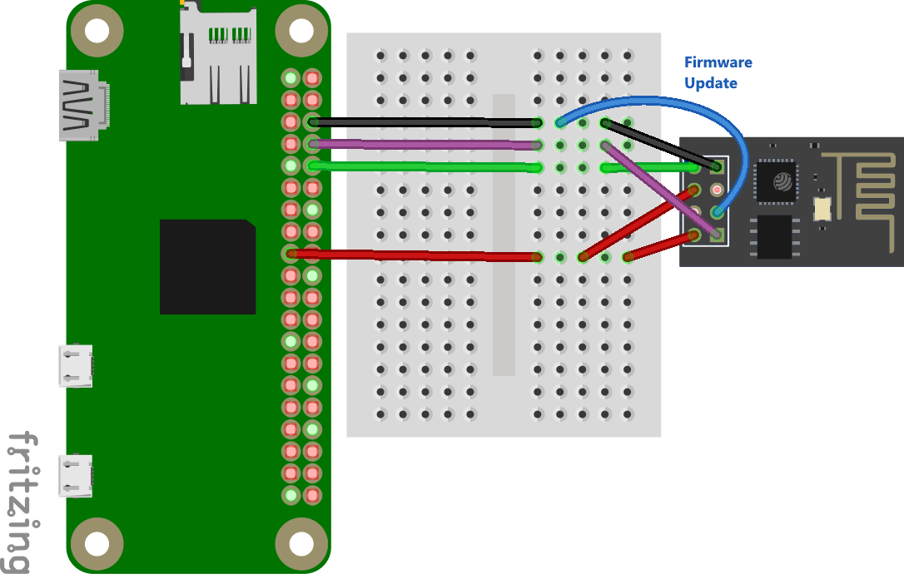
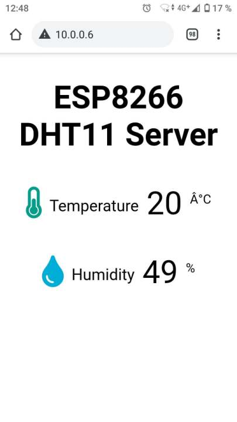

+++
showonlyimage = false
draft = false
image = "img/ESP-01S_DHT11.jpg"
date = "2021-02-28"
title = "ESP8266 ESP-01(S) MicroPython Firmware"
writer = "Martin Strohmayer"
categories = ["uC", "Raspberry Pi", "Programmierung"]
keywords = ["WiFi", "WLAN", "IoT", "ESP8266", "ESP-01", "ESP-01S", "Firmware", "NodeMCU", "lua", "Mikrocontroller"]
weight = 1
+++

Das kleine Experimentierboard ESP-01(S) mit dem ESP8266 Mikrocontroller kann man recht einfach mit der MicroPyhon Firmware ausstatten. Dann kann der Mikrocontroller mit Python programmiert werden. Mit dem  Raspberry Pi kann die neue Firmware übertragen und programmiert werden.
<!--more-->

## Beschreibung ##

MicroPython ist eine eigene Firmware die es möglich macht, den ESP8266 mit Python programmieren zu können. Dabei werden keine Binärprogramme erzeugt, sondern der Source-Code wird direkt auf das System übertragen. Der Python Code ist dann permanent gespeichert und wird direkt vom Mikrocontroller ausgeführt.  
In userem Fall wird das kleinste ESP-01(S) Board verwendet, auf dem die MicroPython Firmware problemlos installiert und verwendet werden kann. 

 
 

## Anschluss ##

Die ESP-01(S) Platine kann über den UART-Anschluss mit dem Raspberry Pi verbunden werden. 
Die Versorgung erfolgt über den 3,3 V und den GND Anschluss.

 

Um später ein Firmware Update ausführen zu können, muss der GPIO0 Eingang des ESP auf GND gesetzt werden. 

## Firmware Update


### esptool

Zuerst muss man das Python 3 Programm "esptool" installieren. 
```
sudo apt-get install python3 python3-pip
sudo pip3 install esptool nodemcu-uploader -t /usr/local/lib/python3.7/dist-packages
alias esptool.py='python3 /usr/local/lib/python3.7/dist-packages/esptool.py'
alias nodemcu-uploader.py='python3 /usr/local/lib/python3.7/dist-packages/nodemcu-uploader.py'

alias sudo='sudo '
sudo esptool.py version
```

```
esptool.py v2.8
2.8
```

### MicroPython Firmware 

Nun wird die MicroPython Firmware benötigt. Sie kann auf der Internetseite [Firmware for Generic ESP8266 module ](http://micropython.org/download/esp8266/) für das jeweilige ESP8266 Board heruntergeladen werden. Wichtig ist dabei zu wissen wieveil Flash Speicher verfügbar ist. Nicht zu empfehlen sind die alten blauen ESP-01 Boards die nur 512 kB Speicher haben. Für sie gibt es eine um einige Features reduzierte Firmware. In unserem Fall setzen wir das neuere schwarze ESP-01S Board ein. Somit können wir die stabile Firmware von "Daily builds, 1M of flash" verwenden.

```
wget http://micropython.org/resources/firmware/esp8266-1m-20210202-v1.14.bin
```

### Update durchführen


Nun muss GPIO0 auf GND gesetzt werden um den Programmiermodus zu setzen. Danach muss der ESP-01 aus- und angesteckt oder ein Reset ausgelöst werden. Ein Reset kann erreicht werden, indem man kurzzeitig den RST-Anschluss auf GND setzt.  
*Verwendet man den GC2-xHAT, so kann der Programmiermodus mit den Befehlen "esppoweron" und "espflashingon" aktiviert werden.*  
Dann ist der Programmiermodus aktiv und folgende Befehle können ausgeführt werden.

```
sudo esptool.py -p /dev/ttyAMA0 flash_id 
```

```
esptool.py v2.8
Serial port /dev/ttyAMA0
Connecting....
Detecting chip type... ESP8266
Chip is ESP8266EX
Features: WiFi
Crystal is 26MHz
MAC:    
Uploading stub...
Running stub...
Stub running...
Manufacturer: 85
Device: 6014
Detected flash size: 1MB
Hard resetting via RTS pin...
```

Da nach dem Befehl ein Reset geschieht, muss man möglicherweise nochmal in den Programmieremodus wechseln bzw. auch nachdem man das Flash gelöscht hat.  
*Verwendet man den GC2-xHAT, so kann der Programmiermodus nochmal mit dem Befehl "espflashingon" aktiviert werden.*  

Dann kann die Firmware übertragen werden. Die Firmware-Datei wird als letzter Parameter übergeben. 
```
sudo esptool.py -p /dev/ttyAMA0 erase_flash
sudo esptool.py -p /dev/ttyAMA0 write_flash 0x00000 esp8266-1m-20210202-v1.14.bin
```

## MicroPython Testprogramm

Nun muss beim GPIO0 die GND Verbindung entfernt werden. Danach muss der ESP-01(S) aus- und angesteckt oder ein Reset ausgelöst werden. Der Reset kann wieder durch kurzzeitige setzen des RST-Anschlusses auf GND erfolgen.  
*Verwendet man den GC2-xHAT, so kann der Programmiermodus mit dem Befehl "espflashingoff" deaktiviert werden.*  
Dann ist der Programmiermodus inaktiv und die MicroPython-Konsole sollte gestartet sein.

```
sudo screen /dev/ttyAMA0 115200
```

Nach einem Reset (*GC2-xHAT: espreset*) oder Neustart wird >>> ausgegeben und somit ist die MicroPython Konsole bereit.

Nun könnte man wenn man möchte WebREPL aktivieren. In dem Fall erzeugt der ESP-01 einen AccessPoint mit dem Namen "Mycro-Python-168582". Die Nummer hinten ist ein Teil der MAC-Adresse. Das Passwort des AccessPoint ist "micropythoN". Über diesen Zugang kann der ESP-01 direkt über ein Web-Interface programmiert und Source-Code Dateien übertragen werden.  

Damit dies eingerichtet wird, muss man in der seriellen Konsole den Befehl `` import webrepl_setup`` eingeben.  
Danach wird man gefragt ob der WebREPL Dienst automatisch gestartet werden soll, mit E bestätigt man das. Nun muss ein Passwort definiert werden. Am Schluss kann man einen reboot auslösen.

```
>>> 
import webrepl_setup


WebREPL daemon auto-start status: disabled

Would you like to (E)nable or (D)isable it running on boot?
> e

To enable WebREPL, you must set password for it
New password (4-9 chars): 1234
Confirm password: 1234
Changes will be activated after reboot
Would you like to reboot now? (y/n) y

```

```
ets Jan  8 2013,rst cause:2, boot mode:(3,6)

load 0x40100000, len 30712, room 16 
tail 8
chksum 0xd1
load 0x3ffe8000, len 996, room 0 
tail 4
chksum 0x6b
load 0x3ffe83f0, len 1064, room 4 
tail 4
chksum 0x4a
csum 0x4a
WebREPL daemon started on ws://192.168.4.1:8266
Started webrepl in normal mode

MicroPython v1.14 on 2021-02-02; ESP module (1M) with ESP8266
Type "help()" for more information.
```

Nun kann man sich das Web-interface, herunterladen 

```
wget https://github.com/micropython/webrepl/archive/master.zip
unzip master.zip
```

Danach kann die Datei webrepl.html mit einem Browser geöffnet werden.  
Optional kann man die Seite auch im Internet öffen. Sie steht auf http://micropython.org/webrepl/ zur Verfügung. Dies ist aber nicht zu empfehlen da eine Verbindung zum ESP und zum Internet bestehen muss. Das ist nicht ganz leicht zu bewerkstelligen da auch noch das Routing passen muss. 


In disem Fall verwenden wir aber WebREPL aber nicht und übertragen unseren Source über die serielle Schnittstelle. Dazu benötigen wir das Python 2 Programm ampy.   


Zuerst testen wir unseren ESP aber einmal. Den Python Code kann man über die serielle Schnittstelle direkt eingegeben. Man kann z. B. eine Textausgabe machen.

```
>>> print('hallo esp!')
hallo esp!
```

Die GPIOs können direkt mit ihrer Nummer angesprochen werden.
Mit folgenden Befehlen kann man den Ausgang GPIO2 testweise setzen. Beim ESP-01S leuchtet die blaue LED wenn der Ausgang auf LOW bzw. off steht. 

```
>>> import machine
>>> from machine import Pin
>>> led = Pin(2, Pin.OUT)
>>> led.off()
>>> led.on()
```

*Verwendet man den GC2-xHAT, so kann man den Zusand des ESP GPIO0 (Index 3) auf dem Raspberry Pi GPIO12 (Eingang) sehen. Mit dem aufruf "watch -n 0.2 gpio readall" kann man den Status in einem eigenen Terminal überwachen*  


Hat man einen DHT11 oder DHT22 Sensor an IO0 angeschlossen so kann man sehr einfach die Feuchte und Temperatur auslesen. Der übliche Pull-up Widerstand ist beim ESP-01S nicht nötig, ein 12 KOhm Widerstand ist bereits am Board vorhanden ist.

 

Das folgende einfache Python Programm ermittelt die Sensordaten Temperatur und Luftfeuchte und gibt sie auf der Konsole aus. 

```
>>> import dht
>>> from machine import Pin
>>> sensor = dht.DHT11(Pin(0))
>>> sensor.measure() 
>>> sensor.temperature()
>>> sensor.humidity()
```

## MicroPython Programm speichern

Ein gespeichertes Programm kann allerdings auch ausgeführt werden. Dazu muss das Python2 Programm ampy installiert werden.  

```
pip install adafruit-ampy
```


Nun kann man sich ansehen welche Dateien bzw. Programme am System vorhanden sind
```
sudo ampy -p /dev/ttyAMA0 ls
```
```
/boot.py
/webrepl_cfg.py
```

Man kann sich auch die Datei holen und ausgeben oder auf eine Datei umlenken. 

```
sudo ampy -p /dev/ttyAMA0 get boot.py > boot.py_orig
```

Nun erstellen wir unser eigenes Programm. Auf https://gndtovcc.home.blog/2020/04/16/micropython-esp32-esp8266-with-dht11-dht22-web-server/ findet man ein Projekt, dass die Sensordaten eines DHT11-Sensors über ein Web-Interface verfügbar macht.  
 Es verbindet sich ins lokale W-LAN und startet einen Web-Server, der die aktuelle Temperatur und Feuchte des Sensors als Web-Seite zur Verfügung stellt. Somit kann der ESP01 mit dem DHT-Sensor überall im Haus aufgestellt und fern ausgelesen werden.


boot.py:
```python
try:
  import usocket as socket
except:
  import socket
 
import network
from machine import Pin
import dht
 
import esp
esp.osdebug(None)
 
import gc
gc.collect()
 
ssid = 'AP-Name'
password = 'Hackme'
 
station = network.WLAN(network.STA_IF)
 

print('Connecting to SmartDevices')
station.active(True)
station.connect(ssid, password)
 
while station.isconnected() == False:
  pass
 
print('Connection successful')
print(station.ifconfig())
 
#sensor = dht.DHT22(Pin(0))
sensor = dht.DHT11(Pin(0))

```

main.py:
```python
def read_sensor():
  global temp, hum
  temp = hum = 0
  try:
    sensor.measure()
    temp = sensor.temperature()
    hum = sensor.humidity()
    if (isinstance(temp, float) and isinstance(hum, float)) or (isinstance(temp, int) and isinstance(hum, int)):
      msg = (b'{0:3.1f},{1:3.1f}'.format(temp, hum))
      hum = round(hum, 2)
      return(msg)
    else:
      return('Invalid sensor readings.')
  except OSError as e:
    return('Failed to read sensor.')
 
def web_page():
  html = """<!DOCTYPE HTML><html>
<head>
  <meta name="viewport" content="width=device-width, initial-scale=1">
  <link rel="stylesheet" href="https://use.fontawesome.com/releases/v5.7.2/css/all.css" integrity="sha384-fnmOCqbTlWIlj8LyTjo7mOUStjsKC4pOpQbqyi7RrhN7udi9RwhKkMHpvLbHG9Sr" crossorigin="anonymous">
  <style>
    html {
     font-family: Arial;
     display: inline-block;
     margin: 0px auto;
     text-align: center;
    }
    h2 { font-size: 3.0rem; }
    p { font-size: 3.0rem; }
    .units { font-size: 1.2rem; }
    .dht-labels{
      font-size: 1.5rem;
      vertical-align:middle;
      padding-bottom: 15px;
    }
  </style>
</head>
<body>
  <h2>ESP8266 DHT11 Server</h2>
  <p>
    <i class="fas fa-thermometer-half" style="color:#059e8a;"></i> 
    <span class="dht-labels">Temperature</span> 
    <span>"""+str(temp)+"""</span>
    <sup class="units">°C</sup>
  </p>
  <p>
    <i class="fas fa-tint" style="color:#00add6;"></i> 
    <span class="dht-labels">Humidity</span>
    <span>"""+str(hum)+"""</span>
    <sup class="units">%</sup>
  </p>
</body>
</html>"""
  return html
 
print('bind to port  80')
s = socket.socket(socket.AF_INET, socket.SOCK_STREAM)
s.bind(('', 80))
s.listen(5)
 
while True:
  conn, addr = s.accept()
  print('Got a connection from %s' % str(addr))
  request = conn.recv(1024)
  print('Content = %s' % str(request))
  sensor_readings = read_sensor()
  print(sensor_readings)
  response = web_page()
  conn.send('HTTP/1.1 200 OK\n')
  conn.send('Content-Type: text/html\n')
  conn.send('Connection: close\n\n')
  conn.sendall(response)
  conn.close()
```

Nun müssen nur noch die beiden Source-Dateien übertragen werden

```
sudo ampy -p /dev/ttyAMA0 put main.py
sudo ampy -p /dev/ttyAMA0 put boot.py
```

Nach einem Reset oder Neustart wird dann das Programm automatisch ausgeführt. 
Über die Android App "Fing" habe ich die IP-Adresse des ESP01 im Netz herausgefunden.
Damm muss man sie nur im Browser eingeben und schon hat man die Daten des Sensors am Handy.

 


Um das ganze an eine beliebigen Ort betreiben zu können, wurde in diesem Fall ein Micro-USB Breakout Board mit einem 
3,3 V Spannungsregler verbunden, um so die nötige Spannung für das ESP-Board bereitszustellen.

 


## Verlinkungen

[MicroPyhon Firmware for Generic ESP8266 module ](http://micropython.org/download/esp8266/)  
[MicroPyhon WEBRepl Seite](http://micropython.org/webrepl/)  
[ESP8266 with DHT11/DHT22 Web Server](https://gndtovcc.home.blog/2020/04/16/micropython-esp32-esp8266-with-dht11-dht22-web-server/)
