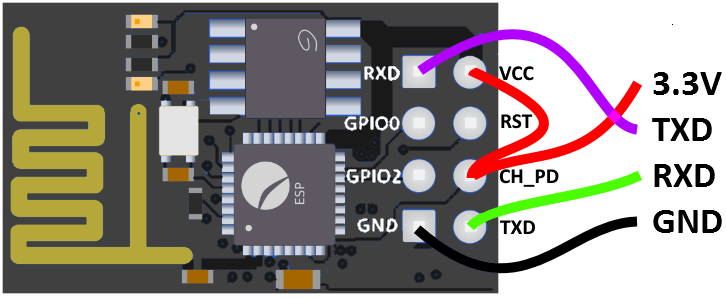

+++
showonlyimage = false
draft = false
image = "img/ESP8266_ESP-01S.jpg"
date = "2020-07-25"
title = "ESP8266 ESP-01(S) NodeMCU Firmware"
writer = "Martin Strohmayer"
categories = ["uC", "Raspberry Pi"]
keywords = ["WiFi", "WLAN", "IoT", "ESP8266", "ESP-01", "ESP-01S", "Firmware", "NodeMCU", "lua", "Mikrocontroller"]
weight = 1
+++

Das kleine Experimentierboard ESP-01(S) mit dem ESP8266 Mikrocontroller kann man recht einfach mit der NodeMCU Firmware ausstatten. Dann kann der Mikrocontroller mit Lua programmiert werden. Mit dem  Raspberry Pi kann die neue Firmware übertragen und programmiert werden.
<!--more-->

## Beschreibung ##

NodeMCU ist eine eigene Firmware die es möglich macht, den ESP8266 mit Lua programmieren zu können. Dabei werden keine Binärprogramme erzeugt, sondern der Source-Code wird direkt auf das System übertragen. Der Lua Code ist dann permanent gespeichert und wird direkt vom Mikrocontroller ausgeführt.  
Nicht verwechseln sollte man die Firmware mit dem NodeMCU Hardware Board. Es ist eine ESP8266 Platine mit USB Schnittstelle für Kommunikation und Stromversorgung sowie einem Reset-Taster.  
Hier wird dagegen das kleinste ESP-01(S) Board verwendet, auf dem die NodeMCU Firmware problemlos installiert und verwendet werden kann. 

 
 

## Anschluss ##

Die ESP-01(S) Platine kann über den UART-Anschluss mit dem Raspberry Pi verbunden werden. 
Die Versorgung erfolgt über den 3,3 V und den GND Anschluss.

 

Um später ein Firmware Update ausführen zu können, muss der GPIO0 Eingang des ESP auf GND gesetzt werden. 

## Firmware Update


### esptool

Zuerst muss man das Python 3 Programm "esptool" installieren. Später benötigen wir auch noch das Programm "nodemcu-uploader" um Programmcode übertragen zu können.

```
sudo apt-get install python3 python3-pip
sudo pip3 install esptool nodemcu-uploader -t /usr/local/lib/python3.7/dist-packages
alias esptool.py='python3 /usr/local/lib/python3.7/dist-packages/esptool.py'
alias nodemcu-uploader.py='python3 /usr/local/lib/python3.7/dist-packages/nodemcu-uploader.py'

alias sudo='sudo '
sudo esptool.py version
```

```
esptool.py v2.8
2.8
```

### NodeMCU Firmware 

Nun wird die NodeMCU Firmware benötigt. Sie kann auf der Internetseite [NodeMCU Cloud Build](https://nodemcu-build.com/) an die Bedürfnisse angepasst und erstellt werden.  
Zuerst muss man seine E-Mail Adresse angeben. Dorthin wird später der Download-Link für die binäre Firmwaredatei geschickt. 
Bei 'Select branch to build from' wählt man die Version (Sourcecode) aus. Mit 'master' ist man hier auf dem neuesten Stand.  
Dann wählt man die Module aus die benötigt werden. Je mehr man auswählt, desto größer wird die Firmware. Ein paar sind bereits vorausgewählt, je nach Anforderung könnte man z. B. Buse (I2C, SPI) , Sensoren (DHT, BME) oder sonsiges hinzufügen. "Miscellaneous options"  werden nicht benötigt und brauchen nicht aktiviert werden.  
Nachdem man die Schaltfläche "Start your build" gedrückt hat, wird die Firmware erzeugt und per Mail ein Download-Link verschickt. Das kann ein paar Minuten dauern. Dann stehen zwei Versionen zur Verfügung, integer und float. integer kann nur ganzzahlige Berechnung und float kann mit Flieskommazahlen umgehen. Die integer Version is zu bevorzugen weil sie wesentlich schneller ist, Flieskommazahlen machen nur bei speziellen Anforderungen Sinn.


### Update durchführen


Nun muss GPIO0 auf GND gesetzt werden um den Programmiermodus zu setzen. Danach muss der ESP-01 aus- und angesteckt oder ein Reset ausgelöst werden. Ein Reset kann erreicht werden, indem man kurzzeitig den RST-Anschluss auf GND setzt.  
*Verwendet man den GC2-xHAT, so kann der Programmiermodus mit den Befehlen "esppoweron" und "espflashingon" aktiviert werden.*  
Dann ist der Programmiermodus aktiv und folgende Befehle können ausgeführt werden.

```
sudo esptool.py -p /dev/ttyAMA0 flash_id 
```

```
esptool.py v2.8
Serial port /dev/ttyAMA0
Connecting....
Detecting chip type... ESP8266
Chip is ESP8266EX
Features: WiFi
Crystal is 26MHz
MAC: 60:01:94:18:90:e6
Uploading stub...
Running stub...
Stub running...
Manufacturer: ef
Device: 4014
Detected flash size: 1MB
Hard resetting via RTS pin...
```

Da nach dem Befehl ein Reset geschieht, muss man möglicherweise nochmal in den Programmieremodus wechseln.   
*Verwendet man den GC2-xHAT, so kann der Programmiermodus nochmal mit dem Befehl "espflashingon" aktiviert werden.*  

Dann kann die Firmware übertragen werden. Die Firmware-Datei wird als letzter Parameter übergeben und muss zuvor entsprechend angepasst werden. 
```
sudo esptool.py -p /dev/ttyAMA0 erase_flash
sudo esptool.py -p /dev/ttyAMA0 write_flash 0x00000 nodemcu-master-13-modules-2020-07-22-10-30-13-integer.bin
```

## Lua Testprogramm

Nun muss beim GPIO0 die GND Verbindung entfernt werden. Danach muss der ESP-01(S) aus- und angesteckt oder ein Reset ausgelöst werden. Der Reset kann wieder durch kurzzeitige setzen des RST-Anschlusses auf GND erfolgen.  
*Verwendet man den GC2-xHAT, so kann der Programmiermodus mit dem Befehl "espflashingoff" deaktiviert werden.*  
Dann ist der Programmiermodus inaktiv und die Lua-Konsole sollte gestartet sein.

```
sudo screen /dev/ttyAMA0 115200
```

Nach einem Reset (*GC2-xHAT: espreset*) oder Neustart wird die NodeMCU Softwareversion ausgegeben. Zusätzlich werden auch noch die verfügbaren Module und weitere Informationen ausgegeben. 

```
NodeMCU 3.0.0.0 built on nodemcu-build.com provided by frightanic.com
        branch: master
        commit: 8d091c476edf6ae2977a5f2a74bf5824d07d6183
        release: 3.0-master_20200610
        release DTS: 202006092026
        SSL: false
        build type: integer
        LFS: 0x0 bytes total capacity
        modules: dht,file,gpio,i2c,net,node,pwm,tmr,uart,wifi,ws2801,ws2812,ws2812_effects
 build 2020-07-22 10:30 powered by Lua 5.1.4 on SDK 3.0.1-dev(fce080e)
cannot open init.lua:
```

Die GPIOs werden mit einer anderen I/O-Index-Nummer angesprochen als ihre Bezeichnung. Dabei gilt für GPIO0 Index 3 und GPIO2 Index 4. Eine komplette Liste ist auf der Seite [NodeMCU Pinout](https://nodemcu.readthedocs.io/en/master/modules/gpio/) verfügbar.  
Mit folgenden Befehlen kann man den Ausgang GPIO2 testweise setzen. Beim ESP-01S leuchtet die blaue LED wenn der Ausgang auf LOW steht. 

```
out=4
gpio.write(out, gpio.LOW)
gpio.write(out, gpio.HIGH)
```

*Verwendet man den GC2-xHAT, so kann man den Zusand des ESP GPIO0 (Index 3) auf dem Raspberry Pi GPIO12 (Eingang) sehen. Mit dem aufruf "watch -n 0.2 gpio readall" kann man den Status in einem eigenen Terminal überwachen*  

Ein ganzes Programm kann allerings auch ausgeführt werden. Dazu erzeugt man die Datei init.lua mit einem Beispielcode für eine Toggle-Funktion auf GPIO0. 
Achtung, bei zyklischen Ausgaben mit printf, sie verhindern, dass eine neue Datei übertragen wird. Im Notfall müsste man dann die NodeMCU Firmware nochmal neu einspielen. Im Beispiel wird deshalb darauf verzichtet.


```
out = 4 
print("toogle GPIO2")
gpio.mode(out, gpio.OUTPUT)
local initTimer = tmr.create()
initTimer:register(2000, tmr.ALARM_AUTO, function() 
 gpio.write(out, gpio.LOW)
 tmr.delay(1000000)
 gpio.write(out, gpio.HIGH)
 end
)
initTimer:start()
```

Am System läft lua 5.1, deshlab insallieren wir auch lokal die Version. Mit dem Python Programm "nodemcu-uploader" können Source-Dateien auf das ESP-System übertragen werden. Installieren werden die Programme mit folgenden Aufruf.
```
sudo apt-get install lua5.1
sudo pip2 install nodemcu-uploader
```

Zuerst kann der Sytax des Codes überprft werden. Dazu startet man den lua Kompiler mit der lua-Datei. Eventuelle Fehler können nun vor der Übertragung korrigiert werden.
 
```
luac init.lua
```

Zum Übertragen der Datei muss dann lediglich der Port und die Datei angegeben werden. Achtung, es darf keine Verbindung auf der seriellen Schnitstelle offen sein. Eventuell kann der Aufruf "sudo killall screen" hierfür sorgen.  
```
sudo nodemcu-uploader --port /dev/ttyAMA0 upload init.lua
```

```
opening port /dev/ttyAMA0 with 115200 baud
Preparing esp for transfer.
Transferring init.lua as init.lua
All done!
```

Nach einem Reset oder Neustart wird dann das Programm automatisch ausgeführt. Bei älteren ESP01-01 ohne S muss am GPIO2 eine LED angeschlossen werden, damit man den Zustand des Ausgangs sehen kann. 


*GC2-xHAT*:  
Verwendet man den GC2-xHAT mit dem ESP01 ohne S, kann man auch den ESP GPIO0 (Index 3) verwenden. Man kann den Zustand des Ausgangs nicht direkt sehen, er ist aber mit GPIO12 vom Raspberry Pi verbunden. Mit folgenden Python Programm kann man den Status des ESP GPIO0 auf die grüne LED übertragen.
 
```
from gpiozero import Button, LED
from signal import pause

led = LED(21)

def InputHigh():
    print(" high")
    led.on()

def InputLow():
    print(" low")
    led.off()

print("GPIO mapping 12 to 21")
Input = Button(12,pull_up=False)
Input.when_pressed = InputHigh
Input.when_released = InputLow

pause()
```


## Verlinkungen

[NodeMCU GPIO Zuordnung](https://nodemcu.readthedocs.io/en/master/modules/gpio/)

[NodeMCU Cloud Build](https://nodemcu-build.com/)

