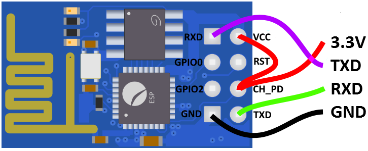

+++
showonlyimage = false
draft = false
image = "img/ESP8266_ESP-01.jpg"
date = "2018-12-20"
title = "ESP8266 ESP-01(S)"
writer = "Martin Strohmayer"
categories = ["uC", "Raspberry Pi"]
keywords = ["WiFi", "WLAN", "IoT", "ESP8266", "ESP-01", "ESP-01S"]
weight = 1
+++

Das kleinste Experimentierboard mit dem ESP8266 Mikrocontroller nennt sich ESP-01 bzw. ESP-01S. Es hat nur die nötigsten Anschlüsse und wird mit einer einfachen Firmware ausgeliefert. Perfekt für erste Experimente mit dem Raspberry Pi.
<!--more-->

## Beschreibung ##

Der ESP8266 ist ein kostengünstiger 32-Bit-Mikrocontroller der chinesischen Firma Espressif und ermöglicht durch sein integriertes WLAN viele einfache IoT Anwendungen.  
Der Mikrocontroller hat mehrere GPIOs die unter anderem SPI, I2C, UART, ADC, RTC und mehr unterstützen. Die Betriebsspannung beträgt 3,3 V, weshalb er sich auch gut mit dem Raspberry Pi kombinieren lässt.  
Es gibt in auf unterschiedlichen Experimentierboards zu kaufen. Die kleinste und günstigste Platine ist der ESP-01. Auf den 8 Kontakten sind ein UART (RX, TX, GND) und 2 GPIO Pins vorhanden.  
Über den UART kann mit der enthaltenen Firmware verschiedene Netzwerkfunktionen über WLAN genutzt werden. Unter der Rubrik Verlinkungen ist eine Dokument zu finden, dass den gesamten AT-Befehlssatz auflistet und beschreibt. 
 
 

Inzwischen gibt es eine aktualisierte Version mit der Bezeichnung ESP-01S. Diese hat gegenüber den alten Modulen folgende Unterschiede:

* Keine rote LED für die Versorgungsanzeige (weniger Verbrauch)
* Die blaue LED ist bei GPIO2 (Active Low) angeschlossen anstatt bei TX 
* Die Eingänge EN, RST und GPI0 sind bereits über einen Pull-up Widerstand (12 kOhm) auf 3,3 V gesetzt (RST auch bei schwarzer ESP01 Platine)
* 1 MBit Flash Speicher (Die blaue ESP-01 Platine hat nur 512 kBit, die schwarze ESP-01 Platine hatte allerdings ebenfalls 1 MBit Speicher) 
* Pins sind auf der Platine beschriftet
* Eine neuere Firmware ist vorinstalliert
* Wegen der neuen Firmware, ist der schnellere QIO SPI-Modus mit 80 % höherer Übertragungsgeschwindigkeit aktiv

Insgesamt bietet die ESP-01S Platine einige Vorteile, weshalb man sie bevorzugt erwerben sollte. Vor allem sind die Anschlüsse EN, RST und GPI0 bereits für den korrekten Betrieb vorkonfiguriert, sodass man nur die Versorgung (3,3 V und GND) und eventuell den UART anschließen muss.  
Von der alten blauen ESP01 Platine ist wegen des geringen Speichers (512 KB) generell abzuraten.

## Anschluss ##

Die ESP-01 Platine kann über den UART Anschluss mit dem Raspberry Pi verbunden werden. 
Die Versorgung erfolgt über den 3.3 V und GND Anschluss.

 

Um ein Firmware Update ausführen zu können, muss der GPIO0 Eingang auf GND gesetzt werden. Die kann man z. B. mit einem zusätzlichen Kabel erledigen. 


## Kommunikation ##

Um mit dem Raspberry Pi über den UART kommunizieren zu können, muss zunächst der serielle Terminal Dienst beendet werden.

```
sudo systemctl stop serial-getty@ttyAMA0.service
sudo systemctl status serial-getty@ttyAMA0.service
``` 

Danach kann ein serielles Kommunikationsprogramm wie z. B. Minicom installiert und gestartet werden.

```
sudo apt-get install minicom
sudo minicom -b 115200 -o -D /dev/ttyAMA0
```

Alternativ kann auch screen zur Kommunikation benutzt werden.
```
sudo screen /dev/ttyAMA0 115200
``` 

Bei beiden Programmen müssen alle Eingaben mit den Tasten Enter (CR-Zeichen) und Strg+J (LF-Zeichen) abgeschlossen werden. 


Als erstes kann man die Verbindung mit dem Befehl "AT" überprüfen (danach Enter und Strg+J nicht vergessen). Als Antwort muss "OK" zurückgeschickt werden.  
Sendet man den Reset Befehl "AT+RST" so wird ein Reset durchgeführt und Informationen über den Mikrocontroller ausgegeben. 

```
 ets Jan  8 2013,rst cause:2, boot mode:(3,6)

load 0x40100000, len 1396, room 16
tail 4
chksum 0x89
load 0x3ffe8000, len 776, room 4
tail 4
chksum 0xe8
load 0x3ffe8308, len 540, room 4
tail 8
chksum 0xc0
csum 0xc0

2nd boot version : 1.4(b1)
  SPI Speed      : 40MHz
  SPI Mode       : DIO
  SPI Flash Size & Map: 8Mbit(512KB+512KB)
jump to run user1 @ 1000

Ai-Thinker Technology Co.,Ltd.

ready
```

<!--
```
 ets Jan  8 2013,rst cause:2, boot mode:(3,6)

load 0x40100000, len 1856, room 16 
tail 0
chksum 0x63
load 0x3ffe8000, len 776, room 8 
tail 0
chksum 0x02
load 0x3ffe8310, len 552, room 8 
tail 0
chksum 0x79
csum 0x79

2nd boot version : 1.5
  SPI Speed      : 40MHz
  SPI Mode       : DIO
  SPI Flash Size & Map: 8Mbit(512KB+512KB)
jump to run user1 @ 1000

Ai-Thinker Technology Co. Ltd.

ready
```
-->

Der Befehl "AT+GMR" liest die Firmware Version aus.

```
AT version:0.40.0.0(Aug  8 2015 14:45:58)
SDK version:1.3.0
Ai-Thinker Technology Co.,Ltd.
Build:1.3.0.2 Sep 11 2015 11:48:04
OK
```

<!--
```
AT version:1.1.0.0(May 11 2016 18:09:56)
SDK version:1.5.4(baaeaebb)
Ai-Thinker Technology Co. Ltd.
Jun 13 2016 11:29:20
OK
```
-->

Der Befehl "AT+CWLAP" listet die gefundenen WLAN-Netze mit Zusatzinformationen auf.

```
+CWLAP:(3,"NETGEAR23",-86,"a0:63:91:ca:98:ca",6,-14)
+CWLAP:(4,"A1-XZY",-78,"a4:b1:e9:43:f4:d3",11,-41)
+CWLAP:(4,"Home",-92,"f4:06:8d:3b:e1:3c",11,-41)
+CWLAP:(3,"AndroidAP",-89,"10:a5:d0:73:de:eb",11,23)
```

Minicom beenden man indem man die Tasten Strg+A und dann X drückt. 
Zum Beenden von screen drückt man zuerst Strg+A und gibt dann ":quit" gefolgt von der Enter-Taste ein. 

## Verlinkungen

Datenblatt Englisch [ESP8266EX](https://www.espressif.com/sites/default/files/documentation/0a-esp8266ex_datasheet_en.pdf)

Firmware und Tools sind im NONOS SDK auf [Github](https://github.com/espressif/ESP8266_NONOS_SDK/releases) verfügbar.

Der [AT-Befehlssatz](https://www.espressif.com/sites/default/files/documentation/4a-esp8266_at_instruction_set_en.pdf) kann heruntergeladen werden.

Datenblatt Englisch [ESP-01/07/12 Version 1.1](http://wiki.ai-thinker.com/_media/esp8266/esp8266_series_modules_user_manual_v1.1.pdf)

Datenblatt Englisch [ESP-01S](https://ecksteinimg.de/Datasheet/Ai-thinker%20ESP-01%20EN.pdf)

Datenblatt Chinesisch [ESP-01S](https://www.electrodragon.com/w/images/a/ad/Esp-01s.pdf)


