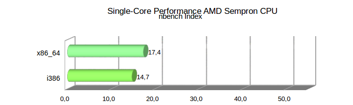
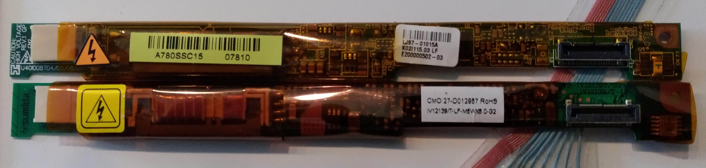

+++
showonlyimage = false
draft = false
image = "img/GC2-Laptop.jpg"
date = "2019-08-04"
title = "Dell Laptop upgrade"
writer = "Martin Strohmayer"
categories = ["GC2"]
keywords = ["Laptop", "GC2", "CPU", "Dell", "Latitude","120L", "131L", "D520", "D530", "D531", "BIOS"]
weight = 1
+++

Für die Raspberry Pi Jams haben wir uns uralte Dell Laptops besorgt. Teilweise könnten diese Laptops mit besseren Prozessoren ausgerüstet werden. Ein Vergleich der Prozessorleistung hilft die Leistungsfähigkeit einzuordnen.
<!--more-->

## Beschreibung ##

Um möglichst vielen TeilnehmerInnen die Möglichkeit zu geben an unseren Raspberry Pi Jam (Raspjamming) teilnehmen zu können wollten wir ein System zum Ausleihen anbieten.  
Möglich wären Tabletts, alte Laptops bzw. Netbooks oder Raspberry Laptops (Pi-Top) gewesen. Pi-Top hört sich gut an, ist aber weit außerhalb der Preisgrenze. Günstige Amazon Tabletts erschienen zuerst als günstigste Wahl. Allerdings mit dem Nachteil nicht aller Anwendungsfälle optimal abdecken zu können.  
Netbooks wären besser gewesen, diese hätten wir allerdings einzel gebraucht erwerben müssen. Das wäre wohl recht aufwendig gewesen. Die CPU-Leistung und Bildschirmauflösung (1024x600) wären nicht ganz optimal aber brauchbar.  
Dann hat sich allerdings ergeben, dass wir mehrere sehr alte Dell Laptops (ca. 2005) gebraucht kaufen konnten. Diese sind bei Firmen oft im Einsatz gewesen und dementsprechend auch robust gebaut. Die Laptops sind aus der Latitude Serie 120L, 131L, D520, D530, D531 usw..  

## Dell Laptitude ##

Leider sind bei mehreren Laptops nur Intel Pentium M Prozessoren verbaut. Diese sind zwar wesentlich schneller als Netbook Prozessoren (Intel Atom) aber sie besitzen ebenso nur einen einzigen 32-Bit Prozessorkern. Auch die AMD Sempron Prozessoren haben nur einen Kern aber unterstützen immerhin die 64-Bit Architektur.  
Die neuere Modell haben bereits einen Intel Core2 Duo Prozesser und damit einen Zweikernprozessor mit gesteigerter Leistung. Es werden fast ausschließlich SO-DIMMs DDR2-SDRAM verwendet. Dieser ist leicht und günstig zu bekommen, sodass wir überall mindestens 1,5 GB RAM einbauen konnten. Teilweise besitzen die Modelle auch integrierte SD-Karten Lesegeräte, für die anderen können USB-Adapter bereitgestellt werden. Die Displays sind im 4:3 Format und haben die Auflösung 1280x800 oder 1400x1050, nur der D510 hat eine Auflösung von 1024x768. Als Festplatte kommen zumeist IDE-Platten mit min. 40 GB zu Einsatz.
Leider fehlten viel Netzteile, allerdings können die standardisierten Modelle PA-16 und PA-10 bzw. PA-12 auch heute noch leicht gebraucht und neu erworben werden.

## Betriebssystem ##

Als Betriebssystem wurde eine Distribution gesucht, das auf alten PCs gut läuft und somit wenig Ressourcen benötigt. Es sollte aber auch eine gut gewartete bekannte Distribution sein. Darum fielen die ganz spezifischen Distributionen (SparkyLinux) weg. 
Zum Schluss verglichen wir Lubuntu und Mint XFCE. 

Beim Booten waren die Systeme ziemlich gleich schnell aber was Fehlermeldungen und Hardwareuntertütztung anging, war Mint XFCE eindeutig das bessere System. Es werden die Architektur 32-Bit (i386) und 64-bit (x86_64) angeboten und damit auch die alten Intel Pentium M Prozessoren unterstützt, die noch keine 64-Bit Erweiterung besitzen. Wir entschlossen uns ausschließlich 32-Bit zu verwenden um ein einheitliches System zu haben. 

### Perfomance

Ein Performancevergleich von alten Systemen mit dem Titel [Ubuntu: 32-bit v. 64-bit Performance](https://www.phoronix.com/scan.php?page=article&item=616) von 2006 ist bei Phoronix verfügbar. Hier zeigt sich, dass sich der Leistungzuwachs bei 64-Bit kaum bemerkbar macht.  
Bei einem eigenen Testlauf mit dem AMD Sempron Einkernprozessor ist bei 7-zip und Firefox Java Script Benchmark [Octane](https://chromium.github.io/octane/) kaum eine Verbesserung festellbar. Allerdings zeigt das nbench Testprogramm eine gesteigerte Leistung von ca. 18 % (siehe Bild). 

 

Vergleicht man aber die neueren Intel Core 2 Duo Prozessoren, ändert sich das Bild. Ein Performancevergleich von 2009 mit dem Titel [Ubuntu 32-bit, 32-bit PAE, 64-bit Kernel Benchmarks](https://www.phoronix.com/scan.php?page=article&item=ubuntu_32_pae) ist bei Phoronix verfügbar. Hier werden wesentlich Performancevorteile bei 64-Bit festgestellt. Eine Vergleichsmessung unsererseits steht hier noch aus.
Die Entscheidung wegen der Pentium M Prozessoren auf ausschließlich 32-Bit zu setzen, muss überdacht werden. 

## CPU Umbau ##

Zuerst stellte sich die Frage ob man die Laptops sinnvoll und günstig mit besseren CPUs ausrüsten kann. Dazu muss man den Hersteller, Sockel und den Chipsatz analysieren.

### CPU Typ Intel (Sockel 479 / Sockel M)

Bei den [Intel Pentium M](https://de.wikipedia.org/wiki/Intel_Pentium_M) Prozessoren können leider keine neueren Prozessortypen eingesetzt werden. Nur innerhalb der Serie kann auf höher getaktete Modelle gewechselt werden. Im Latitide D510 ist ein 730 (1,6 GHz) und beim Latitide 120L ein 740 (1,73 GHz) Prozessoren verbaut. Das schnellste Modell ist der 780 mit 2,26 GHz, wobei dieser sehr teuer ist. Der zweitschnellste ist der 770 mit 2,13 GHz, er kostet gebraucht ca. 6 Euro. Trotz 30 % Mehrleistung wird die selbe TDP von 27 Watt angeben. 

Bei den neuer Intel Prozessoren der [Core Duo](https://de.wikipedia.org/wiki/Intel_Core_Duo)
und [Core 2 Duo](https://de.wikipedia.org/wiki/Intel_Core_2) Serie kommt es vorallen auf dem verwendeten Chipsatz an welche Prozessoren man einsetzen kann. Prinzibell können Core Duo durch Core 2 Duo ersetzt werden, was viel Spielraum beim Upgrade ermöglicht. 
Beim Latitide D520 wird ein 945 Chipsatz von Intel verwendet. Auf der Internet Seite [Intel 945GM Express chipset processor support](http://www.cpu-upgrade.com/mb-Intel_(chipsets)/945GM_Express.html) wird eine Tabelle mit möglichen Prozessoren angezeigt. Ob wirklich nur diese eingesetzt werden können, ist nicht sicher aber zumindest eine Anhaltspunkt. Als Topmodell wird der T7600 mit 2,33 GHz Taktfrequnez und 4 MB Cache angeben. Dieser ist aber natürlich vergleichsweise teuer. Darum haben wir uns für den günstigen T7200 mit 2,0 GHz bzw. T7250 (nur 2 MB Cache) entschieden.

Beim Latitide D530 wird ein 965 Chipsatz von Intel verwendet. Auf der Internet Seite [Intel GM965 Express chipset processor support](http://www.cpu-upgrade.com/mb-Intel_(chipsets)/GM965_Express.html) wird eine Tabelle mit möglichen Prozessoren angezeigt. Ob wirklich nur diese eingesetzt werden können, ist auch hier nicht sicher. Als Topmodell, fern der Extreme Edition, wird der T9500 mit 2,6 GHz Taktfrequnz und 6 MB Cache angeben. Dieser ist aber wieder sehr teuer. Darum haben wir uns für den günstigen T8300 mit 2,4 GHz und 4 MB Cache entschieden.
Insgesamt wurde zumindest eine um 20 % hohere Taktrate bei weniger als 4 Euro Kosten angestrebt. Beim Wechsel von Core Duo auf Core 2 Duo ist allerings aufgrund des besseren Single-Core Performance bereits eine Verbesserung vorhanden.  
Bei Latitide D520 und D530 stehen die Update allerdings noch aus, daher kann nicht garantiert werden das die gewählten Prozessoren auch wirklich unterstützt werden. 

### CPU Typ AMD (Socket-1)

Bei den Modellen mit [AMD Mobile Sempron](https://de.wikipedia.org/wiki/AMD_Mobile_Sempron) Prozessor mit S1-Sockel, kann auf die Zweikernprozessoren [AMD Turion 64 X2](https://de.wikipedia.org/wiki/AMD_Turion_64_X2) aufgerüstet werden. Der Laptop D531 wurde bereits damals optional mit dem Prozessor TL-56 (1,8 GHz) angeboten. Die TDP liegt bei dem Modell je nach Revision bei 31 oder 33 Watt.  
Beim Upgrade haben wir uns für das Modell TL-58 (1,9 GHz, 60 nm) entschieden, da es sehr günstig mit nur 4 Euro zu bekommen ist und die TDP bei nur 31 Watt liegt. Den TL-60 Prozessor (2,0 GHz) gibt es in der Revision F2 (90 nm) mit 35 Watt und G1/G2 (60 nm) mit 31 Watt TDP. Ach diese Modell ist günstig zu bekommen wenngleich nicht sicher ist welche Variante man bekommt. Der schnellste Prozessor der Serie wäre der TL-68 (2,4 GHz, 60 nm) mit einer TDP von 35 Watt. Alle Modelle ab den TL-62 sind leider teuer, besonders das Topmodell.  
Eine Aufrüstung auf die neuere [AMD Turion X2 (Ultra)](https://de.wikipedia.org/wiki/AMD_Turion_X2)(z. B. RM-70 oder ZM-80) Generation ist leider nicht möglich. Sie benutzen den neueren S1-Sockel in der zweiten Generation (s1g2) der eine andere Pinbelegung benötigt.  

### BIOS update ##

Im Zuge des CPU Umbaus sollte man auch das BIOS des Laptops auf aktuellen Stand bringen. Hier war fast duchweges eine veraltete Version auf den Systemen zu finden. Beim Latitude D531 war sogar die erste Version A00 von 2007 installiert. Zum Download beim [Dell-Support](https://www.dell.com/support/home/at/de/atdhs1/) stehen die Versionen A10 von 2011 und A12 von 2013 zur Verfügung. Welche Änderungen das Update bringt, kann man aufgrunde der fehlenen Angabe nur erahnen. Bei Version A10 ist angegeben "Enhanced support for AMD Power Now" und bei A12 "Enhance System Security". Mehr Informationen inbesonders eine komplette Change History wird nicht bereitgestellt.  
Für den Aktualiserungsvorgang wurde ein FreeDOS USB-Bootstick erstellt. Leider hat der mit UNetbootin unter Linux erstellte USB-Stick nicht gebootet. Der mit Rufus unter Windows erzeugte, hat anstandslos gebootet. Hierzu musst man am Anfang die F12-Taste drücken, um ins Boot-Menü zu gelangen. Dann kann USB-Device als Bootmedium gewählt werden.  
Auf den USB-Stick wurden zuvor noch die aktuellsten BIOS Dateien von allen Systemen kopiert. Beim Latitude D531 heißt die BIOS Update Datei "D531_A12.exe". Diese kann unter DOS ausgeführt werden und damit wurde der Aktualiserungsvorgang ohne Rückfrage gestartet. Beim manchen Systemen wie D510 muss man noch eine beliebige Taste und die englische Y-Taste (also Z-Taste) drücken. Nach einer längeren Zeit zumeist ohne Rückmeldung, startet der Laptop automatisch neu mit dem aktualisieren BIOS. Der Ablauf war im Großen und Ganzen bei den unterschiedlichen Laptopserien gleich, nur die jeweilige BIOS-Datei hat einen eigenen Namen. 

### Umbau

Die Durchführung des Umbaus der CPU beim D531, lief ohne Probleme. Es muss hierzu lediglich die Abdeckung oberhalb der Tastatur hochgehoben werden. Dann kann die Tastatur abgeschraubt und entfernt werden. Dann müssen die Antennenleitungen von WLAN-Modul abgesteckt werden. Danach kann der Kühlkörper abgeschraubt und herausgehoben werden. Es zeigte sich auch, dass die CPU-Kühlkörper und Lüfter dringend einer Reinigung bedurften. Am CPU-Sockel ist eine Schlitzschraube die 
um 90° gedreht werden muss. Dann kann die CPU ausgetauscht werden und allers wieder zusammengebaut werden.

  
### Performance 

Der Wechsel von AMD Einkern- auf Zweikern-Prozessor bringt natürlich einen deutlichen Leistungsschub, die Singlecore-Leistung profitiert aber kaum vom Wechsel.
Wird innerhalb der gleichen Serie aufgerüstet, steigt die Leistung linear mit der Taktrate. Beim Wechsel von Intel Core auf Intel Core 2 bringt der Wechsel ca. 17 % wie man beim Vergleich T2300 zu T5500 sehen kann.  
Als Vergleich wurde mit dem alten [nbench](https://www.math.utah.edu/~mayer/linux/bmark.html) Benchmark Programm alle CPUs vermessen und in einem Diagramm dargestellt. Als Referenz wurde in Grau ein Intel Atom N280 Prozessor und ein i5-M450 sowie ein aktuellerer i7-4600U Prozessor (amd64 Architektur) hinzugefügt. Auch die Performancewerte der Raspberry Pi Zero und 3+ sind als Vergleich im Diagramm (armhf Architektur) enthalten. Im Diagramm wurden Einkern-Prozessoren in helleren Farben dargestellt.

## Display Reparatur ##

Bei einem D531 Latitude Laptop funktionierte die Hintergrundbeleuchtung des Displays nicht. Es war zu erkennen, dass die Anzeige funktionierte, aber eben extrem dunkel. Auf Verdacht wurde dann die Versorgungsplatine (Dell LCD Inverter Board LJ97-01015A) getauscht. Das entsprechende Modul konnte um ca. 7 Euro nachbestellt werden. Es wurde dann zwar nicht exakt die gleiche Platine geliefert (siehe Bild unten), dennoch hat nach dem Umbau das Display wieder funktioniert. 

