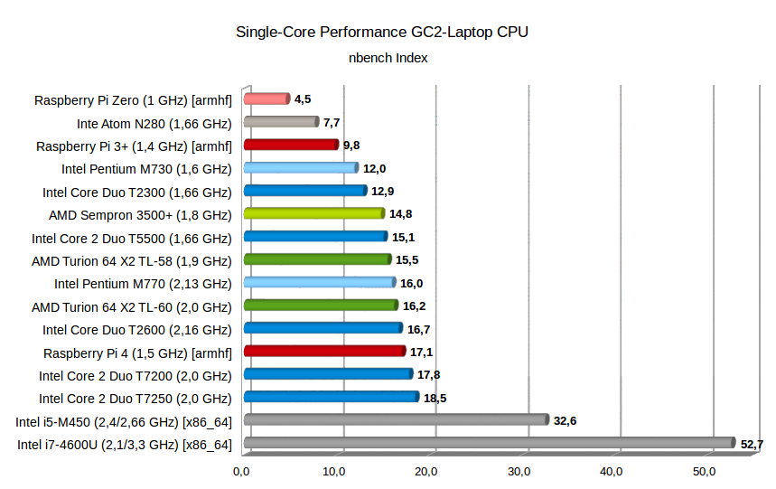

+++
showonlyimage = false
draft = false
image = "img/GC2-Laptop.jpg"
date = "2019-08-04"
title = "Dell Laptop CPU upgrade"
writer = "Martin Strohmayer"
categories = ["GC2"]
keywords = ["Laptop", "GC2", "CPU"]
weight = 1
+++

Für die Raspberry Pi Jams haben wir uns uralte Dell Laptops besorgt. Teilweise könnten diese Laptops mit besseren Prozessoren ausgerüstet werden. Ein Vergleich der Prozessorleistung hilft die Leistungsfähigkeit einzuordnen.
<!--more-->

## Beschreibung ##

Um möglichst vielen TeilnehmerInnen die Möglichkeit zu geben an unseren Raspberry Pi Jam (Raspjamming) teilnehmen zu können wollten wir ein System zum Ausleihen anbieten.  
Möglich wären Tabletts, alte Laptops bzw. Netbooks oder Raspberry Laptops (Pi-Top) gewesen. Pi-Top hört sich gut an, ist aber weit außerhalb der Preisgrenze. Günstige Amazon Tabletts erschienen zuerst als günstigste Wahl. Allerdings mit dem Nachteil nicht aller Anwendungsfälle optimal abdecken zu können.  
Netbooks wären besser gewesen, diese hätten wir allerdings einzel gebraucht erwerben müssen. Das wäre wohl recht aufwendig gewesen. Die CPU-Leistung und Bildschirmauflösung (1024x600) wären nicht ganz optimal aber brauchbar.  
Dann hat sich allerdings ergeben, dass wir mehrere sehr alte Dell Laptops (ca. 2005) gebraucht kaufen konnten. Diese sind bei Firmen oft im Einsatz gewesen und dementsprechend auch robust gebaut. Die Laptops sind aus der Latitude Serie D120L, D131L, D520, D531 usw..  

## Dell Laptitude ##

Leider sind bei mehreren Laptops nur Intel Pentium M Prozessoren verbaut. Diese sind zwar wesentlich schneller als Netbook Prozessoren (Intel Atom) aber sie besitzen ebenso nur einen einzigen 32-Bit Prozessorkern. Auch die AMD Sempron Prozessoren haben nur einen Kern aber unterstützen immerhin die 64-Bit Architektur.  
Die neuere Modell haben bereits einen Intel Core2 Duo Prozesser und damit einen Zweikernprozessor mit gesteigerter Leistung. Es werden fast ausschließlich SO-DIMMs DDR2-SDRAM verwendet. Dieser ist leicht und günstig zu bekommen, sodass wir überall mindestens 1,5 GB RAM einbauen konnten. Teilweise besitzen die Modelle auch integrierte SD-Karten Lesegeräte, für die anderen können USB-Adapter bereitgestellt werden. Die Displays sind im 4:3 Format und haben die Auflösung 1280x800 oder 1400x1050, nur der D510 hat eine Auflösung von 1024x768. Als Festplatte kommen zumeist IDE-Platten mit min. 40 zu Einsatz.
Leider fehlten viel Netzteile, allerdings können die standardisierten Modelle PA-16 und PA-10/12 auch heute noch leicht gebraucht und neu erworben werden.

## Betriebssystem ##

Als Betriebssystem wurde eine Distribution gesucht, das auf alten PCs gut läuft und somit wenig Ressourcen benötigt. Es sollte aber auch eine gut gewartete bekannte Distribution sein. Darum fiele die ganz spezifischen Distributionen (SparkyLinux) weg. 
Zum Schluss verglichen wir Lubuntu und Mint XFCE. 

Beim Booten waren die Systeme ziemlich gleich schnell aber was Fehlermeldungen und Hardwareuntertütztung anging, war Mint XFCE eindeutig das bessere System. Es werden die Architektur i386 und amd64 angeboten und damit auch die alten Intel Pentium M Prozessoren unterstützt.
Wir entschlossen uns ausschließlich i386 zu verwenden um ein einheitliches System zu haben. 

## CPU Umbau ##

Nun stellte sich die Frage ob man die Laptops sinnvoll und günstig mit besseren CPUs ausrüsten kann.  
Bei den [Intel Pentium M](https://de.wikipedia.org/wiki/Intel_Pentium_M) Prozessoren könnten leider keine neueren Prozessortypen eingesetzt werden. Nur innerhalb der Serie kann auf höher getaktete Modelle gewechselt werden. Zumeist waren 730 (1,6 GHz) oder 740 (1,73 GHz) Prozessoren verbaut. Das schnellste Modell ist der 780 mit 2,26 GHz, wobei dieser sehr teuer ist. Der zweitschnellste ist der 770 mit 2,13 GHz, er kostet gebraucht ca. 6 Euro. Trotz 30 % Mehrleistung wird die selbe TDP von 27 Watt angeben. 

Bei den Modellen mit [AMD Mobile Sempron](https://de.wikipedia.org/wiki/AMD_Mobile_Sempron) Prozessor mit S1-Sockel, kann auf die Zweikernprozessoren [AMD Turion 64 X2](https://de.wikipedia.org/wiki/AMD_Turion_64_X2) aufgerüstet werden. Der Laptop wurde bereits damals optional mit dem Prozessor TL-56 (1,8 GHz) angeboten. Die TDP liegt bei dem Modell je nach Revision bei 31 oder 33 Watt.  
Beim Upgrade haben wir uns für das Modell TL-58 (1,9 GHz, 60 nm) entschieden, da es sehr günstig mit nur 4 Euro zu bekommen ist und die TDP bei nur 31 Watt liegt. Den TL-60 Prozessor (2,0 GHz) gibt es in der Revision F2 (90 nm) mit 35 Watt und G1/G2 (60 nm) mit 31 Watt TDP. Beim gebraucht Kauf ist leider nicht sicher welche Variante man bekommt. Der schnellste Prozessor der Serie wäre der TL-68 (2,4 GHz, 60 nm) mit einer TDP von 35 Watt. Alle Modelle über den TL-62
ist leider sehr teuer, besonders das Topmodell.  
Eine Aufrüstung auf die neuere [AMD Turion X2 (Ultra)](https://de.wikipedia.org/wiki/AMD_Turion_X2)(z. B. RM-70 oder ZM-80) Generation ist leider nicht möglich. Sie benutzen den neueren S1-Sockel Generation 2 (s1g2) der eine andere Pinbelegung benötigt.   
Die Durchführung des Umbaus der CPU, lief ohne Probleme. Es muss hierzu lediglich die Tastatur auf der Oberseite entfernt werden. Es zeigte sich auch, dass die CPU-Kühlkörper und Lüfter dringend einer Reinigung bedurften. 

  
## CPU Performance ##

Der Wechsel von Einkern- auf Zweikern-Prozessor bringt natürlich einen deutlichen Leistungsschub, die Singlecore-Leistung profitiert aber kaum vom Wechsel.
Wird innerhalb der Serie aufgerüstet steigt die Leistung linear mit der Taktrate.  
Als Vergleich wurde mit dem alten [nbench](https://www.math.utah.edu/~mayer/linux/bmark.html) Benchmark Programm alle CPUs vermessen und in einem Diagramm dargestellt. Als Referenz wurde in Grau ein Intel Atom N280 Prozessor und ein aktuellerer i7-4600U Prozessor (amd64 Architektur) hinzugefügt. Auch die Performancewerte der Raspberry Pi Zero und 3+ sind als Vergleich im Diagramm (armhf Architektur) enthalten. Die hellrot und hellgrünen Prozessoren sind Einkern-Prozessoren.

## Display Reparatur ##

Bei einem D531 Latitude Laptop funktionierte die Hintergrundbeleuchtung des Displays nicht. Es war zu erkennen, dass die Anzeige funktionierte, aber eben extrem dunkel. Auf Verdacht wurde dann die Versorgungsplatine (Dell LCD Inverter Board LJ97-01015A) getauscht. Das entsprechende Modul konnte um ca. 7 Euro nachbestellt werden. Es wurde dann zwar nicht exakt die gleiche Platine geliefert (siehe Bild unten), dennoch hat nach dem Umbau das Display wieder funktioniert. 

