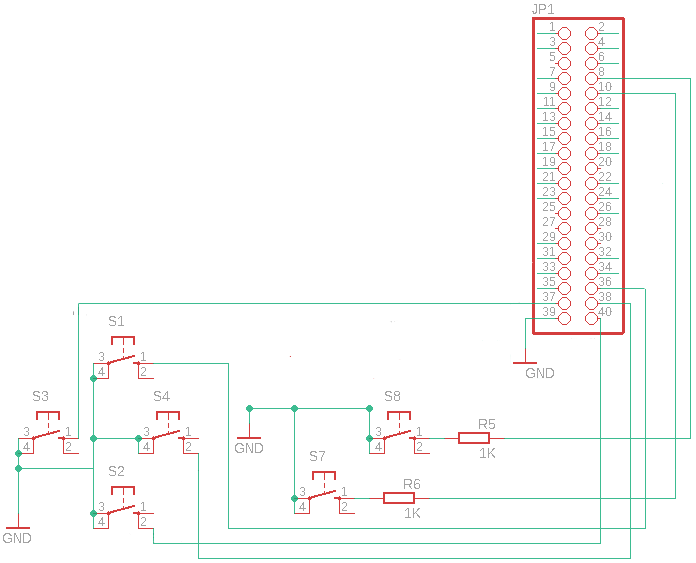

+++
showonlyimage = false
draft = false
image = "img/GPIO-Input-Mouse.jpg"
date = "2020-02-14"
title = " GPIO-Eingang zur Maus Emulation"
writer = "Martin Strohmayer"
categories = ["Raspberry Pi", "Programmierung"]
keywords = ["GPIO", "maus", "uinput", "scummvm", "Point-and-Click-Adventure", "C"]
weight = 1
+++


Die Anforderung, dass man mit GPIO-Eingängen eine virtuelle Maus am System erstellt, ist mit dem Raspberry Pi sehr einfach umzusetzen. Ein paar GPIOs und ein paar Zeilen C-Code reichen. 
<!--more-->


## Aufgabe

Es gibt verschiedene Game-HATs oder auch Gaming Gehäuse für den Raspberry Pi. Die werden zumeist für die Emulation von alten Konsolen wie Gameboy, NES, Mega Drive usw. verwendet. Was ist aber wenn man sie für Point-and-Click-Adventure oder alte DOS-Spiele benutzen will. Dann würde man eine Maus benötigen oder zumindest eine Maus Emulation. ScummVM kann den analogen Stick eines Joysticks oder Joypads als Maus interpretieren. Dazu muss man in der Konfigurationsdatei "/home/pi/.config/scummvm/scummvm.ini" das Joypad mit dem Eintrag "joystick_num=0" hinzufügen. Was aber wenn man gar keinen analogen Stick bzw. Eingabemöglichkeit hat. Dann könnte man mit wenigen Codezeilen eine Mausemulation via GPO-Eingänge realisieren.   

   
## uinput Bibliothek

uinput ist ein Kernelmodul, mit dem Eingabegeräte aus dem Userspace emuliert werden können. Durch Schreiben auf das Gerät /dev/uinput kann ein Programm ein virtuelles Eingabegerät mit bestimmten Funktionen erstellen. Dieses Eingabegerät kann eine Tastatur, Maus oder Joypad bzw. Joystick sein.  
libsuinput ist eine einfache C-Bibliothek die den Zugriff auf uinput etwas erleichtert. Es ist kein Hexenwerk direkt ohne Bibliothek zu arbeiten, in dem Fall benutzen wir aber die Bibliothek umso den Programmieraufwand zu reduzieren.  
Zuerst muss die Library aus den Sourcecode erstellt und dann am System installiert werden. 

```
git clone https://github.com/tuomasjjrasanen/libsuinput.git
cd libsuinput
sudo apt-get install libtool
./autogen.sh
./configure && make 
sudo make install
sudo sh -c "echo /usr/local/lib > /etc/ld.so.conf.d/user.conf"
sudo ldconfig
```

<!--
Sichern:

```
cd /usr/local
tar -czvf ~/libsuinput.tar.gz lib/libsuinput* include/suinput.h
```

Auf neuem Zielsystem entpacken:
sudo tar -C /usr/local -xzvf libsuinput.tar.gz
-->


## GPIO Schaltplan 

Es werden mindestens 6 GPIO-Eingänge benötigt:  

* Rauf
* Runter 
* Links 
* Rechts
* Linke Maustaste
* Rechte Maustaste


 


## GPIO Maus   

Das Programm führt folgende Schritte aus:  

* Wiring Pi GPIO-Bibliothek initialisieren
* GPIO-Eingänge konfigurieren
* Maus Achsen und Tasten anlegen bzw. bekannt geben
* Bei entsprechenden GPIO-Eingang die Maus in X- oder Y-Richtung verschieben
* Bei entsprechenden GPIO-Eingang die Maustaste drücken


```C
#include <stdio.h>
#include <err.h>
#include <string.h>
#include <unistd.h>
#include <time.h>
#include <wiringPi.h>
#include <suinput.h>
#include <signal.h>
#include <stdlib.h>

const int GPIO_BTN_LEFT_CLICK=15;
const int GPIO_BTN_RIGHT_CLICK=14;
const int GPIO_BTN_UP=16;
const int GPIO_BTN_DOWN=21;
const int GPIO_BTN_LEFT=26;
const int GPIO_BTN_RIGHT=20;

static sig_atomic_t end = 0;
const int LED = 16;

static void sighandler(int signo) {
  end = 1;
}

int main(void) {
  struct sigaction sa;
  int GPIO_btns[] = {GPIO_BTN_LEFT_CLICK, GPIO_BTN_RIGHT_CLICK, GPIO_BTN_UP, GPIO_BTN_DOWN, GPIO_BTN_LEFT, GPIO_BTN_RIGHT};

  setbuf(stdout, NULL); // deactivate stdout buffering 
  printf("Raspberry Pi GPIO button mouse\n");
  if (wiringPiSetupGpio() == -1) { // Init with BCM GPIO numering
    perror("wiringPiSetup failed");
    exit(1);
  }
  //Buttons with internal pull-up, connected to GND by activation
  for (int count=0, end= sizeof(GPIO_btns)/sizeof(GPIO_btns[0]); count<end; count++) {
    pinMode(GPIO_btns[count], INPUT);
    pullUpDnControl(GPIO_btns[count], PUD_UP); 
  }

  memset(&sa, 0, sizeof(struct sigaction)); //Handling stop events, like ctrl+c 
  sa.sa_handler = sighandler;
  sigaction(SIGINT, &sa, NULL);
  sigaction(SIGQUIT,&sa, NULL);
  sigaction(SIGTERM,&sa, NULL); 
        
  int uinput_fd;
  int btns[] = {BTN_LEFT, BTN_RIGHT, BTN_MIDDLE};
  int rel_axes[] = {REL_X, REL_Y, REL_WHEEL};
  struct uinput_user_dev user_dev;

  memset(&user_dev, 0, sizeof(struct uinput_user_dev));
  strcpy(user_dev.name, "GPIO Mouse");
  uinput_fd = suinput_open();
  if (uinput_fd == -1) {
    err(1, "suinput_open");
  }
  /* Error handling is omitted to keep code as readible as possible. */
  for (int i = 0; i < 3; ++i) {
    suinput_enable_event(uinput_fd, EV_KEY, btns[i]);
  }
  for (int i = 0; i < 3; ++i) {
    suinput_enable_event(uinput_fd, EV_REL, rel_axes[i]);
  }
  suinput_create(uinput_fd, &user_dev);

  struct timespec sleeptime = {0, 60000000};
  while (!end) {
    if (LOW==digitalRead(GPIO_BTN_UP)) {
      suinput_emit(uinput_fd, EV_REL, REL_Y, -5);
    }
    if (LOW==digitalRead(GPIO_BTN_DOWN)) {
      suinput_emit(uinput_fd, EV_REL, REL_Y, 5);
    }
    if (LOW==digitalRead(GPIO_BTN_LEFT)) {
      suinput_emit(uinput_fd, EV_REL, REL_X, -5);
    }
    if (LOW==digitalRead(GPIO_BTN_RIGHT)) {
      suinput_emit(uinput_fd, EV_REL, REL_X, 5);
    }
    if (LOW==digitalRead(GPIO_BTN_LEFT_CLICK)) {
      suinput_emit_click(uinput_fd, BTN_LEFT);
    }
    if (LOW==digitalRead(GPIO_BTN_RIGHT_CLICK)) {
      suinput_emit_click(uinput_fd, BTN_RIGHT);
    }
    suinput_syn(uinput_fd);
    nanosleep(&sleeptime, NULL);
  }
  suinput_destroy(uinput_fd);
  return 0;
}
```

```
gcc -Wall -o gpiomouse gpiomouse.c -lsuinput -lwiringPi
sudo ./gpiomouse &
```

<!--
```
sudo LD_LIBRARY_PATH=/usr/local/lib/ ./gpiomouse
```
-->

Wenn der Fehler "suinput_open: No such device" ausgegeben wird, so ist das uinput Device nicht verfügbar. Dann kann mit "sudo modprobe uinput" das Kernel-Modul geladen werden.  


## Testen mit ScummVM Emulation

Testen kann man die Funktion mit dem Point-and-Click-Adventure Emulationsprogramm ScummVM.

```
sudo apt-get install scummvm lure-of-the-temptress
scummvm
```

Danach kann man "Spiel hinzufügen" drücken und den Pfad "/usr/share/scummvm/lure-of-the-temptress/de" angeben, um das Spiel "Lure of the Temptress (DOS/German)" im Menü zu erhalten. Mit einem Doppelklick auf den Namen kann man das Speil dann starten, sofern die GPIO-Maus funktioniert. 

## YouTube Video

[](https://www.youtube.com/watch?v=9YzMNbByE_w)

## Verlinkungen

[Libsuinput Library](https://github.com/tuomasjjrasanen/python-uinput/tree/master/libsuinput)


