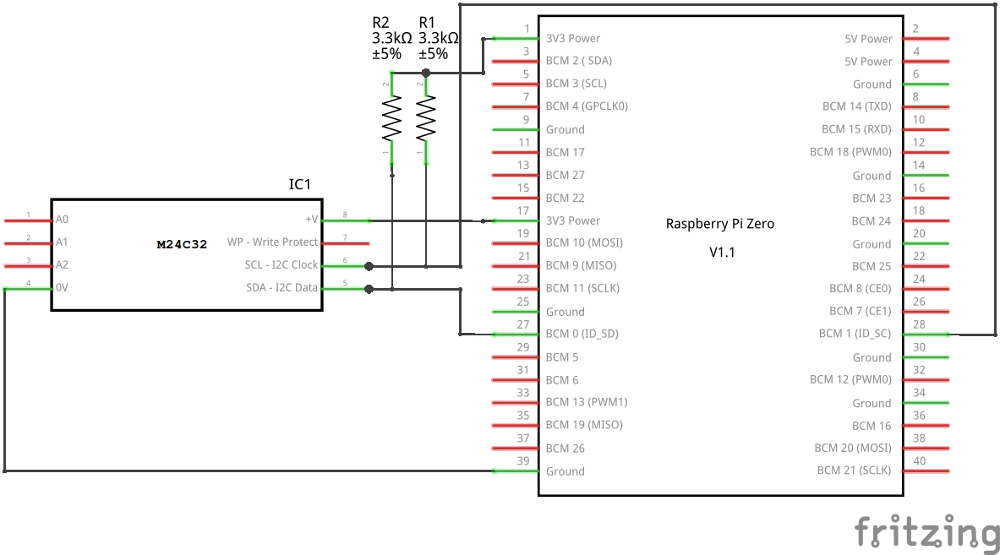

+++
showonlyimage = false
draft = false
image = "img/EEPROM.jpg"
date = "2019-03-03"
title = "HAT EEPROM anschließen und konfigurieren"
writer = "Martin Strohmayer"
categories = ["Raspberry Pi"]
keywords = ["EEPROM", "HAT", "24C32", "I2C0", "ID_SD", "ID_SC", "DNC"]
weight = 1
+++

Über die zwei Anschlüsse *ID_SD* und *ID_SC* auf der GPIO-Leiste des Raspberry Pi kann ein spezielles EEPROM angeschlossen werden. Damit können GPIO Einstellungen und Devicetree Konfigurationen automatisch beim Boot geladen werden. Diese Funktion wird zur Erkennung und Parametrierung von HATs (Aufsteckboards) verwendet.
<!--more-->

## Einleitung ##

Auf der 40-Pin GPIO-Leiste des Raspberry Pi befinden sich die Pins **ID_SD** (GPIO00) und **ID_SC** (GPIO01). Oft werden sie auch als DNC (do not connnect) bezeichnet, da sie nicht zum Anschluss von x-beliebiger Elektronik benutzt werden sollen. Sie gehören zum I2C0-Bus, der aber nur für einen Zweck vorgesehen ist. Man kann dort ein spezielles EEPROM anschließen, über das GPIO Einstellungen und Devicetree Konfigurationen automatisch beim Boot geladen werden. Dies soll vorallem zur Erkennung und Parametrierung von HATs (Hardware Attached on Top) also Aufsteckboards dienen.  
Für diese offiziellen HATs gelten einige Regeln und Vorgaben um zu gewährleisten das Standards eingehalten werden. Weitere Informationen dazu erhält man bei 
[ADD-ON BOARDS AND HATs](https://github.com/raspberrypi/hats).  
Diese Anleitung behandelt den Anschluss und die Speicherung der Daten des HAT EEPROMs. 

## EEPROM Anforderungen ##

* Typ 24Cxx
* 3,3 V Betriebsspannung
* 16-Bit Addressierung
* 8-Bit Daten
* 100 kHz I2C-Frequenz 

Das EEPROM muss vom Typ "24Cxx" sein, dann hat es eine I2C-Schnittstelle. Es muss eine 16-Addressierung haben und 8-Bit Daten verwenden. Kleinere EEPROMs (1 kBit oder 4 x 1 kBit, paged) haben oft nur eine 8-Bit Adressierung, siehe funktionieren nicht.  
Offiziell empfohlen wird das EEPROM "OnSemi CAT24C32" welches 32 kBit bzw. 4 kByte groß ist. Dies ist allerings nicht so leicht erhältlich, weshalb ich das EEPROM STMicroelectronics [M24C32](https://www.conrad.at/de/speicher-ic-stmicroelectronics-m24c32-rmn6tp-soic-8-eeprom-32-kbit-4-k-x-8-1186007.html) bzw.  [M24C64](https://www.conrad.at/de/speicher-ic-stmicroelectronics-m24c64-wmn6-so-8-eeprom-64-kbit-8-k-x-8-155494.html) empfehlen würde.


## Anschluss ##

Beim Anschluss ist darauf zu achten, dass die Pull-up Widerstände am I2C0-Bus fehlen. Hier wird empfohlen je 3,9 KOhm bei ID_SD (SDA) und ID_SC (SCL) gegen 3,3 V vorzusehen.  
Ein Eingang dient als Schreibschutz (WP - Write protect), wird dieser auf 3,3 V gelegt so kann das EEPROM nicht mehr beschrieben werden. Bleibt der Eingang offen, so ist der Schreibschutz nicht aktiv. Empfohlen wird diesen über einen Pullup-up Widerstand zu sperren und bei Bedarf über einen Jumper auf GND zu ziehen, um ihn programmieren zu können. Ich würde eher den umgekehrten Weg gehen und den Eingang offen lassen und bei Bedarf auf 3,3 V setzen.  
Die Addressleitungen A0-A2 bzw. E0-E2 müssen auf GND gelegt werden. Das kann man sich allerdings auch sparen, denn wenn man die Eingänge offen lässt, sind diese bereits auf GND gesetzt. 

 


## Erstellung ##

Zuerst muss der I2C0, der für den HAT EEPROM IC benutzt wird, aktiviert werden. Dazu trägt man folgende Zeile in die Datei "config.txt" auf der Boot-Partition ein.

```
dtparam=i2c_vc=on
```

Danach muss man neu starten.
Nun benötigt man die EEPROM Programme von Git-Hub. Folgende Befehle stellen diese Programme zur Verfügung.

```
cd ~
git clone https://github.com/raspberrypi/hats.git
cd hats/eepromutils
make
```


### Konfiguration ###


In der Datei "eeprom_settings.txt" kann man nun seine eigenen Einstellungen und HAT Kennungen parametrieren.

```
# 16 bit product id
product_id 0x6C20

# 16 bit product version
product_ver 0x0100

# ASCII vendor string  (max 255 characters)
vendor "Grazer Computer Club (Austria)"

# ASCII product string (max 255 characters)
product "GC2-xHAT (Raspjamming)"
```
Nun kann eine binäre Form der Konfigurationsdatei mit einem beliebigen Namen und der Endung "eep" erzeugt werden.

``` 
./eepmake eeprom_settings.txt GC2-xHAT.eep
```

Nun sollte man noch eine leere Datei mit der Größe des verwendeten EEPROM erzeugen. Damit kann man das EEPROM zuerst löschen. Bei einem 32 kBit EEPROM muss man eine 4 KByte Datei erzeugen. Man rechnet also die KiloBit Angabe am EEPROM durch 8, um auf die Größe in PC üblichen KiloByte zu kommen.

``` 
dd if=/dev/zero bs=4k count=1 of=blank.eep
ls -l *.eep
``` 

``` 
-rwr--r-- 1 pi pi 4096 Mär  2 16:11 blank.eep
-rw-r--r-- 1 pi pi  136 Mär  2 16:04 GC2-xHAT.eep
``` 
``` 
hexdump blank.eep
``` 

``` 
0000000 0000 0000 0000 0000 0000 0000 0000 0000
*
0001000
``` 


``` 
hexdump GC2-xHAT.eep
``` 

``` 
0000000 2d52 6950 0001 0002 0088 0000 0001 0000
0000010 004c 0000 1046 2881 bd24 9ea3 4ce4 2e7b
0000020 d99a c999 6c20 0100 161e 7247 7a61 7265
0000030 4320 6d6f 7570 6574 2072 6c43 6275 2820
0000040 7541 7473 6972 2961 4347 2d32 4878 5441
0000050 2820 6152 7073 616a 6d6d 6e69 2967 27e1
0000060 0002 0001 0020 0000 0000 0000 0000 0000
0000070 0000 0000 0000 0000 0000 0000 0000 0000
0000080 0000 0000 0000 6eed                    
0000088
``` 

Nun kann das EEPROM beschrieben werden, dazu wird zuerst der gesamte Speicher gelöscht (auf 0 gesetzt) und dann die Daten übertragen. 

``` 
sudo ./eepflash.sh -d=0 -t=24c32 -w -f=blank.eep
``` 

``` 
This will attempt to talk to an eeprom at i2c address 0xNOT_SET on bus 0. Make sure there is an eeprom at this address.
This script comes with ABSOLUTELY no warranty. Continue only if you know what you are doing.
Do you wish to continue? (yes/no): yes
Writing...
4096 Bytes (4,1 kB, 4,0 KiB) kopiert, 17,0786 s, 0,2 kB/s
8+0 Datensätze ein
8+0 Datensätze aus
4096 Bytes (4,1 kB, 4,0 KiB) kopiert, 17,079 s, 0,2 kB/s
Closing EEPROM Device.
Done.
``` 

``` 
sudo ./eepflash.sh -d=0 -t=24c32 -w -f=GC2-xHAT.eep
``` 

``` 
This will attempt to talk to an eeprom at i2c address 0xNOT_SET on bus 0. Make sure there is an eeprom at this address.
This script comes with ABSOLUTELY no warranty. Continue only if you know what you are doing.
Do you wish to continue? (yes/no): yes
Writing...
0+1 Datensätze ein
0+1 Datensätze aus
136 Bytes kopiert, 0,559799 s, 0,2 kB/s
Closing EEPROM Device.
Done.
``` 


[//]: # (sudo echo "24c32 0x50" > /sys/class/i2c-adapter/i2c-0/new_device)


Nun kann man den Raspberry Pi neu starten. Danach können die Kennungen ausgelesen werden. 


[//]: # (name  product  product_id  product_ver  uuid  vendor)

``` 
cat  /proc/device-tree/hat/*
``` 

``` 
hatGC2-xHAT (Raspjamming)0x6c200x0100c999d99a-2e7b-4ce4-9ea3-bd2428811046Grazer Computer Club (Austria)
``` 

### Devicetree ###

Es ist auch möglich eine Devicetree Konfiguration im EEPROM abzulegen. Man kann eine bestehende Devicetree Konfiguration verwenden oder einen neue erstellen.
Im Beispiel wird ein Blinklicht auf GPIO16 aktiviert und SD-Kartenzugriffe auf GPIO20. Dazu wird folgender Inhalt in der Datei led.dts erzeugt.

``` 
/dts-v1/;
/plugin/;

/ {
    compatible = "brcm,bcm2708";

    fragment@0 {
        target = <&leds>;
        __overlay__ {
            ledred: ledred {
                label = "LED16";
                gpios = <&gpio 16 0>;
                linux,default-trigger = "heartbeat";
            };
        };
    };

    fragment@1 {
        target = <&leds>;
        __overlay__ {
            ledorange: ledorange {
                label = "LED20";
                gpios = <&gpio 20 0>;
                linux,default-trigger = "mmc0";
            };
        };
    };
};
``` 

Nun wird der Devicetree-Source in eine binäre dtb bzw. dtbo-Datei übersetzt. Diese Datei wird bei der EEPROM-Datei Erzeugung als zusätzlicher Paranmeter  angehängt.

``` 
dtc -@ -I dts -O dtb -o led.dtbo led.dts
./eepmake eeprom_settings.txt GC2-xHAT-dt.eep led.dtbo
``` 

Die erhaltene Datei wird dann wieder auf das EEPROM geschrieben.

``` 
sudo ./eepflash.sh -d=0 -t=24c32 -w -f=GC2-xHAT-dt.eep
``` 

```
This will attempt to talk to an eeprom at i2c address 0xNOT_SET on bus 0. Make sure there is an eeprom at this address.
This script comes with ABSOLUTELY no warranty. Continue only if you know what you are doing.
Do you wish to continue? (yes/no): yes
Writing...
512 Bytes kopiert, 2,15489 s, 0,2 kB/s
1+1 Datensätze ein
1+1 Datensätze aus
967 Bytes kopiert, 3,97047 s, 0,2 kB/s
Closing EEPROM Device.
Done.
```

Wenn keine weiteren Änderungen am EEPROM durchgeführt werden, kann die Aktivierung des I2C0-Buses wieder aus der Datei "config.txt" entfernt werden.
 
```
#dtparam=i2c_vc=on
```

Nach einem Reboot müsste eine an GPIO16 angeschlossene LED (mit Vorwiderstand) blinken und eine LED an GPIO20 SD-Kartenzugriffe ersichtlich machen. 


## Verlinkungen

Spezifikationen für Aufsteckboards und [HATs](https://github.com/raspberrypi/hats)  
Raspberry Pi Forum [HOWTO: Raspi HAT EEPROM and device-tree](https://lb.raspberrypi.org/forums/viewtopic.php?t=108134)


## Beispielvideo ##

[](https://www.youtube.com/watch?v=1dkpccwG0sw)
