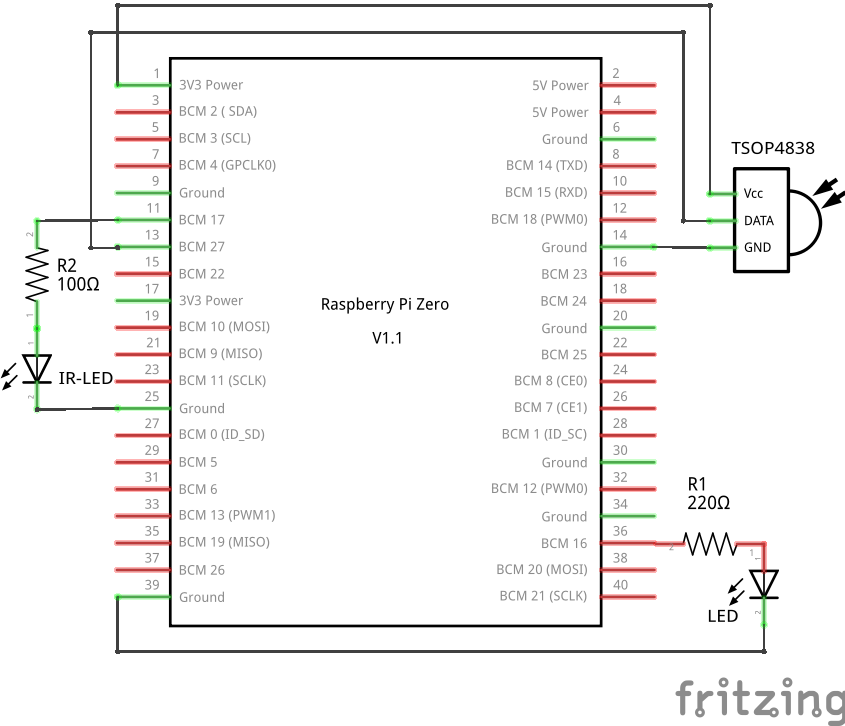
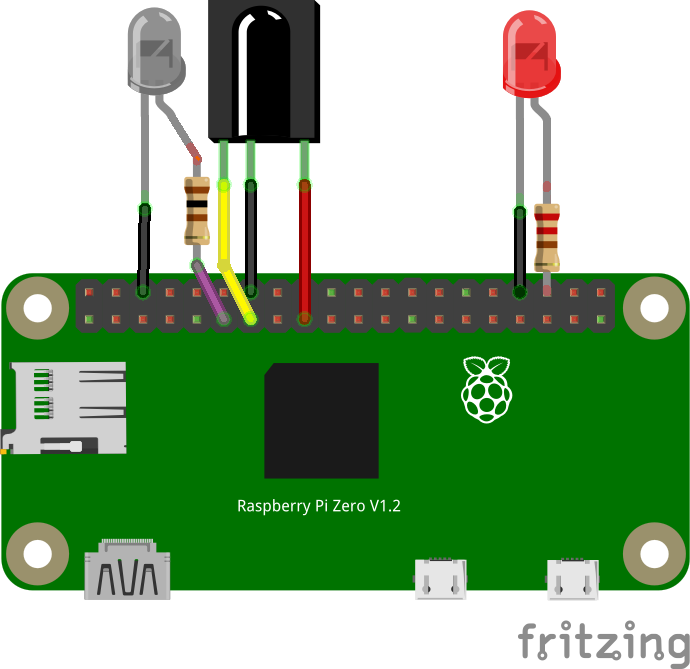

+++
showonlyimage = false
draft = false
image = "img/IR.jpg"
date = "2019-11-10"
title = "IR-Empfänger"
writer = "Martin Strohmayer"
categories = ["Raspberry Pi"]
keywords = ["IR", "infrarot", "GPIO"]
weight = 1
+++

Mit einem günstigen IR-Empfänger lässt sich über einen GPIO-Pin, Kommandos mit einer IR-Fernbedienung am Raspberry Pi auslösen. Nachdem der Kernel in Raspbian aktualisiert wurde, hat sich die Einbindung aber verkompliziert. Wie es richtig geht erfahrt man hier... 
<!--more-->

## Beschreibung ##

Über einen GPIO Pin lässt sich eine IR-Empfängerbauteil z.B. den Typ TSOP4838 ganz leicht an den Raspberry Pi anschließen. Zusätzliche Bauteile werden nicht benötigt. So lassen sich über eine IR-Fernbedienung Kommandos am System ausführen. Leider hat sich mit dem letzten 4er Kernel bei Raspbian Stretch und Buster einiges geändert, sodass viele Anleitungen im Internet nicht mehr funktionieren. Das neue Kernel-Modul benutzt nun ein anderes Protokoll wodurch der [LIRC - Linux Infrared Remote Control](http://www.lirc.org/) Dienst nun nicht mehr korrekt funktioniert. Es bedarf eines Patch (Softwareänderung) des LIRC Programms um den korrekten Betrieb zu gewährleisten.
 

## Anschluss ##

Der IR-Sensor TSOP4838 funktioniert mit 2,5 bis 5,5 V und kann somit direkt mit 3,3 V versorgt werden. Pin 3 (links) ist dabei die Versorgung VCC. An Pin 2 (mitte) wird GND angeschlossen. Der Signal-Ausgang ist dann auf Pin 1 (rechts), der direkt an einen frei wählbaren GPIO angeschlossen wird (z. B. GPIO18).  

 

 


## Installation ##

Es muss lediglich ein Devicetree Eintrag in der Konfigurationsdatei "config.txt" eingefügt werden, damit das entsprechende Kernelmodul geladen wird. Als Parameter wird der verwendetet GPIO angegeben.

```
# TSOP4838 IR-receiver at GPIO27
dtoverlay=gpio-ir,gpio_pin=27
```

Nach einem Neustart kann LIRC installiert werden.

```
sudo apt-get install lirc
```

Der Dienst startet allerdings nicht, da die Parametrierung fehlt. 


## Parametrierung ##


Zuerst sollte man überprüfen ob das Kernel Modul korrekt geladen wurde und damit das lirc-Device vorhanden ist. 
```
ls /dev/lirc* 
```
Als Ausgabe sollte man "/dev/lirc0" finden.  
Beispielkonfigurationen für LIRC wurden bereits abgelegt, müssen aber noch umbenannt bzw. umkopiert und modifiziert werden.

```
sudo cp /etc/lirc/lirc_options.conf.dist /etc/lirc/lirc_options.conf
sudo cp /etc/lirc/lircd.conf.dist /etc/lirc/lircd.conf
sudo mv /etc/lirc/lircd.conf.d/devinput.lircd.conf /etc/lirc/lircd.conf.d/devinput.lircd.dist
```
<!--
sudo cp irexec.lircrc.dist /home/pi/.lircrc
sudo cp /etc/lirc/irexec.lircrc.dist /etc/lirc/irexec.lircrc
-->

In der Datei "/etc/lirc/lirc_options.conf" müssen folgenden Zeile angepasst werden (Werte sind anders gesetzt).

```
    driver = default
    device = /dev/lirc0
```

```
sudo service lircd restart
```

Nun könnte man den IR-Empfänger bereits mit "mode2" und einer beliebigen Fernbedienung testen.

```
mode2
```

Bei einem Tastendruck werden Pulsdauer bzw. Pulspausen ausgegeben.  
Allerdings ist eine Programmierung oder Verwendung noch nicht möglich!


## LIRC-Dienst anpassen ##

Leider versteht der LIRC Dienst das Kernel Modul nicht korrekt und muss deshalb modifiziert werden.
Wie das Funktioniert wird im Raspberry Pi Forum im Beitrag [Using LIRC with kernel 4.19.X and gpio-ir](https://www.raspberrypi.org/forums/viewtopic.php?p=1438740&sid=1a1aa370b94e5b2f20158d64d1b0b254#p1438740) beschrieben.  

Folgend ist eine Anleitung für die Erzeugung der aktualisierten Pakete für das aktuelle Debian 10 (Buster) aufgeführt:

```
sudo su -c "grep '^deb ' /etc/apt/sources.list | sed 's/^deb/deb-src/g' > /etc/apt/sources.list.d/deb-src.list"
sudo apt update
sudo apt install devscripts

sudo apt install dh-exec doxygen expect libasound2-dev libftdi1-dev libsystemd-dev libudev-dev libusb-1.0-0-dev libusb-dev man2html-base portaudio19-dev socat xsltproc python3-yaml dh-python libx11-dev python3-dev python3-setuptools
mkdir build
cd build
apt source lirc
wget https://raw.githubusercontent.com/neuralassembly/raspi/master/lirc-gpio-ir-0.10.patch
patch -p0 -i lirc-gpio-ir-0.10.patch
cd lirc-0.10.1
debuild -uc -us -b
cd ..
```

Alternativ können sie auch von unserem GitHub Repository heruntergeladen werden.

```
wget https://github.com/GrazerComputerClub/Raspbian-Image-Generator/raw/master/stageA/02-install-packages/files/liblirc-client0_0.10.1-5.2_armhf.deb
wget https://github.com/GrazerComputerClub/Raspbian-Image-Generator/raw/master/stageA/02-install-packages/files/liblirc0_0.10.1-5.2_armhf.deb
wget https://github.com/GrazerComputerClub/Raspbian-Image-Generator/raw/master/stageA/02-install-packages/files/lirc_0.10.1-5.2_armhf.deb

``` 

Nachdem die Pakete bereitgestellt wurden, müssen sie noch installieren werden. 

```
sudo apt remove lirc liblirc0 liblirc-client0
sudo apt install ./liblirc0_0.10.1-5.2_armhf.deb ./liblirc-client0_0.10.1-5.2_armhf.deb ./lirc_0.10.1-5.2_armhf.deb 
```
Wenn nachgefragt wird wie mit den geänderten Konfigurationsdaten umgegangen werden soll, soll wählt man N für "Die momentan installierte Version beibehalten".  
Nun kann man noch zukünftige automatische Updates für die Pakete abschalten.
```
sudo apt-mark hold liblirc0 liblirc-client0 lirc
```

Bei unserer Raspjamming Distribution ab Version 10.11.2019 sind die modifizierten LIRC Pakete bereits vorinstalliert! 

## Fernbedienung anlernen und parametrieren  ##


In diesem Fall wird eine Fernbedienung für einen Holzbahnzug (Brio oder ähnliche Modelle) angelernt. Es gibt bei der Steuerung nur 4 Tasten. Vorwärts, Rückwerts, Licht und Hupe.  

```
sudo service lircd stop
sudo irrecord -H default --disable-namespace
```

"--disable-namespace" benötigt man, wenn man eigene Namen für Tasten vorgeben möchte.

* Press RETURN to continue. [<kbd>Enter</kbd>]
* Nun muss man ein paar Sekunden warten bei denen gemessen wird ob Störungen (z. B. von Leuchtstofflampen) auftreten. 
* Enter name of remote (only ascii, no spaces) :ZugB [<kbd>Enter</kbd>]
* Press RETURN now to start recording. [<kbd>Enter</kbd>]
* Nun muss man einige Tasten abwechselnd für 1 Sekunde drücken, bis eine Zeile mit Punkten voll ist
* Got gap (142596 us)}, Please keep on pressing buttons like described above.
* Nun muss man einige Tasten nochmal abwechselnd für 1 Sekunde drücken bis eine zweite Zeile mit Punkten voll ist
* Please enter the name for the next button (press ENTER to finish recording): UP_B[<kbd>Enter</kbd>]
* Taste auf der Fenbedingung drücken
* Please enter the name for the next button (press ENTER to finish recording): DOWN_B[<kbd>Enter</kbd>]
* Taste auf der Fenbedingung drücken
* Please enter the name for the next button (press ENTER to finish recording): LIGHT_B[<kbd>Enter</kbd>]
* Taste auf der Fenbedingung drücken
* Please enter the name for the next button (press ENTER to finish recording): SOUND_B[<kbd>Enter</kbd>]
* Taste auf der Fenbedingung drücken
* [<kbd>Enter</kbd>] drücken
* Checking for toggle bit mask. Press RETURN to continue.: [<kbd>Enter</kbd>]
* Nun muss eine Taste immer wieder gedrückt werden ohne, dass man auf der Taste bleibt.

Danach wird eine Konfigurationsdatei mit dem Namen "ZugB.lircd.conf ins" aktuelle Verszeichnis geschrieben.  
Die Datei sieht ungefähr so aus:

```
begin remote

  name  ZugB
  bits           16
  flags SPACE_ENC|CONST_LENGTH
  eps            30
  aeps          100

  header       3032   954
  one          2010   959
  zero         1026   959
  gap          142587
  toggle_bit_mask 0x3030
  frequency    38000

      begin codes
          UP_B                       0x916E
          DOWN_B                     0x8976
          SOUND_B                    0x837C 0x8683900
          LIGHT_B                    0x857A 0x8683900
      end codes

end remote
```

Nun muss sie in das LIRC Konfigurationsverzeichnis kopiert werden.

```
sudo cp ZugB.lircd.conf  /etc/lirc/lircd.conf.d/
service lircd restart
```

## Tasten einem Befehl zuordnen  ##

Nach dem Anlernen der Fernbedienung kann die irexec.lircrc Konfigurationsdatei erstellt werden, um Befehle mit dem Programm "irexec" ausführen zu können.
Eine Beispieldatei wurde bei der Installation mit dem Namen "/etc/lirc/irexec.lircrc.dist" angelegt.  
Durch das Anlegen folgender Befehle in der "/etc/lirc/irexec.lircrc" Konfigurationsdatei, wird anfänglich aber nur die Taste auf der Konsole ausgegeben. 
 

```
begin
    prog   = irexec
    button = UP_B
    config = echo "UP-B"
end

begin
    prog   = irexec
    button = DOWN_B
    config = echo "DOWN-B"
end

begin
    prog   = irexec
    button = SOUND_B
    config = echo "SOUND-B"
end

begin
    prog   = irexec
    button = LIGHT_B
    config = echo "LIGHT-B"
end
```

Für einen Testlauf muss das Programm mit der Konfigurationsdatei gestartet werden.

```
irexec  /etc/lirc/irexec.lircrc
```


Wenn das geht, kann eine Konfiguration als Hintergrunddienst erfolgen. Man könnte z. B. eine LED am GPIO schalten. Hierzu verwenden wir eine Low Power LED, die über den internen Pull-Up Widerstand von ca. 50 KOhm angesteuert wird. Hierzu bleibt der GPIO16 auf Eingang, wir schalten aber bei Eingang einmal den internen Pull Widerstand auf 3,3 V und GND. Die Low Power LEDs können auch bei dem geringen Strom von ca. 25 µA noch merklich leuchten. 

```
begin
    prog   = irexec
    button = UP_B
    config = gpio -g mode 16 up
end

begin
    prog   = irexec
    button = DOWN_B
    config = gpio -g mode 16 down
end
```

Wenn man den Dienst aktivieren und starten möchte, so muss man folgende Befehle eingeben (Service Datei: /lib/systemd/system/irexec.service):

```
sudo systemctl unmask irexec.service
sudo systemctl enable irexec.service
sudo service irexec start
```

## Beispielvideo ##

[](https://www.youtube.com/watch?v=15_rlINwO8A)


## Verlinkungen

Datenblatt [TSOP48..](https://produktinfo.conrad.com/datenblaetter/150000-174999/171115-da-01-en-IR_EMPFAENGER_MODUL_TSOP_4838__VIS.pdf)  
Raspberry Pi Forum [Using LIRC with kernel 4.19.X and gpio-ir](https://www.raspberrypi.org/forums/viewtopic.php?p=1438740&sid=1a1aa370b94e5b2f20158d64d1b0b254#p1438740)
