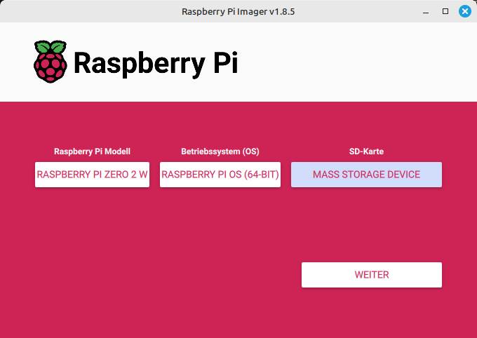
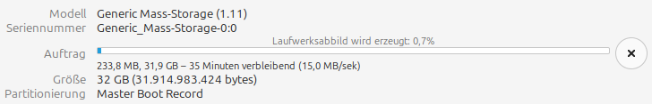
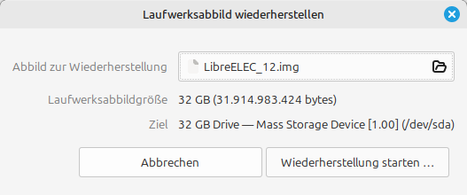

+++
showonlyimage = false
draft = false
image = "img/Imager.png"
date = "2025-08-24"
title = "SD-Karte lesen und schreiben"
writer = "Martin Strohmayer"
categories = ["Raspberry Pi"]
keywords = ["Imager", "Image", "SD", "USB", "OS", "USBImage", "Gnome-disk-utility"]
weight = 1
+++

Raspberry Pi Betriebsysteme auf eine SD-Karte zu bringen hierfür gibt es inzwischen einige Programme, aber das Erzeugen von Images von einer SD-Karte können viele nicht ... 
<!--more-->

## Beschreibung 

Lange Zeit hatte es keine einfachen Werkzeuge zum Beschreiben einer SD-Karte unter Linux gegeben. So ein Programm wird benötigt um das Raspberry Pi OS bzw. Betriebssystem Image auf die SD-Karte zu bringen. Anfänglich musste man das Konsolenprogramm dd verwenden, das für Anfänger einfach zu viele Gefahren birgt. Danach kam das Programm etcher, dass den Vorgang wesentlich sicherer und einfacher machte. Das Programm selbst enthält aber Werbung, ist riesig (> 100MB) und muss als eigenständiges Programm heruntergeladen und ausgeführt werden. Zum glück gibt es inzwischen auch andere Programme.

### Raspberry Pi Imager

 

Inzwischen gibt es das Programm **Raspberry Pi Imager** das diese Aufgabe perfekt verrichtet. Als Zusatzfeature können vordefinierten Images ausgewählt werden und man kann auch Voreinstellungen am Ziel-System machen. Es ermöglicht z. B. den SSH-Dienst zu aktivieren, das Passwort setzen und die Einrichtrung des WLAN Netzwerkes. Es ist das Programm der Wahl um Raspberry Pi Images auf eine SD-Karte zu schreiben! Der Download erfolgt auf der Raspberry Pi Software Seite https://www.raspberrypi.com/software/ .

### USBImager

Allerdings fehlt dem Programm eine entscheidente Funktion. Images von einer SD-Karte können nicht erstellt werden. 
Früher hab ich für diese Aufagbe **USBImager** verwendet https://gitlab.com/bztsrc/usbimager/ . Allerdings kann das Programm in der aktuellen Version 1.0.10 keine Images mehr erzeugen sondern nur schreiben. Komisch denn es gibt Screenshots auf dennen auch eine "Read" Schaltfläche vorhanden ist. Ein Nachteil des Programms ist auch, das es bei Mint Linux nicht im Respository zu finden ist, sondern extra heruntergeladen und installiert werden muss.

### Gnome-disk-utility

 

Also empfiehlt sich das Programm Disk bzw. "Gnome-disk-utility" zu verwenden. Es wird über "apt install gnome-disk-utility" oder die Anwendungsverwaltung installiert.  
Nach dem Start Links kann links das Laufwerk gewählt werden und oben bei den drei Punkten die Funktionen erzeugen und wiederherstellen.

**Laufwerksabbild Erzeugen:**
 

Beim Erezuegen gibt man einfach den Ziel-Dateinamen und das Laufwerk an und mit "Erstellung Starten..." startet der Vorgang.
Es wird eine Vortschrittsanzeige und die voraussichtliche Dauer angezeigt. Aber Achtung da keine Kompression unterstützt wird wird die Zieldatei  

 


**Laufwerksabbild Wiederherstellen:**
 


### dd

Aber natürlich funktioniert auch noch das gute alte dd, dann sogar mit zip-Kompression:

```bash
  sudo dd bs=4M status=progress if=/dev/sda | gzip > LibreELEC_12.gz
```
