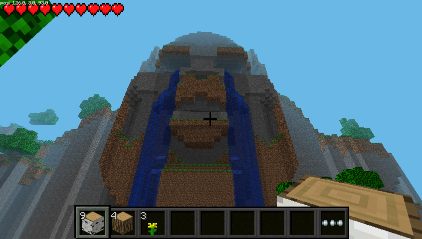

+++
showonlyimage = false
draft = false
image = "img/Minecraft.png"
date = "2020-08-02"
title = "Minecraft Pi"
writer = "Martin Strohmayer"
categories = ["Raspberry Pi"]
keywords = ["Raspberry Pi", "Minecraft", "Pi"]
weight = 1
+++

Auch nach vielen Jahren ist das Interesse an dem Raspberry Pi und auch an dem Spiel Minecraft ungebrochen. Für den Raspberry Pi wurde einmalig eine 
spezielle gratis Variante herausgebracht. Wie man sie installiert und den Überlebensmodus (survival mode) aktiviert erfährt man hier.
<!--more-->


## Grundsätzliches

Minecraft ist eine besonders bei Kindern beliebtes Computerspiel, das die Kreativität fördert. Für den Raspberry Pi gibt es eine spezielle gratis Variante des Spiels. Sie ist inzwischen recht alt und wurde nicht mehr aktualisiert, funktioniert aber immer noch. Das besondere ist, dass sie eine Programmierschnittstelle, sprich API, besitzt. Mit ihr kann man spielerisch programmieren lernen, in dem man mit einem Python Programmen mit dem Spiel interagiert. Damit lassen sie z. B. einfache Spiele im Spiel realisieren. Oder man lässt automatisiert Blocke erzeugen.  
Ursprünglich könnte man nur im kreativ Modus spielen und programmieren, es gibt aber auch einen Modifikation, sodass auch der Überlebensmodus (survival mode) funktioniert. Dann können Stürze in die Tiefe können zum Tot oder Verlust von Energie führen.  
Mit der richtigen Karte gibt es einen Tag und Nacht Zyklus. Dann trifft man auch auf Creeper, Skelette, Spinnen und andere Monster. Sie tauchen regelmäßig in der Nacht auf und sind nur darauf aus dir zu Schaden. Somit kann man nun auch die ersten Erfahrungen vom originalen Spiel sammeln.

## Technisches

Die Grafik wird direkt in der GPU erzeugt und so funktioniert das Spiel nicht über einen SSH-Tunnel. Auch Screenshots können nicht so einfach erzeugt werden. Das Programm [raspi2png](https://github.com/AndrewFromMelbourne/raspi2png) bietet sich dazu an. VNC-Programme die direkt auf der GPU arbeiten wie [dispmanx_vnc](https://github.com/patrikolausson/dispmanx_vnc) können auch verwendet werden. Nicht so gut verträgt sich das Programm mit HDMI Overscan Anpassungen. Dann kommt es zur falschen Platzierung des Fensterrahmens und Grafikfehlern. 


## Installation

Leider ist die Anleitung auf der Webseite des Spiel nicht korrekt. Allerdings ist das kein Problem, denn in der aktuellen Raspbian/Raspberry Pi OS Version kann man kann das Spiel direkt installieren. Damit wird auch gleich die Programmierschnittstelle installiert und alles nötige eingerichtet. Der Patch für den Überlebensmodus und passende Karten müssen aber manuell installiert werden.

```
sudo apt-get install minecraft-pi

sudo apt-get install bspatch
cd /opt/minecraft-pi/ 
sudo wget https://www.dropbox.com/s/iutdy9yrtg3cgic/survival.bsdiff
sudo bspatch minecraft-pi minecraft-pi-survival survival.bsdiff
sudo chmod +x minecraft-pi-survival
cd ~/.minecraft/games/com.mojang/minecraftWorlds/
wget https://thebraithwaites.co.uk/wp-content/uploads/2016/09/Temple-of-Notch.zip
unzip Temple-of-Notch.zip
```

**Startscript:** /usr/local/bin/minecraft-pi-survival

```
#!/bin/sh

cd /opt/minecraft-pi || exit
test -e minecraft-pi-survival || exit

if grep -q okay /proc/device-tree/soc/v3d@7ec00000/status \
	/proc/device-tree/soc/firmwarekms@7e600000/status 2> /dev/null; then
	export LD_PRELOAD=libbcm_host.so.1.0
	export LD_LIBRARY_PATH=lib/mesa
else
	export LD_LIBRARY_PATH=lib/brcm
fi

./minecraft-pi-survival
```

```
sudo chmod +x /usr/local/bin/minecraft-pi-survival
minecraft-pi-survival
```

Weitere Karten für den Survival Modus findet man auf der originalen englischen Anleitung von [The Braithwaites](https://thebraithwaites.co.uk/minecraft-pi-edition-maps-texture-packs-survival-and-more/).  
Hier ist eine Liste der Karten-Links angeführt. Wenn man sie in die Datei 'list.txt' einträgt, kann man sie später mit einem Kommando herunterladen.

```
https://thebraithwaites.co.uk/wp-content/uploads/2016/09/Tnt-Trouble.zip
https://thebraithwaites.co.uk/wp-content/uploads/2016/09/The-Grid-2.zip
https://thebraithwaites.co.uk/wp-content/uploads/2016/09/Canyons.zip
https://thebraithwaites.co.uk/wp-content/uploads/2016/09/Columbia-Bioshock-Infinite.zip
https://thebraithwaites.co.uk/wp-content/uploads/2016/09/Deep-Ocean.zip
https://thebraithwaites.co.uk/wp-content/uploads/2016/09/Dense-Forest.zip
https://thebraithwaites.co.uk/wp-content/uploads/2016/09/Hamster-Escape-Part-1.zip
https://thebraithwaites.co.uk/wp-content/uploads/2016/09/Lava-Citadel.zip
https://thebraithwaites.co.uk/wp-content/uploads/2016/09/Level-Screenshots.zip
https://thebraithwaites.co.uk/wp-content/uploads/2016/09/Nether-Nightmare.zip
https://thebraithwaites.co.uk/wp-content/uploads/2016/09/Paradise-Cove.zip
https://thebraithwaites.co.uk/wp-content/uploads/2016/09/Plaza.zip
https://thebraithwaites.co.uk/wp-content/uploads/2016/09/prisonEscape.zip
https://thebraithwaites.co.uk/wp-content/uploads/2016/09/Temple-of-Notch.zip
https://thebraithwaites.co.uk/wp-content/uploads/2016/09/The-Grid.zip
https://thebraithwaites.co.uk/wp-content/uploads/2016/09/The-Island.zip
https://thebraithwaites.co.uk/wp-content/uploads/2016/09/The-N.R.A.M-world-save.zip
https://thebraithwaites.co.uk/wp-content/uploads/2016/09/The-Underground.zip
https://thebraithwaites.co.uk/wp-content/uploads/2016/09/Volcano.zip
https://thebraithwaites.co.uk/wp-content/uploads/2016/09/Canyons.zip
https://thebraithwaites.co.uk/wp-content/uploads/2016/09/MW3-Seatown.zip
```
```
cd ~/.minecraft/games/com.mojang/minecraftWorlds/
wget -i list.txt
unp *.zip
```




Der Kreative-Modus funktoniert auch noch und kann mit dem Kommando "minecraft-pi" oder über das Startmenü gestartet werden. 


## Verlinkung

Originale englischen Anleitung von [The Braithwaites](https://thebraithwaites.co.uk/minecraft-pi-edition-maps-texture-packs-survival-and-more/)
