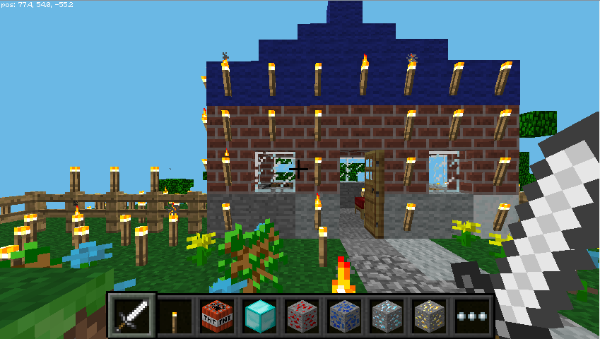
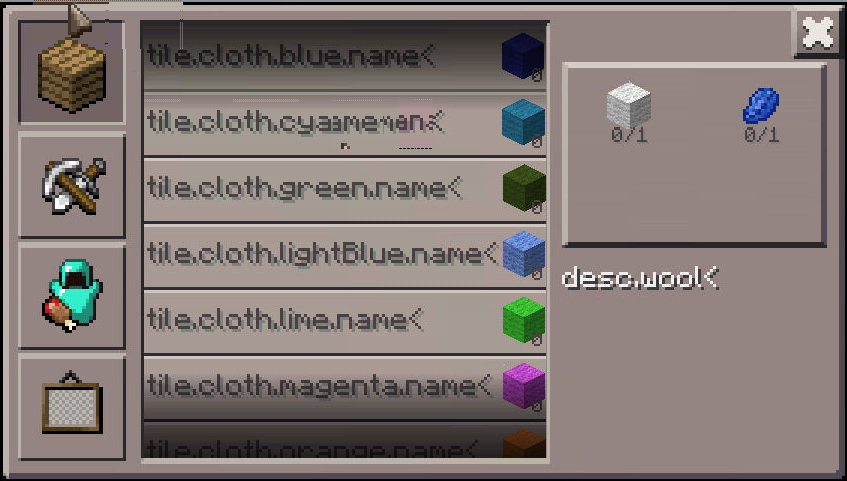

+++
showonlyimage = false
draft = false
image = "img/Minecraft.png"
date = "2020-08-02"
title = "Minecraft Pi"
writer = "Martin Strohmayer"
categories = ["Raspberry Pi", "Raspberry Pi Zero", "Minecraft"]
keywords = ["Raspberry Pi", "Minecraft", "Pi"]
weight = 1
+++

Auch nach vielen Jahren ist das Interesse an dem Raspberry Pi und auch an dem Spiel Minecraft ungebrochen. Für den Raspberry Pi wurde einmalig eine 
spezielle gratis Variante herausgebracht. Wie man sie installiert und den Überlebensmodus (survival mode) aktiviert erfährt man hier.
<!--more-->


## Grundsätzliches

Minecraft ist eine besonders bei Kindern beliebtes Computerspiel, das die Kreativität fördert. Für den Raspberry Pi gibt es eine spezielle gratis Variante des Spiels. Sie ist inzwischen recht alt und wurde nicht mehr aktualisiert, funktioniert aber immer noch. Das besondere ist, dass sie eine Programmierschnittstelle, sprich API, besitzt. Mit ihr kann man spielerisch programmieren lernen, in dem man mithilfe eines Python Programms mit dem Spiel interagiert. Damit lassen sie z. B. einfache Spiele im Spiel realisieren. Oder man lässt automatisiert Blocke erzeugen.  
Eigentlich kann man nur im Kreativmodus spielen und programmieren, es gibt aber auch einen Modifikation, sodass auch der Überlebensmodus (survival mode) funktioniert. Dann können Stürze in die Tiefe zum Tot oder Verlust von Energie führen. Mit der richtigen Karte gibt es einen Tag und Nacht Zyklus. Dann trifft man auch auf Creeper, Skelette, Spinnen und andere Monster. Sie tauchen regelmäßig in der Nacht auf und sind nur darauf aus dir zu Schaden. Leider funktioniert aber das "craften" also das Erzeugen von Gegenständen nicht. Wechsel man vom Überlebensmodus in den Creativen Modus bleiben die Moster im Spiel und man kann sie leicht, ohne verletzt zu werden, auf unterschiedlichste Weise erledigen (z. B. mit TNT).

## Technisches

Die Grafik wird direkt in der GPU erzeugt und so funktioniert das Spiel nicht über einen SSH-Tunnel. Auch Screenshots können mit dem üblichen Programmen nicht erzeugt werden. Das Programm [raspi2png](https://github.com/AndrewFromMelbourne/raspi2png) bietet sich an. Auch VNC-Programme die direkt mit der Raspberry Pi GPU arbeiten, wie [dispmanx_vnc](https://github.com/patrikolausson/dispmanx_vnc) können verwendet werden.  
Nicht so gut verträgt sich das Programm mit HDMI Overscan Anpassungen. Dann kommt es zur falschen Platzierung des Fensterrahmens und Grafikfehlern.  

Das Spiel kann auch auf dem Raspberry Pi Zero verwendet werden. Die Leistung des System reicht aus, wenngleich ein wenig Overclocking nicht schaden kann. Dann darf man aber nicht vergessen die entsprechenden Adapter (HDMI, USB-Hub mit Micro-Adapter für Maus und Tastatur) bereit zu halten.

## Installation

Leider ist die Installations-Anleitung auf der Minecraft Webseite nicht korrekt. Allerdings ist das kein Problem, denn in der aktuellen Raspbian/Raspberry Pi OS Version kann man kann das Spiel direkt installieren. Damit wird auch gleich die Programmierschnittstelle installiert und alles nötige eingerichtet. Den Patch für den Überlebensmodus und die passende Karten muss man aber manuell installieren.

```
sudo apt-get install minecraft-pi

sudo apt-get install bspatch
cd /opt/minecraft-pi/ 
sudo wget https://www.dropbox.com/s/iutdy9yrtg3cgic/survival.bsdiff
sudo bspatch minecraft-pi minecraft-pi-survival survival.bsdiff
sudo chmod +x minecraft-pi-survival
cd ~/.minecraft/games/com.mojang/minecraftWorlds/
wget https://thebraithwaites.co.uk/wp-content/uploads/2016/09/Temple-of-Notch.zip
unzip Temple-of-Notch.zip
```

**Startscript:** /usr/local/bin/minecraft-pi-survival

```
#!/bin/sh

cd /opt/minecraft-pi || exit
test -e minecraft-pi-survival || exit

if grep -q okay /proc/device-tree/soc/v3d@7ec00000/status \
	/proc/device-tree/soc/firmwarekms@7e600000/status 2> /dev/null; then
	export LD_PRELOAD=libbcm_host.so.1.0
	export LD_LIBRARY_PATH=lib/mesa
else
	export LD_LIBRARY_PATH=lib/brcm
fi

./minecraft-pi-survival
```

```
sudo chmod +x /usr/local/bin/minecraft-pi-survival
minecraft-pi-survival
```

Weitere Karten für den Überlebensmodus findet man bei der originalen englischen Anleitung von [The Braithwaites](https://thebraithwaites.co.uk/minecraft-pi-edition-maps-texture-packs-survival-and-more/).  
Hier ist eine Liste dieser Karten-Links angeführt. Wenn man sie in die Datei 'list.txt' einträgt, kann man sie später mit einem Kommando herunterladen.

```
https://thebraithwaites.co.uk/wp-content/uploads/2016/09/Tnt-Trouble.zip
https://thebraithwaites.co.uk/wp-content/uploads/2016/09/The-Grid-2.zip
https://thebraithwaites.co.uk/wp-content/uploads/2016/09/Canyons.zip
https://thebraithwaites.co.uk/wp-content/uploads/2016/09/Columbia-Bioshock-Infinite.zip
https://thebraithwaites.co.uk/wp-content/uploads/2016/09/Deep-Ocean.zip
https://thebraithwaites.co.uk/wp-content/uploads/2016/09/Dense-Forest.zip
https://thebraithwaites.co.uk/wp-content/uploads/2016/09/Hamster-Escape-Part-1.zip
https://thebraithwaites.co.uk/wp-content/uploads/2016/09/Lava-Citadel.zip
https://thebraithwaites.co.uk/wp-content/uploads/2016/09/Level-Screenshots.zip
https://thebraithwaites.co.uk/wp-content/uploads/2016/09/Nether-Nightmare.zip
https://thebraithwaites.co.uk/wp-content/uploads/2016/09/Paradise-Cove.zip
https://thebraithwaites.co.uk/wp-content/uploads/2016/09/Plaza.zip
https://thebraithwaites.co.uk/wp-content/uploads/2016/09/prisonEscape.zip
https://thebraithwaites.co.uk/wp-content/uploads/2016/09/Temple-of-Notch.zip
https://thebraithwaites.co.uk/wp-content/uploads/2016/09/The-Grid.zip
https://thebraithwaites.co.uk/wp-content/uploads/2016/09/The-Island.zip
https://thebraithwaites.co.uk/wp-content/uploads/2016/09/The-N.R.A.M-world-save.zip
https://thebraithwaites.co.uk/wp-content/uploads/2016/09/The-Underground.zip
https://thebraithwaites.co.uk/wp-content/uploads/2016/09/Volcano.zip
https://thebraithwaites.co.uk/wp-content/uploads/2016/09/Canyons.zip
https://thebraithwaites.co.uk/wp-content/uploads/2016/09/MW3-Seatown.zip
```
```
cd ~/.minecraft/games/com.mojang/minecraftWorlds/
wget -i list.txt
unp *.zip
```


Einen neuen Menüeintrag kann man auch noch erstellen.

```
sudo cp /usr/share/applications/minecraft-pi.desktop /usr/share/applications/minecraft-pi-survival.desktop
```

```
[Desktop Entry]
Name=Minecraft Pi Survival
Comment=Fun with Blocks and Monsters
Exec=minecraft-pi-survival
Icon=/usr/share/pixmaps/minecraft-pi.png
Terminal=false
Type=Application
Categories=Application;Game;
StartupNotify=true
```

Der Kreativmodus funktioniert auch noch wie gehabt und kann mit dem Kommando "minecraft-pi" oder über das Startmenü gestartet werden. 

## Kreativmodus

Die Steuerung des Spiels erfolgt wie bei den üblichen 3D-Shooter spielen. Mit Mausbewegungen kann man die Ansicht verändern. Die Tasten W,S,A,D dienen zur Bewegung der Spielfigur. Mit der Leertaste kann man springen. Bei doppelten Sprung bzw. doppelte Aktivierung der Leertaste kann man sich nach oben bewegen. Je nachdem fliegt man dann oder man schwimmt nach oben. Der Flugmodus kann durch nochmalige doppelte Aktivierung der Leertaste beendet werden. Dann fällt man zu Boden. Mit der Taste E kann man das Inventar öffnen und einen Block auswählen. Mit dem Mausrad oder der Tasten 1-8 kann man eine der unten eingeblendeten Blöcke auswählen. Mit der rechten Maustaste setzt man den aktiven Block an die markierte Stelle. Mit der linken Maustaste können Blöcke wieder zerstören werden. Teilweise können Gegenstände wie Werkbank oder Ofen mit der rechten Maustaste aktiviert werden.  Mit der Taste Esc kommt man in das Menü.  

Mit dem Schwert können Blöcke entfernt werden, es können aber auch Objekte berührt werden. Die Minecraft API bietet eine Funktion um diese Aktion abfangen zu können. Damit lassen sie dann interessant Aktion auslösen, vor allem in Verbindung mit dem TNT Block. Mehr dazu in nächsten Kapitel.  




##  Überlebensmodus

Der Überlebensmodus steuert sich grundsätzlich gleich wie beim Kreativmodus. Allerdings kann man nicht fliegen und mit der E Taste öffnet sich nicht die Auswahlliste der Blöcke. Leider öffnet sich auch nicht das Minecraft übliche Crafting Menü. Das gilt auch für die Werkbank.  



Im Fenster links oben wird der Lebenszustand mit Herzen angezeigt. Stürze oder Attacken von Monstern verringern diese bis zum Tot. Befindet man sich unter Wasser werden Blasen für den Luftvorrat angezeigt. Geht dieser zur Neige, stirbt man. Eine Nahrungsanzeige wie im originalen Spiel gibt es nicht.


In dunklen Bereichen und in der Nacht tauchen Monster auf, so wie im echten Spiel. Ohne die Möglichkeit Waffen Rüstung und sonstiges zu erzeugen, sind die Möglichkeiten aber sehr eingeschenkt (ohne Crafting Menü). Trotzdem ist es eine Abwechslung mal Gegner zu haben, die man beim Wechsel auch im Kreativmodus finden kann.

## Verlinkung

Originale englischen Anleitung von [The Braithwaites](https://thebraithwaites.co.uk/minecraft-pi-edition-maps-texture-packs-survival-and-more/) 
