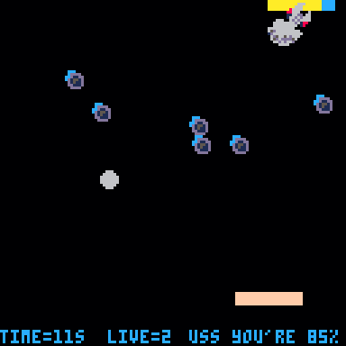

+++
showonlyimage = false
draft = false
image = "img/PICO-8.jpg"
date = "2018-12-21"
title = "PICO-8"
writer = "Martin Strohmayer"
categories = ["Programmierung", "Raspberry Pi"]
keywords = ["Retro", "lua", "GameDev"]
weight = 1
+++


Wer sich gerne einmal mit Retro-Spieleprogrammierung (GameDev) beschäftigen will, dem aber C64, GB und NES Tools zu kompliziert sind, sollte sich unbedingt einmal PICO-8 ansehen. Diese "virtuelle Konsole" mit einer integriertem Entwicklungsumgebung, bietet alles was man zur Spieleprogrammierung benötigt. Dabei läuft sie nicht nur auf dem PC, sondern auch auf dem Raspberry Pi.
<!--more-->

## Grundsätzliches

PICO-8 ist eine erfundene „Fantasy Console“ die am PC (Windows, Linux, MacOS) und auf dem Raspberry
Pi emuliert werden kann. Es handelt sich um ein kommerzielles Produkt das von Lexaloffle Games entwickelt wird. Die Programmierung erfolgt in Lua. Mithilfe der integrierten Entwicklungsumgebung können Source, Musik, Sound, Sprites und Maps erstellen werden.
Der reguläre Preis beträgt 14,99 US Dollar (ca. 14 Euro). Bei einem Game-Jam bzw. im Schulungsbereich kann es gratis benutzt werden. Nach der Schulung können die Teilnehmer vergünstigt eine "Take-home license" erwerben.


## Technische Daten

**Auflösung:** 128 x 128 Pixel  
**Bilder pro Sekunde (FPS):** 30 oder 60  
**Farben:** 16 Farben (Palette unter CC0 freigegeben)  
**Modul (Catridge) Größe:** 32 kB  
**Tasten:** D-PAD, 2 Aktionstasten, Menütaste  
**Sound**: 4 Kanal, 64 definierbare Chip Sounds  
**Limitierungen:**  Sprites (128 8x8 Pixel), Maps (128x32 Zellen), Source (8192 Tokens)  

### Palette


### Tastenzuordnung

Pause: Enter bzw. P

Steuerung Player 1:
  D-PAD: Steuerkreuz  
  Taste 1 (X): Z bzw. N  
  Taste 2 (O): N bzw. M  

Steuerung Player 2:
  D-PAD = S D E F  
  Taste 1 (X): Tab bzw. Shift  
  Taste 2 (O): Q bzw. A  

### Modul (Catridge)

Vielfach wird beim Programmspeicher von Catridge, also von einem Spielmodul gesprochen wie man es von GB, NES usw. kennt. Bei der Catridge handelt es sich allerdings um eine PNG-Bilddatei. Das erstellte Programm kann also in einer Grafikdatei gespeichert werden. Diese Datei enthält dann ein Vorschaubild als auch das Spiel selbst als Zusatzdaten.


## Programmierung  





### Sourcecode Ausschnitt als Beispiel

```
FUNCTION MOVEPADDLE()
  IF BTN(0) THEN
    IF PADX>=STEP THEN
      PADX-=STEP
    ELSE
      PADX=0
    END
  ELSEIF BTN(1) THEN
    IF PADX+PADW<=127-STEP THEN
      PADX+=STEP
    ELSE
      PADX=127-PADW
	  END
  END
END

FUNCTION _UPDATE()
  MOVEENEMY()
  MOVEPADDLE()
  BOUNCEBALL()
  BOUNCEBUMPER()
  BOUNCEPADDLE()
  MOVEBALL()
  CHECKENEMYHIT()
END

FUNCTION _DRAW()
  CLS()
  FOREACH(BUMPERS, DRAW_BUMPER)
  DRAW_ENEMY()
  RECTFILL(PADX,PADY,PADX+PADW,PADY+PADH,15)
  PRINT("TIME="..CEIL(TIME()).."S",0,122,12)
  PRINT("LIVE="..LIVE,40,122,12)
  PRINT("USS YOU'RE "..ENEMY_HEALTH.."%",70,122,12) 
  CIRCFILL(BALLX,BALLY,BALLSIZE,6)
END
```
### Raspberry Pi

Für den Raspberry Pi enthält PICO-8 eine Besonderheit. Auf die ersten 8 GPIOs ([WiringPi Nummerierung](http://wiringpi.com/pins/)) kann direkt zugegriffen werden. Es können also Eingänge gelesen oder Ausgänge auf 1 oder 0 gesetzt werden. Die GPIOs sind dabei auf die Adressen 0x5f80 bis 0x5f87 verfügbar. Will man den ersten GPIO auf High (3,3 V) setzen so muss man mit dem Befehl 'poke' den Wert 255 auf Adresse 0x5f80 zuweisen. Der Wert 0 setzt den Ausgang auf Low (GND).  
Mit dem Befehl 'peek' dient zum Einlesen des Zustands des GPIOs.

**Blinklicht auf zwei GPIOs:**
```
TIMER=0

FUNCTION _UPDATE()
  TIMER = TIMER+1
  IF TIMER>=60 THEN
    TIMER = 0
  END
  IF TIMER==30 THEN
    POKE(0X5F80,255)
    POKE(0X5F87,255)
  ELSEIF TIMER==0 THEN
    POKE(0X5F80,0)
    POKE(0X5F87,0)
  END
END
```

## Verlinkungen 

### PICO-8

Offizielles PICO-8 [Handbuch](https://www.lexaloffle.com/pico8_manual.txt)  
Bezug [PICO-8](https://www.lexaloffle.com/pico-8.php?#getpico8)  
Vergünstigte Lizenz [PICO-8 for Educators](https://www.lexaloffle.com/pico-8.php?page=schools)


### Englische Handbücher für den Einstieg

[Gamedev with PICO-8](https://mboffin.itch.io/gamedev-with-pico-8-issue1)  
[PICO-8 Fanzine #1 - #4](https://sectordub.itch.io/pico-8-fanzine-1)
