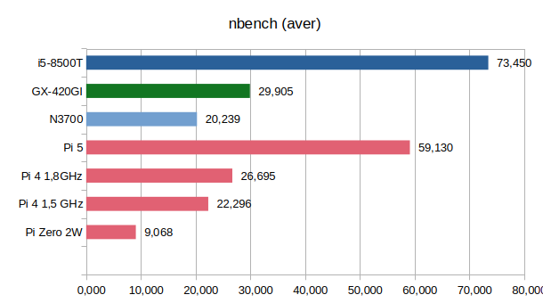
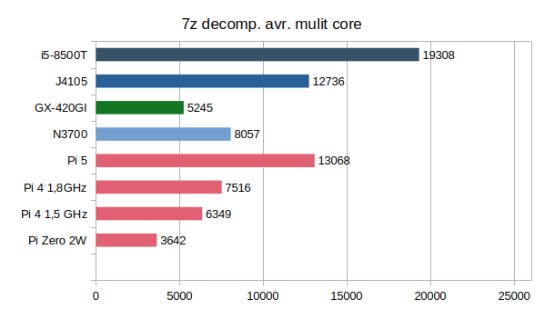

+++
showonlyimage = false
draft = false
image = "img/PIvsTC.jpg"
date = "2025-09-27"
title = "Raspberry Pi vs. Thin Client"
writer = "Martin Strohmayer"
categories = ["Raspberry Pi"]
keywords = ["BCM", "Intel", "AMD"]
weight = 1
+++

In der Lieferkettenkrise als man keine Raspberry Pi's kaufen konnte, musste man sich anderweitig umsehen um kleine, sparsame aber leistungsfähige PC-System zu finden. Thin Clients sind eine Alternative, aber wie schlagen sie sich gegen den Pi? 
<!--more-->

## Beschreibung 

Während der Corona-Pandemie kam es weltweit zu massiven Lieferengpässen bei Elektronikkomponenten – und der beliebte Raspberry Pi war besonders betroffen. Man konnte keine neuen bekommen oder nur zu total überzogenen Preisen. Auch die Gebrauchtpreise stiegen entsprechend. 

In dieser Situation schienen sich gebrauchte Thin Clients als Alternative anzubieten. Ursprünglich für den Einsatz in Unternehmen konzipiert, bieten sie eine solide Hardwarebasis und sind oft günstig gebraucht erhältlich. Sie sind klein und sparsame aber auch mit eine ausreichend leistungsfähigen CPU (x86/AMD64) ausgestattet.    
Ich entschied mich damals für ein Lenovo M600 (Intel N3700) und später noch für ein HP T630 (AMD GX-420GI) System. 

Vergleicht man sie mit dem Raspberry Pi sticht zualler erst die gute Austattung und Erweiterbarkeit heraus. Sie Thin Clients werden zumeist mit Gehäuse, Netzteil, SSD/MMC und integrierter CPU Kühlung angeboten. Komponenten die man beim Pi erst nachkaufen muss.
Beim RAM sind zuminest 4 GB vorhanden, der dann auch günstig auf z.B. 8 GB aufgerüstet werden kann. Beim Raspberry Pi muss man sich beim Kauf entscheiden und kann später nicht aufrüsten. Will man beim Pi5 eine M2-NVMe einsetzen, so muss man einen entsprechenden HAT kaufen. Beim Pi4 geht das nur über die USB-3.0 Schnittstelle.  
Bei den zwei beispielhaften Thin Client kann man zwar nur M2-SATA einsetzen, aber diese sind bereits intern vorhanden (sogar 2 davon). Beim 
M600 Kann man auch intern eine SSD einbauen.  
Das sind doch einige Vorteile die für einen Thin Client sprechen.  

Der Vorteil vom Rapsberry Pi liegt vorallem beim Energieverbrauch und natürlich bei den GPIOs. Ist eines davon kritisch für den Einsatz sollte man auf den Rapsberry Pi setzen!

Ein Nachteil beim den Thin Clients ist, dass man sie gebraucht kaufen muss, wenn man sie günstige haben möchte. Teilweise werden auch zu hohe Preise verlangt, man muss also schon das passende Angebot und Produkt finden.
Zur Produktbewertung  kann man natürlich auch die KI seines Vertrauens befragen. 
z. B. "Ist der Einsatz eines T630 Thin Client als NAS sinvoll oder soll ich lieber einen Raspberry Pi 5 verwenden?"

Mögliche Händler:
 - Willhaben - https://www.willhaben.at
 - Ebay - https://www.ebay.de und https://www.ebay.at
 - RAM-König - https://www.ram-koenig.de/

Eine gute Webseite die sich mit der Analyse von Thin Clients gewidmet hat ist https://www.parkytowers.me.uk/thin/hp/t530/linux.shtml    


Unabhängig von den offensichtlichen Unterschieden wollte ich mir den Energieverbrauch und die CPU Performance genauer ansehen.   
Vorweg der Vergleich der CPU Leistung bei so unterschiedlichen Archikteuren ist schwierig und es kommt sehr auf den Benchmark an. Leider kann man die Systeme also nicht abschließend Bewerten, sondern es kommt immer auf den Einsatz an.

## Vor- und Nachteile

**Thin Client:**

&#x2705; Gebraucht günstiger als Pi4/Pi5 mit Komplettaustattung  
&#x2705; RAM erweiterbar  
&#x2705; M2 Sockel (NVMe oder SATA) und SATA  
&#x2705; x86/AMD64, Möglicherweise Windows kompatibel  
&#x2B55; Gebrauchtes günstiges Modell muss gefunden werden  
&#x2705; Nachhaltig, Umweltschonender, Recycling


**Raspberry Pi:**

&#x2705; Sehr Energiesparend  
&#x2705; GPIOs  
&#x2705; Raspberry Pi Zero's sind sehr günstig  
&#x2705; CPU übertaktbar   
&#x2B55; Netzteil, Lüfter und Gehäuse muss extra erworben werden.  
&#x2B55; RAM nicht erweiterbar  
&#x2B55; NVMe erst ab Pi5  


## Energieverbrauch 


| System          | Idle power (W) | Full power (W) |
| --------------- | -------------  | -------------- |
| M600 (N3700)    | 6,9            | 12,6           |
| T630 (GX-420GI) | 4,2            | 22,3           |
| 720q (i5-8500T) | 15             | 60             |
| Pi 4\*          | 3,4            | 7,1            |
| Pi 4\* @ 1.8 GHz| 3,4            | 9,1            |
| Pi 5\*          | 3,6            | 8-11,5         |

\* with Fan and Raspberry Pi Power Supply 

Powermeter: Shelly Plug-S

Man sieht das gute Thin Clients nahe an den Idle Verbrauch der Pis herankommen. Für mich die wichtigste Kenngröße da meine Systeme zumeinst in Leerlauf arbeiten. 
Energiesparende Intel CPUs (6 Watt) brauchen unter Vollast aber auch nur geringfügig mehr als die ARM Prozessoren.   

## CPU - Benchmark Programme

Es kamen folgende Benchmark programme zum Einsatz:  

 * nbench - https://www.math.utah.edu/~mayer/linux/bmark.html
 * Passmark - https://www.passmark.com/products/performancetest/download.php
 * 7-zip 

### nbench  

```
wget http://www.math.utah.edu/~mayer/linux/nbench-byte-2.2.3.tar.gz
tar xzvf nbench-byte-2.2.3.tar.gz
cd nbench-byte-2.2.3
make
./nbench
```

### Passmark  


Es wird libncurses5 benötig, das bei aktuellen Trixie Debian oder Ubuntu nicht mehr mitgeliefert wird.

```
sudo apt install libncurses5
```

in dem Fall muss man sich die alte Version deshalb manuell installieren. 


<!-- 
wget http://ftp.de.debian.org/debian/pool/main/n/ncurses/libncurses5_6.4-4_armhf.deb 
sudo apt install ./libncurses5_6.4-4_armhf.deb

wget https://www.passmark.com/downloads/PerformanceTest_Linux_ARM32.zip
unzip PerformanceTest_Linux_ARM32.zip
cd PerformanceTest
/pt_linux_arm32
 
 >> Illegal instruction

-->


**ARM64**

```
wget http://ftp.de.debian.org/debian/pool/main/n/ncurses/libncurses5_6.4-4_arm64.deb
sudo apt install ./libncurses5_6.4-4_arm64.deb
```


```
wget https://www.passmark.com/downloads/PerformanceTest_Linux_ARM64.zip
unzip PerformanceTest_Linux_ARM64.zip
cd PerformanceTest
./pt_linux_arm64
```

**AMD64**

```
wget http://ftp.de.debian.org/debian/pool/main/n/ncurses/libncurses5_6.4-4_amd64.deb
sudo apt install ./libncurses5_6.4-4_arm64.deb
```


``` 
wget https://www.passmark.com/downloads/PerformanceTest_Linux_x86-64.zip
unzip PerformanceTest_Linux_x86-64.zip
cd PerformanceTest
./pt_linux_x64
```

Press: A  
Press: n

### 7zip 

```
sudo apt install p7zip-full
```

## Benchmark Ergebnisse

**Passmark:**

 


Hier scheint der Benchmark neuere x86 Architekturen besser zu bewerten.
Der Intel i5-8500T hat ein überproportional gutes Ergebnis, ist er wirklich 3x so schnell wie der Pi5?  
Der Pi4 performt im Vergleich zu Pi5 sehr schlecht.


**nbench:**

 


Der alte Benchmark von 1995 testet nur einen Kern. Hier sind Pi5 und i5-8500T gar nicht so weit auseinander. Die Intel CPU ist ca. doppelt so schnell wie der BCM2712 (auf alle Kerne gerechnet). Der Pi5 ist ca. doppelt so schnell wie der Pi4.


**7-zip:**

 

 

Die Perfromance von 7-zip unterscheidet sich stark beim Komprimieren und Dekomprimieren. Beim Entpacken schlägt sich die ARM Architektur besonders gut. Der AMD Prozesser fällt dabei besonders zurück obwohl er bei Komprimieren gleich auf ist.
