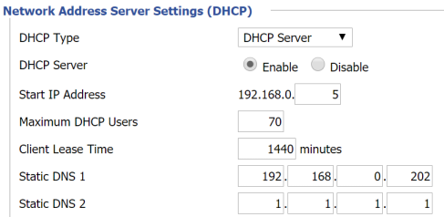
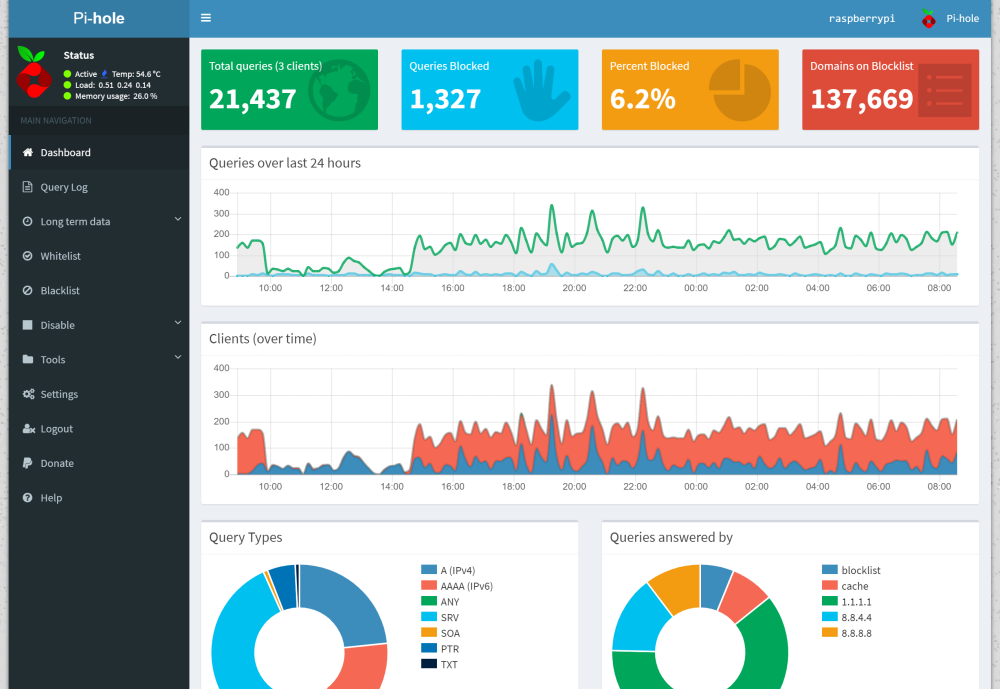
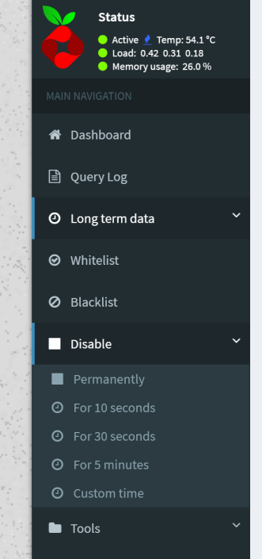

+++
showonlyimage = false
draft = false
image = "img/pihole_homepage.png"
date = "2018-12-"
title = "Werbefrei im Heimnetz mit Pi-hole"
writer = "Manfred Wallner"
categories = ["Raspberry Pi"]
keywords = ["ads", "adblocker", "werbung", "dns"]
weight = 1
+++

Wer kennt es nicht, nervige Werbung beim Surfen im Internet. Auf PCs und Laptops helfen hier Adblocker, diese werden jedoch immer öfters von Website erkannt.
Hier hilft das Projekt "Pi-hole", welches als lokaler DNS-Server eingerichtet wird und Anfragen an Werbebetreiber-Domains blockiert - so ist man nicht nur am PC, sondern z.B. auch am Smartphone Werbefrei unterwegs.
<!--more-->

## Setup

Die Installation ist wirklich einfach, man muss nur den Befehl

```
curl -sSL https://install.pi-hole.net | bash
```

in einem Terminal ausführen.
Nach einem eventuellen Neustart der Raspberry kann man das Pi-hole Dashboard über einen Browser aufrufen.

Wenn man die IP-Adresse seiner Raspberry nicht weiß, kann man diese entweder über das Web-Interface seines Routers, über die "config.txt"-Datei, oder über den Kommandozeilenbefehl ``sudo ifconfig`` herausfinden.

## Pi-hole aktivieren

Um Pi-hole zu nutzen kann man entweder in allen betroffenen Geräten (Computer, Smartphone, Tablet) die IP-Adresse bzw. DNS-Einstellungen manuell anpassen, oder einmal für alle an zentraler Stelle - in eurem Router.

 

Um Pi-hole für das gesamte Heimnetz zu nutzen, kann einfach der 1. DNS-Server in den DHCP-Einstellungen des Routers auf die IP-Adresse des Raspberry Pis angepasst werden.
(Achtung: Bereits mit dem Netzwerk verbundene Geräte benötigen vermutlich einen Neustart, damit der Werbeblocker aktiv wird.)

## Ausnahmen hinzufügen

Stellt man fest, dass die Werbung von bestimmten Websiten nicht geblockt wird, oder lassen sich gewisse Webseiten mit aktiviertem Werbeblocker nicht öffnen, so kann man diese in den Ausnahmeregeln **Whitelist** bzw. **Blacklist** explizit hinzufügen oder ausnehmen.

Whitelist: Es wird keine Werbung von Domains in dieser Liste blockiert

Blacklist: Diese Domain wird blockiert, d. h. DNS-Anfragen werden einfach nicht beantwortet)



Möchte man den Werbeblocker temporär komplett deaktiveren kann man das über das über den Menüeintrag "Disable->" bewerkstelligen.


