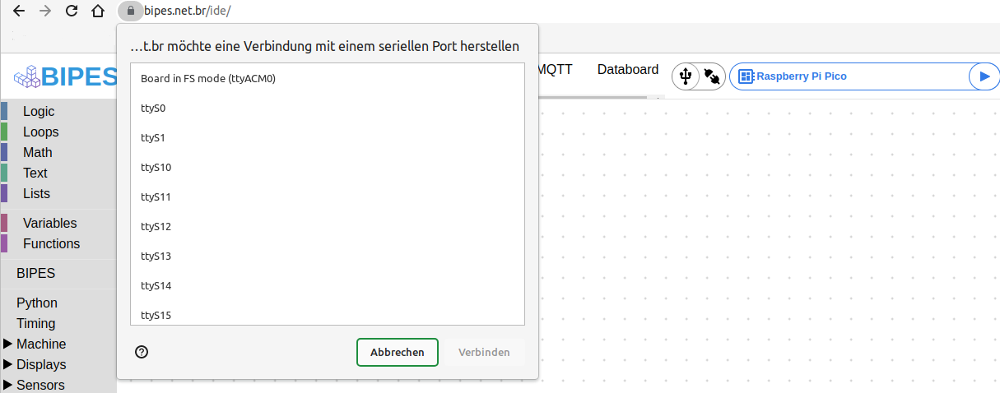

+++
showonlyimage = false
draft = false
image = "img/Raspberry_Pi_Pico.jpg"
date = "2022-10-26"
title = "Raspberry Pi Pico mit Bipes"
writer = "Martin Strohmayer"
categories = ["uC", "Raspberry Pi Pico", "Programmierung"]
keywords = ["Raspberry Pi Pico","Pico", "bipes"]
weight = 1
+++

Raspberry Pi Pico ist ein kleines Experimentierboard mit dem RP2040 Mikrocontroller von Raspbery Pi Hersteller. Die Handhabung und auch die grafische Programmierung mit Bipes ist supereinfach und damit für Kinder perfekt als Einstieg zum Programmieren lernen.
<!--more-->

## Beschreibung ##


Die Raspberry Pi Pico ist eine kleines, schnelles und vielseitiger Boards, das mit dem RP2040 Mikrocontroller-Chip ausgestattet ist. Der Chip selbst, sowie das Board werden vom Raspberry Pi Hersteller verkauft und kostet ca. 4,2 Euro.  
Mehr zu den verschiednen Varianten und zu den Spezifikationen findet man unter https://www.raspberrypi.com/documentation/microcontrollers/raspberry-pi-pico.html 

Das Boards kann über einen Micro-USB-Kabel an einem Windows- oder Linux-PC bzw. Raspberry Pi angeschlossen werden. Wird es mit MicroPython Firmware ausgetstattet kann er sehr leicht programmiert werden. Besonders einfach ist die Programmiereung mit Bipes, da hier keine Code geschreiben werden muss, sondern einfach grafische Blöcken verbunden und konfiguiert werden. Vorallem für Kinder ist diese Art der Programmierung ein super Einstieg in die Materie, ohne gleich Source-Code lernen zu müssen. Das Beste ist man braucht lediglich einen aktuellen Browser und kann dann schon loslegen.  
 

## Anschluss ##

Der Raspberry Pi Pico wird über einen Micro-USB-Kabe an einem PC oder Raspberry Pi angeschlossen. Dann wird automatisch eine Partition bzw. Laufwerk erkannt, je anch System wird es auch automatisch eingehängt und angezeigt. 

```
dmesg
```

```
[ 9451.652332] usb 2-2: new full-speed USB device number 13 using xhci_hcd
[ 9451.801668] usb 2-2: New USB device found, idVendor=2e8a, idProduct=0003, bcdDevice= 1.00
[ 9451.801674] usb 2-2: New USB device strings: Mfr=1, Product=2, SerialNumber=3
[ 9451.801685] usb 2-2: Product: RP2 Boot
[ 9451.801687] usb 2-2: Manufacturer: Raspberry Pi
[ 9451.801690] usb 2-2: SerialNumber: E0C912D24340
[ 9451.804801] usb-storage 2-2:1.0: USB Mass Storage device detected
[ 9451.805229] scsi host3: usb-storage 2-2:1.0
[ 9452.812870] scsi 3:0:0:0: Direct-Access     RPI      RP2              1    PQ: 0 ANSI: 2
[ 9452.813471] sd 3:0:0:0: Attached scsi generic sg2 type 0
[ 9452.814337] sd 3:0:0:0: [sdc] 262144 512-byte logical blocks: (134 MB/128 MiB)
[ 9452.814627] sd 3:0:0:0: [sdc] Write Protect is off
[ 9452.814634] sd 3:0:0:0: [sdc] Mode Sense: 03 00 00 00
[ 9452.814959] sd 3:0:0:0: [sdc] No Caching mode page found
[ 9452.814970] sd 3:0:0:0: [sdc] Assuming drive cache: write through
[ 9452.837574]  sdc: sdc1
[ 9452.857742] sd 3:0:0:0: [sdc] Attached SCSI removable disk
```

## Firmware Update


Zuerst muss MicroPython am Board installiert werden.  
Dazu lädt man sich die neueste stabile Version von der Seite https://micropython.org/download/rp2-pico/ herunter. In diesem Fall heißt die Datei "rp2-pico-20220618-v1.19.1.uf2".
Dann drückt man die BOOTSEL Taste am Pico und steckt dabei das USB-Kabel am PC ein. Eine Partition (/dev/sdc1) mit Namen RPI-RP2 wird nun einhängt und angezeigt.
Nun kann man in das Verzeichnis einfach die Firmwaredatei kopieren. Der Pico startet dann automatisch neu und ist wieder betriebsbereit.

Nun meldet er sich aber etwas anders am System an und es gibt ein neues serielles Device /dev/ttyACM0.
 

```
dmesg
```

```
[ 9581.775385] usb 2-2: new full-speed USB device number 14 using xhci_hcd
[ 9581.924989] usb 2-2: New USB device found, idVendor=2e8a, idProduct=0005, bcdDevice= 1.00
[ 9581.924992] usb 2-2: New USB device strings: Mfr=1, Product=2, SerialNumber=3
[ 9581.924994] usb 2-2: Product: Board in FS mode
[ 9581.924995] usb 2-2: Manufacturer: MicroPython
[ 9581.924996] usb 2-2: SerialNumber: e660443043794a29
[ 9581.950420] cdc_acm 2-2:1.0: ttyACM0: USB ACM device
[ 9581.954855] usbcore: registered new interface driver cdc_acm
[ 9581.954857] cdc_acm: USB Abstract Control Model driver for USB modems and ISDN adapte
```

## Programmierung mit Bipes

Bipes ist eine super einfache Möglichkeit den Raspberry Pi Pico zu programmieren, eine Installation ist nicht nötig. 
Mit einem aktuellen Browser (z.B. Chromium) kann die Web-Seite https://bipes.net.br/ide/ geöffnet werden.  
Dort wählt man rechts oben die Zielplatform "Raspberry Pi Pico" und drückt links davon auf Connect/Disconnet (Steckersymbol).
Dann muss man in einem Fenster das serielle Gerät (Device) auswählen. Hier wird "Board in FS mode (ttyACM0)" ausgewählt und danach drückt man auf Verbinden.
Das Steckersymbol zeigt nun eine Verbindung an. 

 

Jetzt kann man z. B. die LED (GPIO25) am Board mit einem ganz einfachen Programm schalten.
Unter Maschine -> In/Out Pins gibt es den Block "set outputpin to". 
Wenn man den Pin nun auf true setzt, dann etwas wartet (unter Timing delay miliseconds) und dann den Pin auf false setzt, blinkt die LED kurz auf.  
Nun kann man noch eine Schleife darüber bauen in dem man unter Loops den Block "repeat 10 times" wählt und plaziert.
Nun hat man ein blinkende LED, wenn man die Schaltfläche Play neben "Raspberry Pi Pico" drückt.  

Man kann natürlich auch weitere LEDs an den GPIOs anschließen. Die Bezeichnung steht auf der Unterseite des Boards.

Ein PDF-Bild mit dem verfügbaren GPIOs findet man bei der Raspberry Pi Foundation unter
https://datasheets.raspberrypi.com/pico/Pico-R3-A4-Pinout.pdf

Dann kann man noch weitere Blocke einbauen wie z. B. im folgenden Beispiel:

 


## Verlinkungen

[MicroPyhon Firmware for Raspberry Pi Pico](https://micropython.org/download/rp2-pico/)  
[Raspberry Pi Pico Spezifikationen](https://www.raspberrypi.com/documentation/microcontrollers/raspberry-pi-pico.html)  
[Raspberry Pi Pico Pinout](https://datasheets.raspberrypi.com/pico/Pico-R3-A4-Pinout.pdf)  
[Bipes programmier Web-Seite](https://bipes.net.br/ide/)
