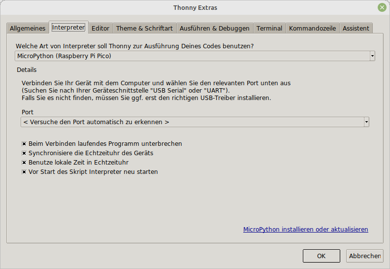
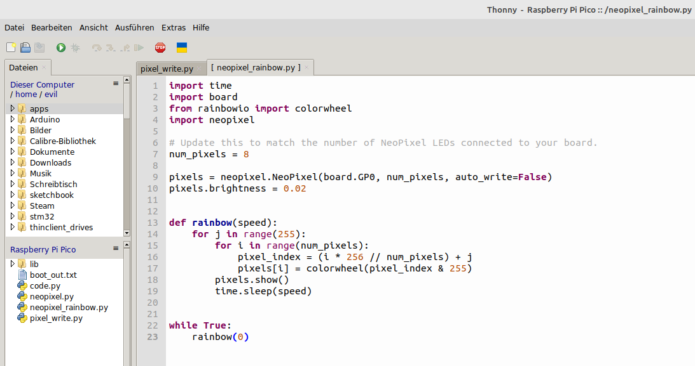

+++
showonlyimage = false
draft = false
image = "img/Raspberry_Pi_Pico_Neopixel.jpg"
date = "2023-01-06"
title = "Raspberry Pi Pico Neopixel"
writer = "Martin Strohmayer"
categories = ["uC", "Raspberry Pi Pico", "Programmierung"]
keywords = ["Raspberry Pi Pico","Pico", "CircuitPython", "Python"]
weight = 1
+++

Mit dem Raspberry Pi Pico kann man RGB LED-Streifen mit der Python Library Neopixel ganz einfach programmieren. Die Entwicklungsumgebung Thonny bietet dabei alles was man braucht und in wenigen Minuten ist eine schöne Animation mit Regenbogenfarben erstellt.
<!--more-->

## Beschreibung ##


Der Raspberry Pi Pico ist ein kleines, schnelles und vielseitiger Boards, das mit dem RP2040 Mikrocontroller-Chip ausgestattet ist. Der Chip selbst, sowie das Board werden vom Raspberry Pi Hersteller verkauft und kostet ca. 4,2 Euro.  
Mehr zu den verschiednen Varianten und zu den Spezifikationen findet man unter https://www.raspberrypi.com/documentation/microcontrollers/raspberry-pi-pico.html 

Das Boards kann über einen Micro-USB-Kabel an einem Windows- oder Linux-PC bzw. Raspberry Pi angeschlossen werden. Wird es mit [CircuitPython Firmware](https://circuitpython.org/board/raspberry_pi_pico/) ausgetstattet, kann es mit Python programmiert werden. Die Firmware liefert auch gleich einige Bibliotheken mit. Mam kann auch sehr leicht weitere Bibliotheken hinzufügen. Als Entwicklungsumgebung bietet sich [Thonny](https://thonny.org/) an, es unterstützt die Platform direkt, sodass man nach der Konfiguration direkt loslegen kann.  
 

## Anschluss ##

Der Raspberry Pi Pico wird über einen Micro-USB-Kabe an einem PC oder Raspberry Pi angeschlossen. Dann wird automatisch eine Partition bzw. Laufwerk erkannt, je nach System wird es auch automatisch eingehängt und angezeigt.

```
dmesg
```

```
[ 9451.652332] usb 2-2: new full-speed USB device number 13 using xhci_hcd
[ 9451.801668] usb 2-2: New USB device found, idVendor=2e8a, idProduct=0003, bcdDevice= 1.00
[ 9451.801674] usb 2-2: New USB device strings: Mfr=1, Product=2, SerialNumber=3
[ 9451.801685] usb 2-2: Product: RP2 Boot
[ 9451.801687] usb 2-2: Manufacturer: Raspberry Pi
[ 9451.801690] usb 2-2: SerialNumber: E0C912D24340
[ 9451.804801] usb-storage 2-2:1.0: USB Mass Storage device detected
[ 9451.805229] scsi host3: usb-storage 2-2:1.0
[ 9452.812870] scsi 3:0:0:0: Direct-Access     RPI      RP2              1    PQ: 0 ANSI: 2
[ 9452.813471] sd 3:0:0:0: Attached scsi generic sg2 type 0
[ 9452.814337] sd 3:0:0:0: [sdc] 262144 512-byte logical blocks: (134 MB/128 MiB)
[ 9452.814627] sd 3:0:0:0: [sdc] Write Protect is off
[ 9452.814634] sd 3:0:0:0: [sdc] Mode Sense: 03 00 00 00
[ 9452.814959] sd 3:0:0:0: [sdc] No Caching mode page found
[ 9452.814970] sd 3:0:0:0: [sdc] Assuming drive cache: write through
[ 9452.837574]  sdc: sdc1
[ 9452.857742] sd 3:0:0:0: [sdc] Attached SCSI removable disk
```

## Firmware Update


Zuerst muss CircuitPython am Board installiert werden. Dazu lädt man sich die neueste stabile (stable) Version von der Seite https://circuitpython.org/board/raspberry_pi_pico/ herunter. In diesem Fall heißt die Datei "adafruit-circuitpython-raspberry_pi_pico-de_DE-7.3.3.uf2".  
Dann drückt man die BOOTSEL Taste am Pico und steckt dabei das USB-Kabel ein. Eine Partition (/dev/sdc1) mit Namen RPI-RP2 wird nun einhängt und angezeigt. Dann kann man in das Verzeichnis einfach die Firmwaredatei kopieren. Der Pico startet dann automatisch neu und ist wieder betriebsbereit.

Nun meldet er sich aber etwas anders am System an und es gibt ein neues serielles Device (/dev/ttyACM0 am PC).
 

```
dmesg
```

```
[  800.478220] usb 2-2: new full-speed USB device number 9 using xhci_hcd
[  800.628229] usb 2-2: New USB device found, idVendor=239a, idProduct=80f4, bcdDevice= 1.00
[  800.628235] usb 2-2: New USB device strings: Mfr=1, Product=2, SerialNumber=3
[  800.628237] usb 2-2: Product: Pico
[  800.628240] usb 2-2: Manufacturer: Raspberry Pi
[  800.628243] usb 2-2: SerialNumber: E660443043794A29
[  800.637883] input: Raspberry Pi Pico Keyboard as /devices/pci0000:00/0000:00:14.0/usb2/2-2/2-2:1.3/0003:239A:80F4.000A/input/input39
[  800.695004] input: Raspberry Pi Pico Mouse as /devices/pci0000:00/0000:00:14.0/usb2/2-2/2-2:1.3/0003:239A:80F4.000A/input/input40
[  800.695458] input: Raspberry Pi Pico Consumer Control as /devices/pci0000:00/0000:00:14.0/usb2/2-2/2-2:1.3/0003:239A:80F4.000A/input/input41
[  800.695760] hid-generic 0003:239A:80F4.000A: input,hidraw9: USB HID v1.11 Keyboard [Raspberry Pi Pico] on usb-0000:00:14.0-2/input3
[  800.723244] cdc_acm 2-2:1.0: ttyACM0: USB ACM device
[  800.726777] usbcore: registered new interface driver cdc_acm
[  800.726778] cdc_acm: USB Abstract Control Model driver for USB modems and ISDN adapters
[  800.756779] usb-storage 2-2:1.2: USB Mass Storage device detected
[  800.764110] scsi host3: usb-storage 2-2:1.2
[  800.765630] usbcore: registered new interface driver usb-storage
[  800.773407] usbcore: registered new interface driver uas
[  801.794686] scsi 3:0:0:0: Direct-Access     Raspberr Pico             1.0  PQ: 0 ANSI: 2
[  801.795050] sd 3:0:0:0: Attached scsi generic sg2 type 0
[  801.795492] sd 3:0:0:0: [sdc] 2049 512-byte logical blocks: (1.05 MB/1.00 MiB)
[  801.795890] sd 3:0:0:0: [sdc] Write Protect is off
[  801.795892] sd 3:0:0:0: [sdc] Mode Sense: 03 00 00 00
[  801.796223] sd 3:0:0:0: [sdc] No Caching mode page found
[  801.796226] sd 3:0:0:0: [sdc] Assuming drive cache: write through
[  801.817384]  sdc: sdc1
[  801.839665] sd 3:0:0:0: [sdc] Attached SCSI removable disk
```

## Installation Thonny IDE

Je nach Betriebssystem installiert man Thonny unterschiedlich. Unter Windows lädt man sich "Installer with 64-Bit Python 3.10" herunter startet das Setup. Bei einem debianbasierenden Linux ruf man einfach "sudo apt install python3-tk thonny" im Terminal auf. Wenn das nicht geht oder nur die alte Version 3 von Thonny installiert wurde, so führt man den Befehl "bash <(curl -s https://thonny.org/installer-for-linux)" aus, um die aktuelle Version zu installieren.  
Der Raspberry Pi hat Thonny bereits vorinstalliert.  
Danach kann man Thonny einfach starten und wählt zuerst die Sprache Deutsch aus. Initial Settings am PC bleiben auf Standard. Nun muss man im Menü auf Ausführen und dann "Den Interpreter konfigurieren..." bzw. "Select interpreter..." gehen. Hier kann man bei aktuellen Version direkt "MicroPython Raspberry Pi Pico" wählen. Weiter unten muss dann der Com-Port des Picos ausgewählt werden. Die Standardeinstellung ist "Versuche den Port automatisch zu erkennen" bzw. "try to detect", man kann aber auch den Port direkt auswählen.


 


## Programmierung Neopixel

Folgendes Programm lässt die erste LED auf einem Neopixel (RGB-LED-Module WS2812) grün blinken. Die Datenleitung ist auf den ersten Pin GP0 angeschlossen. Die Versorgung des Moduls erfolgt über VBUS, also die USB Versorgungsspannung. GND vom Modul wird mit GND am Pico verbunden.  

```Python 
import board
import neopixel_write
import digitalio
import time

pin = digitalio.DigitalInOut(board.GP0)
pin.direction = digitalio.Direction.OUTPUT
green = bytearray([30, 0, 0])
red   = bytearray([0, 30, 0])
blue  = bytearray([0,  0,30])
off   = bytearray([0,  0, 0])

while True:
  neopixel_write.neopixel_write(pin, green)
  time.sleep(1)
  neopixel_write.neopixel_write(pin, off)
  time.sleep(1)
```

Nach dem Drücken von F5 bzw. der Start-Schaltfläche läuft das Programm und die erste LEDs blinkt.
blinkt.


Eine bessere Möglichkeit Neopixel anzusprechen, ist mit der Adafruit NeoPixel Bibliothek.  
Wenn sie noch nicht am Pico vorhanden ist, kann sich manuell draufkopiert werden. Dazu geht man mit dem Browser zum GitHub Projekt https://github.com/adafruit/Adafruit_CircuitPython_NeoPixel . Dort wählt man die Datei "neopixel.py" aus und geht dann auf die Schaltfläche "Raw". Nun kann man mit der rechten Maustaste ins Kontextmenü gelangen und "Seite speichern unter ..." wählen. Optional kann man die Datei auch über den Link herunterladen ``wget https://raw.githubusercontent.com/adafruit/Adafruit_CircuitPython_NeoPixel/main/neopixel.py``  
Nun muss man die Datei "neopixel.py" nur noch auf das Laufwerk des Pi Pico kopieren.
Danach kann man ein Programm erstellen, dass die Neopixel Bibliothek verwendet, z. B. diese Regebogenfarbenablauf.


```Python 
import time
import board
from rainbowio import colorwheel
import neopixel

# number of NeoPixel LEDs connected to your board.
num_pixels = 8

pixels = neopixel.NeoPixel(board.GP0, num_pixels, auto_write=False)
pixels.brightness = 0.02


def rainbow(speed):
    for j in range(255):
        for i in range(num_pixels):
            pixel_index = (i * 256 // num_pixels) + j
            pixels[i] = colorwheel(pixel_index & 255)
        pixels.show()
        time.sleep(speed)


while True:
    rainbow(0)
```

Nach dem Drücken von F5 bzw. der Start-Schaltfläche läuft das Programm und die LEDs lechten in verschiedenen Farben.

 


Nun kann man das Projekt noch abspeichern, indem man im Menü "Datei" und "Speichern unter ..." wählt. Dann wird man gefragt ob man es auf dem Computer oder am Raspberry Pi Pico speichern möchte. 

 

Man kann es also auch direkt am Mikrokontroller speichern! 


## Verlinkungen

[CircuitPython Firmware for Raspberry Pi Pico](hhttps://circuitpython.org/board/raspberry_pi_pico/)  
[Thonny IDE](https://thonny.org/)  
[Raspberry Pi Pico Spezifikationen](https://www.raspberrypi.com/documentation/microcontrollers/raspberry-pi-pico.html)  
[Raspberry Pi Pico Pinout](https://datasheets.raspberrypi.com/pico/Pico-R3-A4-Pinout.pdf)  
