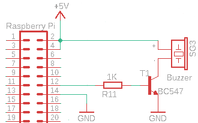

+++
showonlyimage = false
draft = false
image = "img/Music.png"
date = "2019-09-01"
title = "Musik mit Piezo Signalgeber"
writer = "Martin Strohmayer"
categories = ["Raspberry Pi", "Programmierung"]
keywords = ["Buzzer", "beep", "piep", "Piezo", "midi", "tone"]
weight = 1
+++

Mit einem Piezo Signalgeber am GPIO kann man so einiges anstellen, er kann nicht nur ein Piepenton erzeugen, sondern auch Musik abpielen.
<!--more-->

## Einleitung ##

An den Raspberry Pi kann einePiezo Signalgeber, oft wird er auch also Buzzer bezeichnet, angeschlossen werden. Ein Piepen zu erezugen ist dann ganz leicht. Intressanter ist aber ein Musikstück darauf spielen zu lassen.

## Schaltung ##

Der Piezo Signalgeber sollte nicht direkt an den GPIO geschlossen werden, da die Stromaufnahme für den Ausgang zumeist zu hoch ist (30 mA). Über einen 
Transisitor kann, die Ansteuerung nahezu stromlos erfolgen. Dadurch kann das Piezo Element auch mit 5 V versorgt werden.  
Im Schaltungsbeispiel wurde der GPIO18, also bei WiringPi Nummerierung der Pin 1, verwendet. Über den Basis-Vorwiderstand kann man auch die Lautstäke etwas reduzieren - wenn dann der Transistor nicht komplett durchschaltet und dann die Spannung nicht 5 V erreicht. Darum haben ich einen Vorwiderstand von 4,7 KOhm gewählt. Per Software lässt sich das eingeschrenkt über das Puls-Pauseverhältnis anpassen.

 

## Ansteuerung ##

Ein einfacher Piep geht in der Konsole mit WringPi gpio Komandos:
 
```
gpio mode 1 out; gpio write 1 1; sleep 0.1; gpio write 1 0; gpio mode 1 in
```

Damit wird einfach für kurze Zeit der Ausgang gesetzt und ein konstanter kurzer Ton wird ausgegeben.

Wie kann man nun aber Music ausgeben? Dazu muss am Ausgang eine Frequenz erzeugt werden, man muss also den Ausgang mehrmals pro Sekunde ein- und ausschalten. Je nach Frequenz ergibt sich dann ein spezifischer Ton.  
In Python geht das über eine Library wie z. B. RPi.GPIO:

``` Python
import RPi.GPIO as GPIO
import time

tonePin = 18

GPIO.setmode(GPIO.BCM)
GPIO.setup(tonePin, GPIO.IN)
GPIO.setup(tonePin, GPIO.OUT)
p = GPIO.PWM(tonePin, 100)
p.ChangeFrequency(250)
p.start(30)     # parameter: duty-cycle  
time.sleep(0.2)
p.stop()
```

In C könnte man sich das auch leicht selbst programmieren:

``` C 
#include <wiringPi.h>
#include <stdio.h>

void tone(int pin, unsigned int freq, float duration) {
  float SpeedFactor = 1.6; //factor to slow music speed
  duration *= SpeedFactor;

  if (duration<10) { //minimum duration 10ms 
    duration = 10;
  }
  if (freq<=20 || freq>=8000) { //for invalid frequency only duration 
    delayMicroseconds(duration*1000);
    return;
  }
  long PeriodeDelay = (long)(1000000.0/freq); //period time of freq.
  long PeriodeCounts = (long)((duration*1000)/PeriodeDelay); //periods need for duration
  for (int Periode=0;Periode<PeriodeCounts; Periode++) {
    digitalWrite(pin, HIGH); //on period part
    delayMicroseconds(PeriodeDelay*0.2);
    digitalWrite(pin, LOW); //off period part
    delayMicroseconds(PeriodeDelay*0.8);
  }

  //Add a little delay to separate the single tones
  delay(20);
}

void play(int tonePin) {
  tone(tonePin, 697, 195);
  tone(tonePin,1209, 195);
  tone(tonePin, 770, 195);
  tone(tonePin, 852, 195);
  tone(tonePin, 941, 195);
}


int main(void) {
  if (-1 == wiringPiSetup()) {
    printf("Init wiringPi failed!");
    return 1;
  }
  const int tonePin = 1; //GPIO18
  pinMode(tonePin, OUTPUT);
  play(tonePin);
  digitalWrite(tonePin, LOW);
  pinMode(tonePin, INPUT);

  return 0;
}
```

```
gcc -o tone tone.c -lwiringPi -Wall
./tone
```

## Music ##

Man darf sich nicht zu viel erwarten, wenn man über einen Piezo Signalgeber Music ausgeben will, aber einzelne Tonfolgen funktionieren.
Auf der Seite [MUTOPIA PROJECT](https://www.mutopiaproject.org/) kann man sich viele klassische Musikstücke im Midi-Format herunterladen (CC Lizenzen). Bei [BitMidi](https://bitmidi.com/) kann man bekannte Melodien im Midi-Format finden und direkt im Browser abspielen. Ansonsten eignet sich der VLC-Player am besten um in die Musikstücke am PC abspielen zu können. Auf der Seite [Midi To Arduino](https://www.extramaster.net/tools/midiToArduino/) kann man Midi-Dateien in Tonfolgen konvertieren. Die Midi-Datein haben zumeist mehrere Spuren (Tracks), sodass man sich bei der Erzeugung für einen entscheiden muss. Die Seite schlägt eine Spur (Track) vor, überlicherweise passt diese Voreinstellung. Bei Klavierstücken ist das oft "up". Danach muss man noch das Zielsystem (Device) auswählen. Hier muss "Raspberry Pi (Python, GPIO)" aktiviert werden. Nach dem Drücken der Schaltfläche "Convert to Arduino", wird der Programmcode dargestellt. Nun kann der Source in einer py-Datei gespeichert werden. 
  
Allerdings sind noch ein paar Anpassungen nötig:  
- Bei "tonePin = 21" muss der korrekte GPIO also z. B. 18 eingegeben werden.  
- Die Zeile "p = GPIO.PWM(tonePin, pitch)" ist leider falsch und muss durch "p.ChangeFrequency(pitch)" ersetzt werden.  
- Die Zeile "delay(duration)" entspricht der Dauer der Note, hier kann man mit einem Faktor noch eine generelle Geschwindigkeitsanpassung des Stücks vornehmen, "delay(duration*1.5)".  

Danach kann man sich das Stück anhören, indem man mit python3 die Datei ausführt.

<!--wget https://www.mutopiaproject.org/ftp/BeethovenLv/WoO59/fur_Elise_WoO59/fur_Elise_WoO59.mid -->

## Beispielvideo ##

[](https://www.youtube.com/watch?v=5AZpsij4Oi4)

