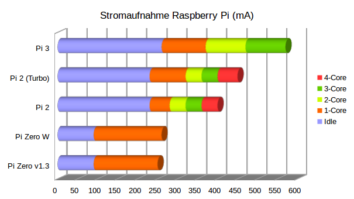

+++
showonlyimage = false
draft = false
image = "img/Strommesser.jpg"
date = "2019-11-24"
title = "Raspberry Pi am USB-Anschluss betreiben"
writer = "Martin Strohmayer"
categories = ["Raspberry Pi", "GC2"]
keywords = ["Consumption", "Verbrauch", "USB", "Pi2", "Pi3"]
weight = 1
+++


Will man eine Raspberry Pi am USB-Anschluss eines Laptops betreiben, so ist man mit ca. 500 mA beschränkt. Welche Modelle kommen damit zurecht?
<!--more-->

## Beschreibung ##

Bei dem Raspberry Pi Jam verwenden wir alte Dell Laptops. Um möglichst einfache Aufbauten zu haben wollen wir die Raspberry Pi mit einem USB-Kabel direkt
über den vorhandenen USB-Anschluss versorgen. Anfänglich hatten wir nur Raspberry Pi Zero Modelle, hier war das kein Problem. Die Stromaufnahme liegt bei ihnen unter 500 mA. Nun haben wir aber Raspberry Pi 2 und 3 Modelle bekommen. Nun soll untersucht werden ob diese auch mit dem USB-Anschluss versorgt werden können.

## Testaufbau ##

Die Stromaufnahme des Systems wurde über einen USB-Tester gemessen. Zuerst wurde die Stromaufnahme im Leerlauf (Idle) Zustand gemessen. Dann wurde mit dem Programm "sysbench" CPU-Last auf einem, zwei, drei und vier Kernen erzeugt und gemessen.  

```
sudo apt-get install sysbench
sysbench --num-threads=1 --test=cpu --cpu-max-prime=20000 run
sysbench --num-threads=2 --test=cpu --cpu-max-prime=20000 run
sysbench --num-threads=3 --test=cpu --cpu-max-prime=20000 run
sysbench --num-threads=4 --test=cpu --cpu-max-prime=20000 run
```

## Ergebnis ##

Verwendet wurde eine Transcend 8 GB Class 10 MicroSD-Karte.  <!-- Die Karte kann einen wesentlichen Einfluss auf die Strohmaufnahme haben! -->
Ansonsten wurde nichts angesteckt. 

| *System*        | *Idle [mA]* | *1-Core [mA]* | *2-Core [mA]* | *3-Core [mA]* | *4-Core [mA]* | CPU-Temp [°C] |
|:----------------|--------|----------|----------|----------|----------|----------|
| Pi Zero V1.3    |  90    | 160      |       |       |       | 49       |
| Pi Zero W       |  90    | 170      |       |       |       | 53       |
| Pi 2 ( 900 MHz) | 230    | 280      | 320      | 360      | 400      | 53       |
| Pi 2 (1000 MHz) | 230    | 320      | 360      | 400      | 450      | 59       |
| Pi 3 (1200 MHz) | 260    | 370      | 470      | 570      |          |          |





## Schlussfolgerung ##

Die Raspberry Pi 2 ist für den Betrieb am USB-Anschluss gut geeignet. Selbst im Turbo-Modus bleibt man unterhalb der 500 mA Grenze. Zu bedenken ist allerdings, dass zusätzliche Hardware auf den GPIOs auch noch Verbrauch generiert. Eine ausreichende Reserve sollte vorhanden sein. Andererseits ist eine Auslastung auf allen vier Kernen im Normalbetrieb eher unwahrscheinlich. Es ist als zu überlegen ob man mit dem Basistakt oder dem Turbo (1000 MHz) arbeitet.  
Die Raspberry Pi 3 hat bereits bei einer Auslastung von zwei Kernen den maximalen Strom fast erreicht. Sie eignet sich weniger für den Betrieb am USB-Anschluss.  

Wer auf Nummer sicher gehen will kann in der Datei "/boot/cmdline.txt" die Anzahl der Kerne limitieren. Man könnte nur drei Kerne freischalten, um so Reserven zu schaffen und mit dem Turbo Modus die Einzelkernleistung erhöhen. So würde das System nie mehr als 400 mA aufnehmen. 

``` 
maxcpus=3
```


<!--
Pi3 xxxx MHz - passiv
idle    260 mA
1 Core  370 mA
2 Core  470 mA
3 Core  570 mA
~4 Core  700 mA   ~53°C


Pi2 900 MHz - passiv
idle    230 mA
1 Core  280 mA
2 Core  320 mA
3 Core  360 mA
4 Core  400 mA   ~53°C


Pi2 1000 MHz - ARM:1000/Core:500/RAM: 500 - passiv
idle    230 mA
1 Core  320 mA
2 Core  360 mA
3 Core  400 mA
4 Core  450 mA   ~59°C
	

Pi2 1000 MHz - ARM:1000/Core:250/RAM:450 -passiv - 3Core
idle    230 mA
1 Core  290 mA
2 Core  350 mA
3 Core  390 mA   ~54°C
4 Core  440 mA 
	


ARM:1000/Core:250/RAM:450

BYTEmark* Native Mode Benchmark ver. 2 (10/95)
Index-split by Andrew D. Balsa (11/97)
Linux/Unix* port by Uwe F. Mayer (12/96,11/97)

TEST                : Iterations/sec.  : Old Index   : New Index
                    :                  : Pentium 90* : AMD K6/233*
--------------------:------------------:-------------:------------
NUMERIC SORT        :          489.16  :      12.54  :       4.12
STRING SORT         :          41.819  :      18.69  :       2.89
BITFIELD            :      1.2403e+08  :      21.28  :       4.44
FP EMULATION        :          109.17  :      52.39  :      12.09
FOURIER             :          6908.2  :       7.86  :       4.41
ASSIGNMENT          :          7.6104  :      28.96  :       7.51
IDEA                :            1537  :      23.51  :       6.98
HUFFMAN             :          723.83  :      20.07  :       6.41
NEURAL NET          :          7.2727  :      11.68  :       4.91
LU DECOMPOSITION    :          261.93  :      13.57  :       9.80
==========================ORIGINAL BYTEMARK RESULTS==========================
INTEGER INDEX       : 23.156
FLOATING-POINT INDEX: 10.759
Baseline (MSDOS*)   : Pentium* 90, 256 KB L2-cache, Watcom* compiler 10.0
==============================LINUX DATA BELOW===============================
CPU                 : 4 CPU ARMv7 Processor rev 5 (v7l)
L2 Cache            : 
OS                  : Linux 4.19.75-v7+
C compiler          : gcc version 8.3.0 (Raspbian 8.3.0-6+rpi1) 
libc                : 
MEMORY INDEX        : 4.587
INTEGER INDEX       : 6.870
FLOATING-POINT INDEX: 5.967
Baseline (LINUX)    : AMD K6/233*, 512 KB L2-cache, gcc 2.7.2.3, libc-5.4.38
* Trademarks are property of their respective holder.


BYTEmark* Native Mode Benchmark ver. 2 (10/95)
Index-split by Andrew D. Balsa (11/97)
Linux/Unix* port by Uwe F. Mayer (12/96,11/97)

TEST                : Iterations/sec.  : Old Index   : New Index
                    :                  : Pentium 90* : AMD K6/233*
--------------------:------------------:-------------:------------
NUMERIC SORT        :          492.81  :      12.64  :       4.15
STRING SORT         :          42.059  :      18.79  :       2.91
BITFIELD            :       1.247e+08  :      21.39  :       4.47
FP EMULATION        :          109.84  :      52.71  :      12.16
FOURIER             :          6952.2  :       7.91  :       4.44
ASSIGNMENT          :          7.7016  :      29.31  :       7.60
IDEA                :          1545.4  :      23.64  :       7.02
HUFFMAN             :          728.15  :      20.19  :       6.45
NEURAL NET          :          7.3119  :      11.75  :       4.94
LU DECOMPOSITION    :          263.64  :      13.66  :       9.86
==========================ORIGINAL BYTEMARK RESULTS==========================
INTEGER INDEX       : 23.315
FLOATING-POINT INDEX: 10.825
Baseline (MSDOS*)   : Pentium* 90, 256 KB L2-cache, Watcom* compiler 10.0
==============================LINUX DATA BELOW===============================
CPU                 : 4 CPU ARMv7 Processor rev 5 (v7l)
L2 Cache            : 
OS                  : Linux 4.19.75-v7+
C compiler          : gcc version 8.3.0 (Raspbian 8.3.0-6+rpi1) 
libc                : 
MEMORY INDEX        : 4.623
INTEGER INDEX       : 6.913
FLOATING-POINT INDEX: 6.004


BYTEmark* Native Mode Benchmark ver. 2 (10/95)
Index-split by Andrew D. Balsa (11/97)
Linux/Unix* port by Uwe F. Mayer (12/96,11/97)

TEST                : Iterations/sec.  : Old Index   : New Index
                    :                  : Pentium 90* : AMD K6/233*
--------------------:------------------:-------------:------------
NUMERIC SORT        :          437.08  :      11.21  :       3.68
STRING SORT         :          37.709  :      16.85  :       2.61
BITFIELD            :      1.1218e+08  :      19.24  :       4.02
FP EMULATION        :           98.81  :      47.41  :      10.94
FOURIER             :          6256.6  :       7.12  :       4.00
ASSIGNMENT          :          6.8636  :      26.12  :       6.77
IDEA                :          1388.5  :      21.24  :       6.31
HUFFMAN             :          655.22  :      18.17  :       5.80
NEURAL NET          :          6.5715  :      10.56  :       4.44
LU DECOMPOSITION    :             238  :      12.33  :       8.90
==========================ORIGINAL BYTEMARK RESULTS==========================
INTEGER INDEX       : 20.891
FLOATING-POINT INDEX: 9.747
Baseline (MSDOS*)   : Pentium* 90, 256 KB L2-cache, Watcom* compiler 10.0
==============================LINUX DATA BELOW===============================
CPU                 : 4 CPU ARMv7 Processor rev 5 (v7l)
L2 Cache            : 
OS                  : Linux 4.19.75-v7+
C compiler          : gcc version 8.3.0 (Raspbian 8.3.0-6+rpi1) 
libc                : 
MEMORY INDEX        : 4.141
INTEGER INDEX       : 6.196
FLOATING-POINT INDEX: 5.406
Baseline (LINUX)    : AMD K6/233*, 512 KB L2-cache, gcc 2.7.2.3, libc-5.4.38


Pi 3:
                    :                  : Pentium 90* : AMD K6/233*
--------------------:------------------:-------------:------------
NUMERIC SORT        :          711.67  :      18.25  :       5.99
STRING SORT         :          70.266  :      31.40  :       4.86
BITFIELD            :      1.9967e+08  :      34.25  :       7.15
FP EMULATION        :          154.13  :      73.96  :      17.07
FOURIER             :           10355  :      11.78  :       6.61
ASSIGNMENT          :          9.2524  :      35.21  :       9.13
IDEA                :          2223.4  :      34.01  :      10.10
HUFFMAN             :          899.15  :      24.93  :       7.96
NEURAL NET          :          11.475  :      18.43  :       7.75
LU DECOMPOSITION    :          402.65  :      20.86  :      15.06
==========================ORIGINAL BYTEMARK RESULTS==========================
INTEGER INDEX       : 33.078
FLOATING-POINT INDEX: 16.544
Baseline (MSDOS*)   : Pentium* 90, 256 KB L2-cache, Watcom* compiler 10.0
==============================LINUX DATA BELOW===============================
CPU                 : 4 CPU ARMv7 Processor rev 4 (v7l)
L2 Cache            : 
OS                  : Linux 4.19.75-v7+
C compiler          : gcc version 8.3.0 (Raspbian 8.3.0-6+rpi1) 
libc                : 
MEMORY INDEX        : 6.822
INTEGER INDEX       : 9.523
FLOATING-POINT INDEX: 9.176
Baseline (LINUX)    : AMD K6/233*, 512 KB L2-cache, gcc 2.7.2.3, libc-5.4.38
* Trademarks are property of their respective holder.

-->


