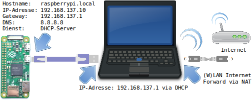

+++
showonlyimage = false
draft = false
image = "img/Raspberry-Pi-USB-Gadget.jpg"
date = "2018-12-02"
title = "Raspberry Pi USB Gadget"
writer = "Martin Strohmayer"
categories = ["Raspberry Pi Zero"]
keywords = ["usb gadget", "ethernet"]
weight = 1
+++

Beim USB-Gadget oder OTG-Betrieb kann ein Einplatinencomputer direkt über den Micro-USB-Anschluss mit einem PC oder Laptop als Client verbunden werden. Der Raspberry Pi Zero verhält sich dann wie ein USB-Gerät und kann z. B. ein
Massenspeicher-, Serielles- oder Netzwerkgerät simulieren. Der Netzwerk bzw. Ethernet-Betrieb ist dabei besonders interessant.
<!--more-->

## Grundsätzliches

Der Raspberry Pi Zero hat einen einzigen USB-Anschluss der direkt mit dem Prozessor verbunden ist. Dadurch kann der USB-Anschluss nicht nur als Host für USB-Geräte (Tastatur,  Maus, USB-Stick) verwendet werden, sondern auch als Client. Beim Client-Betrieb verhält er sich dann wie ein USB-Gerät. Es gibt die unterschiedlichsten Modi wie z. B. Massenspeicher-, Serielles- oder Netzwerkgerät aber auch eine kombierte Funktion ist möglich. Je nachdem welches Kernel-Modul geladen und parametriert wird entscheidet über die Funktion. Weitere Informationen über den OTG-Betrieb und alle möglichen Varianten können der Git-Hub Seite [Raspberry Pi Zero OTG Mode](https://gist.github.com/gbaman/50b6cca61dd1c3f88f41) entnommen werden. 

## Netzwerkgerät

Besonders interessant für den Bastellbetrieb ist der Einsatz als Netzwerkgerät, dann kann der Raspberry Pi Zero direkt an einem PC oder Laptop per USB angeschlossen werden. Die Versorgung und die Netzwerk-Kommunikation erfolgen über USB. Man benötigt für diese Betrieb also nur ein Mirco-USB Kabel. WLAN ist nicht nötig weil die Verbindung über einen virtuellen Netzwerkanschluss läuft. Das funktioniert dann auch mit dem billigen Raspberry Pi Zero der kein WLAN integriert hat.

### Einrichtung Raspberry Pi Zero

Die Installation und Einrichtung des OTG-Ethernet Modus ist nicht ganz einfach, darum habe ich alles im Dokument [Raspberry Pi Jam - Raspjamming Installation/Vorbereitung/Microsoft Windows](http://raspjamming.at/PDF/Raspjamming%20-%20Admin-GLT18.pdf) zusammengefasst. Kapitel 1.2 "USB Gadget/OTG Mode ZeroConf" beschreibt dabei die Netzwerkkonfiguration über Zero Configuration Networking System (ZeroConf). Dazu muss am Host-PC allerdings der Linux-Dienst Avahi (avahi-daemon) installiert sein. Am Windows PC muss das Programm [Bonjour](https://support.apple.com/kb/DL999?locale=de_AT) von Apple installiert sein.\

Kapitel 1.3 "USB Gadget/OTG Mode DHCP-Server" beschreibt die Netzwerkkonfiguration über DHCP. In dem Fall muss am Host PC nichts eingerichtet werden, da alle Einstellungen für das Netzwerk vom DHCP-Server übermittelt werden. Dieser Modus ist eindeutig zu bevorzugen!\

 

Wem die Anpassung zu kompliziert oder aufwendig ist, kann auch unser modifiziertes [Raspjamming Raspbian Image](http://strohmayers.com/image/Raspjamming-April-2018.img.7z) verwenden. Dort ist alles für den OTG-Betrieb vorbereit und man muss nur noch den Host parametrieren wenn Internet am Raspberry Pi benötigt wird. 
Erreichbar ist der Raspberry Pi Zero über den Namen "raspberrypi.local" und der IP-Adresse "192.168.137.10".

### Einrichtung Host

Die Anleitung [Raspberry Pi Jam - Raspjamming](http://raspjamming.at/PDF/Raspjamming-GLT18.pdf) beschreibt in Kapitel 1 alle Schritte für die komplette Einrichtung auf Linux. Wenn Windows als Host zum Einsatz kommt, muss die Anleitung [Raspberry Pi Jam - Raspjamming Installation/Vorbereitung/Microsoft Windows](http://raspjamming.at/PDF/Raspjamming%20-%20Admin-GLT18.pdf) verwendet werden. Kapitel 1.3.2 "Host (DHCP-Client)" beschreibt den Vorgang für Windows 7 und Windows 10 (inkl. Gemeinsame Nutzung der Internet Verbindung).\
Für Linux steht das Script [PiConnect.sh](https://raw.githubusercontent.com/woergi/Raspjamming_Scripts/master/PiConnect.sh)
 zur Verfügung das die Verbindung zur Raspberry Pi herstellt und Internet zur Verfügung stellt bzw. "routing" einrichtet.\

Diese Konfiguration wurde auch bei meinem Vortrag bei den Grazer Linuxtage 2018 beschrieben.\

