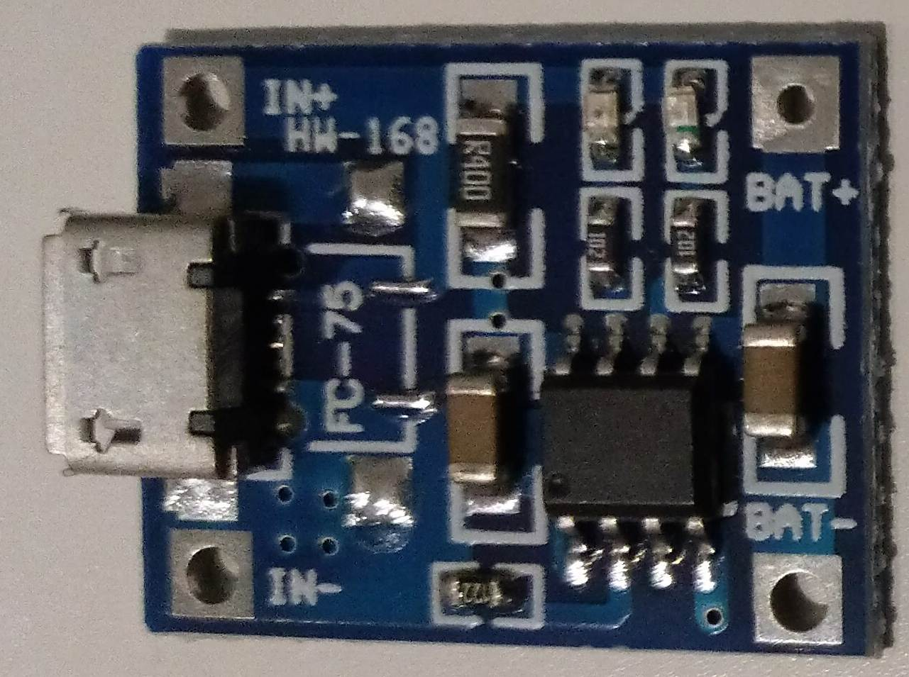

+++
showonlyimage = false
draft = false
image = "img/pi0-accu-powered.jpg"
date = "2020-01-26"
title = "Raspberry Pi Zero Spannungsversorgung"
writer = "Martin Strohmayer"
categories = ["Raspberry Pi Zero"] 
keywords = ["Stromaufnahme", "Consumption", "mA", "Lithium", "NiMH", "Akku", "accu"]
weight = 1
+++

Der Raspberry Pi Zero läuft eigentlich mit einer 5 V Versorgung über den Micro-USB Anschluss. Was aber wenn die Versorgung über Akkus oder andere Quellen erfolgt. Der Raspberry Pi Zero lässt sich nämlich, unter bestimmten Umständen, schon mit etwas mehr als 3,3 V betreiben. Bei der Überspannung liegt der Grenzwert dann bei 6,5 V.
<!--more-->

## Grundsätzliches

Normalerweise wird der Raspberry Pi Zero über den Micro-USB für Power oder OTG versorgt. Man kann ihn aber wie bei allen Raspberry Pis auch über den 5 V GPIO Anschluss versorgen. Bei den normalen Pis ist das nicht ratsam, weil damit die Poly-Fuse also die Sicherung umgangen wird. Doch bei dem Raspberry Pi Zero ist das unerheblich weil er keinen Sicherung hat. Weiters fehlt ihm auch der Überspannungsschutz von ca. 6 V der anderen Pi Varianten.  
Die geringe Leistungsaufnahme des Raspberry Pi Zero macht ihn zum optimalen Kanditaten für einen Batteriebetrieb. Damit stellt sich die Frage welche minimale und maximale Spannungen sind zulässig bzw. werden benötigt. 

## Spannungen 

Die Raspberry Pi Zero hat 3 Versorgungsspannungen, einmal 5 V von extern und dann 3,3 V und 1,8 V die intern erzeugt werden. Aus der externen 5 V Versorgung wird mit dem Bauteil PAM2306 die 1,8 und 3,3 V Spannung erzeugt. Bei dem Bauteil handelt es sich um einen effizienten DC/DC Step-Down-Wandler. Über das Datenblatt kann man sich die maximale und minimale Spannungen heraussuchen. Bei der üblichen bzw. empfohlenen Betriebszuständen wird eine Spannung von 2,5 bis 5,5 V angegeben. Wobei 2,5 V natürlich für die Erzeugung von 3,3 V nicht ausreicht. Hier bedarf es eines geringfügig höheren Wert, da nur Abwärts gewandelt werden kann. Beim absolut maximalen Wert für die Betriebsspannung wird 6,5 V angegeben. Damit sind die Werte für die externe Versorgung also mit größer 3,3 V bis 6,5 V definiert. Wozu wird nun die 5 V Spannung bei Raspberry Pi Zero verwendet? Dies kann man herausfinden indem man den Schaltplan analysiert. Nur der HDMI-Anschluss, der USB-Anschluss, der 5 V GPIO, sowie die Zuleitung zum DC/DC Wandler benötigt die 5 V Spannung.  
Wird also weder am HDMI noch am USB Anschluss noch am 5 V GPIO etwas angeschlossen, so darf die Betriebsspannung bis auf knapp 3,3 V sinken. Diese Erkenntnis eröffnet neue Möglichkeiten bzgl. des Einsatzes von alternativen Spannungsversorgungen. 

## Ni-MH Akkus

Wenn man mit Ni-HM Akkus die Raspberry Pi versorgen will, dann empfehlen sich 4 Akkus zu verwenden. Die Einzelspannung der Akkus beträgt 1,2 V. Damit wird also eine Summenspannung von ca. 4,8 Volt erreicht. Die Spannung von diesen Akkus wird bei der Endladung auf ca. 1,1 V absinken. Dann wären immer noch 4,4 V vorhanden.  
Geht man von der ermittelten Minimalspannung aus, so könnte man die Raspberry Pi Zero auch mit nur 3 Akkus betreiben dann wäre aber bei ca. 1,1 V Schluss. Dies entspricht dann allerdings auch einer sehr starken Entladung der Akkus.  
2 Akkus mit einer Spannung von ca. 2,2-2,4 V können die Raspberry Pi Zero nicht direkt versorgen. Koppelt man die 2 Akkus aber mit einem DC-DC Step-Up Wandler, so kann die benötigte Spannung erreicht werden. Ich habe mich hier für die Platine DD0606SA entschlossen. 

Zuerst wählte ich dafür eine 5 V Version eines solchen Wandlers. Allerdings ergaben sich Probleme durch plötzliche Neustarts des Systems bei WLAN Nutzung. Die ist vermutlich auf eine unzureichende Stromversorgung durch den DC/DC Wandler zurückzuführen.  
Laut Hersteller kann bei 2 V Eingangspannung und 5 V Ausgangsspannung 410 mA bereitgestellt werden können. 

| Eingangsspannung | Eingangstrom | Ausgangsspannung | Ausgangsstrom	|
|:-----:|:-------:|:------:|:-------:|
| 2,0 V | 1,24 A  | 4,99 V |  0,41 A |
| 2,5 V | 1,3 A   | 4,98 V |  0,55 A |
| 3,0 V | 1,3 A   | 4,97 V |  0,68 A |
| 3,3 V | 1,34 A  | 4,96 V |  0,79 A |
| 3,7 V | 1,22 A  | 4,96 V |  0,8 A |
| 4,2 V | 1,0 A   | 4,95 V |  0,8 A |

Bessere Ergebnisse hatte ich indem der Wandler die Spannung der Akkus auf 3,7 V statt 5 V erhöhte.
Laut Hersteller kann bei 2 V Eingangspannung und 3,7 V Ausgangsspannung 480 mA bereitgestellt werden können. 

| Eingangsspannung | Eingangstrom | Ausgangsspannung | Ausgangsstrom	|
|:-----:|:------:|:------:|:-------:|
| 2,0 V | 1,2 A  | 3,73 V |  0,48 A |
| 2,5 V | 1,24 A | 3,72 V |  0,66 A |
| 3,0 V | 1 A    | 3,66 V |  0,69 A |
| 3,3 V | 1 A    | 3,65 V |  0,8 A |

Auch wenn sich die Stabilität dadurch erhöhte, gab es immer noch Zustände bei denen es zu plötzlichen Neustarts kam. Nur nach Abschalten der WLAN Funktion bzw. Einsatz einen Raspberry Zero V1.3 (ohne WLAN), war ein fehlerfreier Betrieb möglich.
Ohne zusätzliche Beschaltung besteht beim Einsatz von NiMH-Akkus keine Tiefentladungsschutz. Ein Beispiel für so eine einfache Schaltung bietet der Make Bericht [Tiefentladeschutz für Akkus](https://www.heise.de/make/artikel/Tiefentladeschutz-fuer-Akkus-3276794.html).

## Batterien 
 
Wenn man eine Versorgung mit 4 AA Akkus vorsieht, könnte es allerdings auch auftreten das jemand statt NiMH-Akkus normale Batterien mit einer Spannung von 1,5 V einsetzt. Wie wir aber aus dem oberen Ermittlung wissen, liegt die Maximalspannung bei 6,5 V. Auch bei den 4 Batterien mit der Summenspannung von 6 V liegt man darunter und es sollte zu keinen Problemen kommen. Natürlich nur sofern am HDMI, 5 V GPIO und USB nichts angeschlossen ist. 
  

## Lithium Akkus

Ein Raspberry Pi Zero kann mit einer Lithium Zelle mit ca. 3,7 V gut betrieben werden. Als Lithium-Ionen Akku bietet sich der standardisierte Typ 18650 mit 2500 bis 3500 mAh an.  
Lithium-Polymer Akku sind empfindlicher, dafür aber in einer flachen Bauform erhältlich. Der Typ 503035 mit 500 mAh wird bereits mit einer integrierten Schutzelektronik kostengünstig verkauft. So ist er vor Überladung, Tiefentladung und Kurzschluss geschützt. Der Ladestrom darf aber maximal 1C also 500 mA betragen! Empfohlen wird 0,5C also 250 mA. Der maximale Entladestrom wird mit ausreichenden 1500 mA angegeben. Die Betriebstemperatur liegt zwischen 0 und 45 °C.

Zusätzlich zur Lithium Zelle wird noch eine Ladeelektronik benötigt. Die Platine FC-75 bzw. TP4056 auf Basis des ICs TP4056 bietet sich dafür an. 

Achtung der Ladestrom ist über einen Widerstand anpassbar und muss zur Lithium Zelle passen! Zumeist sind die Platinen auf 1 A voreingestellt, was für keine Zellen viel zu hoch ist.  
Laut [Datenblatt](https://dlnmh9ip6v2uc.cloudfront.net/datasheets/Prototyping/TP4056.pdf) lautet die Formel für den Ladestrom IBAT:

IBAT = VPROG / RPROG * 1200 ,  VPROG=1 V 

| RPROG (kOhm) | IBAT (mA) |
|:----:|:----:| 
| 10   | 130  | 
| 5    | 250  |
| 4    | 300  |
| 3    | 400  |
| 2    | 580  |
| 1.66 | 690  |
| 1.5  | 780  |
| 1.33 | 900  |
| 1.2  | 1000 |

Beim 503035 Akku müsste also der Widerstand von 1,2 kOhm durch 5 kOhm getauscht werden.  
Es gibt auch noch Platinen mit dem TP4056 IC die einen eigenen OUT+ und OUT- Pin besitzen. Sie haben zusätzlich eine Batterieschutzschaltung integriert. Hier ist aber darauf zu Achten, dass bei Ladung des Akkus die Last also die Raspberry Pi Zero abgeschaltet ist. Es sollte also ein Wechselschalter oder ähnliches benutzt werden. Wobei der Typ 503035 eine eigene Schutzschaltung besitzt.  
Die Ladespannung beträgt maximal 4,2 V. Beim Entladen sinkt die Spannung wieder von 4,2 V bis minimal 2,5 V. Die Schutzschaltung des TP4056 Platine schaltet irgendwo zwischen 2,5 V und 3 V ab. Die Schutzschaltung des 503035 Lithium-Polymer Akku, sollte auch bei 3 V abschalten. Dies konnte aber nicht verifiziert werden.  
Kurz vor dem Erreichen der Schutzabschaltung funktioniert die Raspberry Pi Zero nicht mehr, weil der Spannung zu gering ist.

Es gibt auch Ladeelektronik die einen DC/DC Step-Up-Wandler integriert hat. So eine Patine ist unter den Namen DD05CVSA erhältlich. Sie kann über VIN und GND mit einer Micro-USB Buchse für das Laden verbunden werden. Der Anschluss BAT und GND wird mit dem Lithium Akku verbunden. Am Ausgang VOUT und GND kann dann 5 V abgegriffen werden. Achtung die Platine hat keine Schutzmechanissmen integriert. Darum kombiniert man sie am besten noch mit einem Schutzschaltung von Type DD04CPMA. So ist der Akku vor Überladung, Tiefentladung und Kurzschluss geschützt.
 
