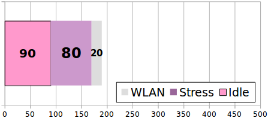

+++
showonlyimage = false
draft = false
image = "img/consumtion.jpg"
date = "2018-12-09"
title = "Raspberry Pi Zero W Stromaufnahme"
writer = "Martin Strohmayer"
categories = ["Raspberry Pi Zero"] 
keywords = ["Stromaufnahme", "Consumption", "mA"]
weight = 1
Version = "Bullseye K5 & K6"
+++


Der Raspberry Pi Zero W ist ideal für den Einsatz, wenn wenig Energie zur Verfügung steht. Sei dies nun aufgrund eines Batteriebetriebs oder auch der Betrieb an einem USB-Anschluss (OTG-Betrieb). Der USB-Anschluss liefert nämlich laut Spezifikation maximal 500 mA. Reicht das für den Betrieb des Raspberry Pi Zero W?
<!--more-->

## Messaufbau

Beim Test wurde nichts außer einer MicroSD-Karte und ein USB-Kabel für den OTG-Betrieb angeschlossen. WLAN war verbunden, im Idle-Betrieb ohne aktive Kommunikation. Gemessen wurde mit einem USB-Messgerät. CPU-Last wurde mit dem Programm 'stress' erzeugt. 


## Messung

Die Messergebnisse offenbaren einen Stromverbrauch im Idle-Betrieb von nur 90 mA ohne WLAN und 110 mA mit verbundenen WLAN. Bei CPU-Belastung stieg der Wert um 80 mA auf maximal 190 mA an. Wird das WLAN stark belastet kann der Verbrauch kurzzeitig auf bis zu 290 mA steigen!  
Die Leistung beträgt also ca. 0,6 Watt im Idle-Betrieb und 1 Watt im ausgelasteten Betrieb. Kommt starke CPU-Last und WLAN Kommunikation zusammen, so liegt die maximale Leitungsaufnahme bei ca. 1,5 Watt. Damit steht dem Betrieb am USB-Bus (2,5 Watt) nichts entgegen!  
Zu beachten ist allerdings, dass durch zusätzlich angeschlossene Hardware wie z. B. Display oder Elektronik ein höherer Verbrauch generiert wird.

 

## Optimierungen

Das Abschalten des HDMI-Ausgangs mit dem Aufruf ``vcgencmd display_power 2 0``, bringt eine Reduktion von 10 mA.  
Beim Auruf muss man die ID des Displays angeben:

| Display       | ID |
|---------------|:--:|
| Main LCD      |  0 |
| Secondary LCD |  1 |
| HDMI 0        |  2 |
| Composite     |  3 |
| HDMI 1        |  7 |


Das Abschalten der LED brachte keine messbare Reduktion. Rein rechnerisch liegt die Verringerung bei 3 mA.  
WLAN kann zu Beispiel über den 'rfkill' Befehl deaktiviert werden. Parameter 'list' dient dabei zum Auflisten der Geräte, 'block' zum Abschalten und 'unblock' zum Einschalten.

``rfkill list``
``` 
0: hci0: Bluetooth
	Soft blocked: no
	Hard blocked: no
1: phy0: Wireless LAN
	Soft blocked: no
	Hard blocked: no
```
``rfkill block 1``\
``rfkill list``
``` 
0: hci0: Bluetooth
	Soft blocked: no
	Hard blocked: no
1: phy0: Wireless LAN
	Soft blocked: yes
	Hard blocked: no
```
``rfkill unblock 0``

Permanent kann WLAN und Bluetooth mit einem Eintrag in der Konfigurationsdatei "config.txt" deaktiviert werden.

``` 
dtoverlay=pi3-disable-wifi
dtoverlay=pi3-disable-bt
```

Das so deaktivierte WLAN reduziert die Stromaufnahme um 20 mA. 
