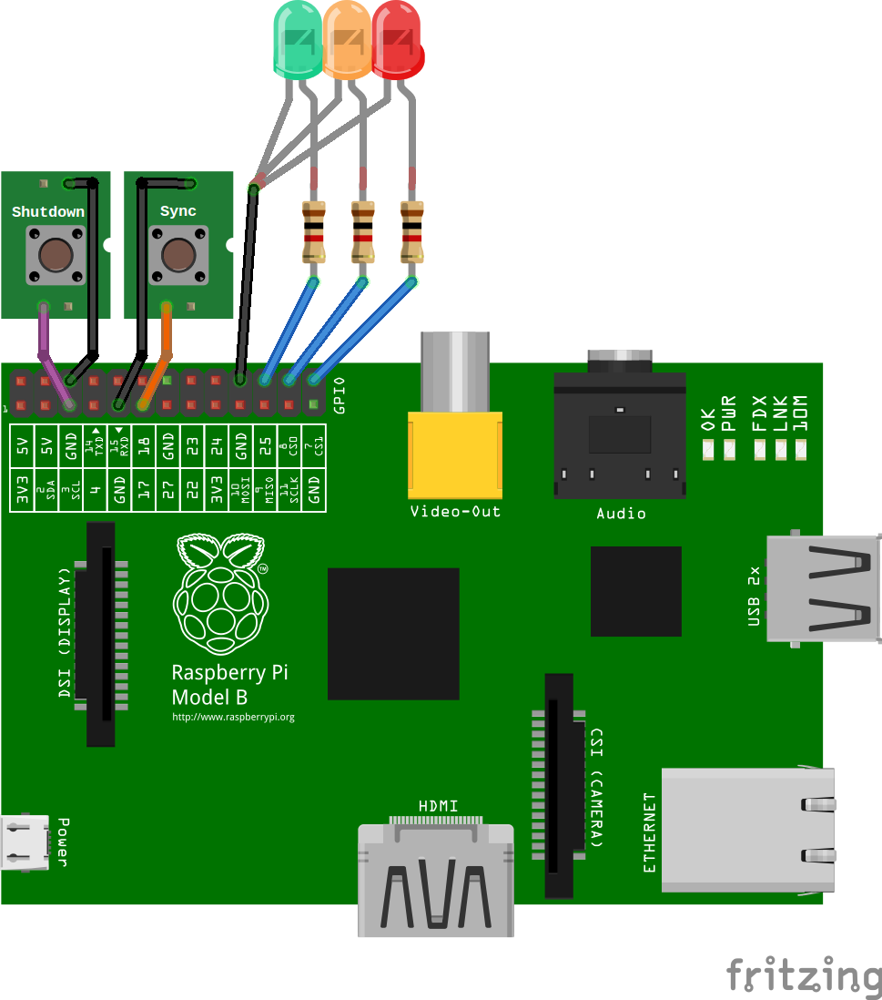
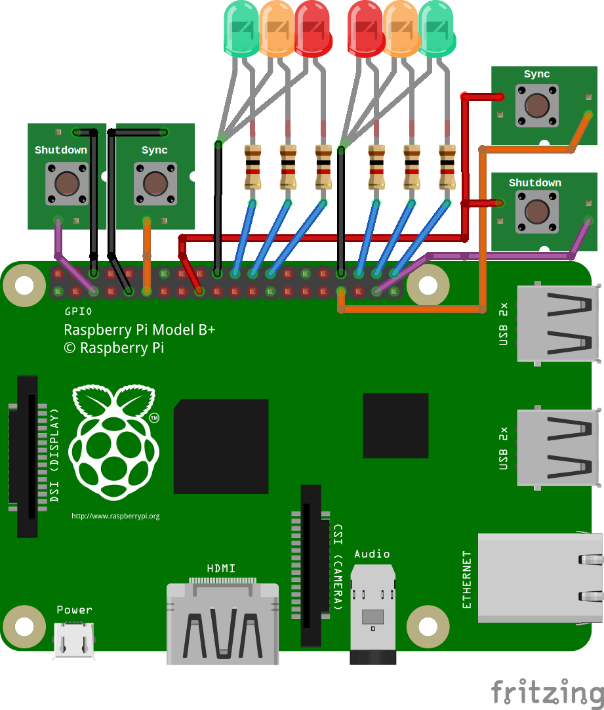
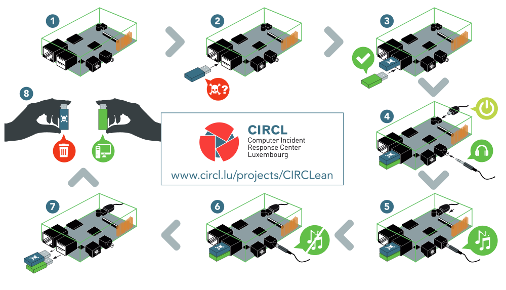
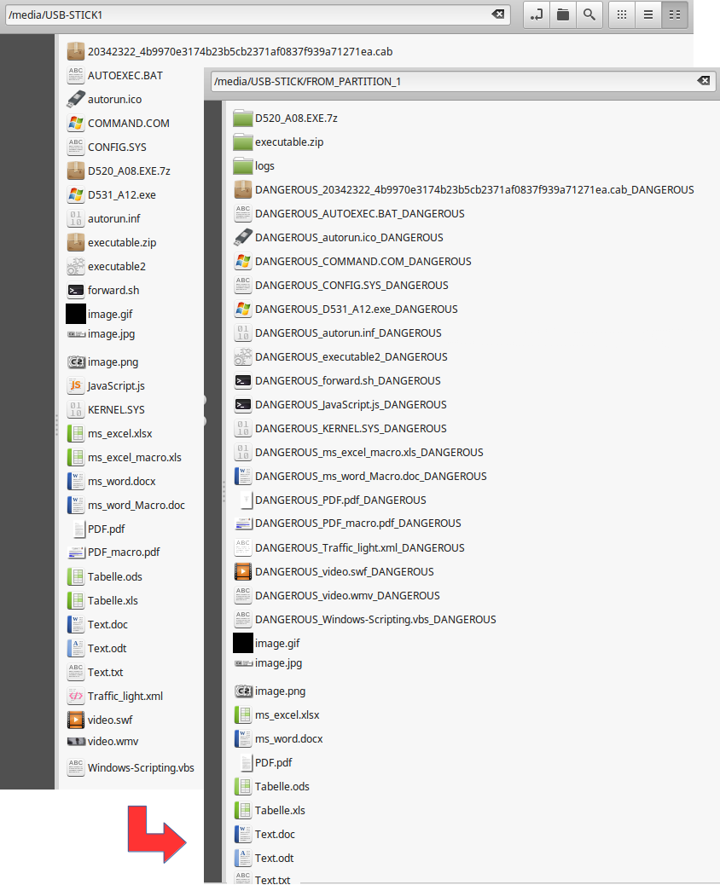

+++
showonlyimage = false
draft = false
image = "img/USB-Sanitizer.jpg"
date = "2019-11-16"
title = "CIRCLean USB Sanitizer"
writer = "Martin Strohmayer"
categories = ["Raspberry Pi"]
keywords = ["USB", "Sanitizer", "USB-Killer", "Malware", "Schadprogramm"]
weight = 1
+++

USB-Sticks unbekannter Herkunft können potentiell gefährliche Daten beinhalten. So einen USB-Stick sorglos in den eigenen PC oder Laptop zu stecken wäre nicht ratsam.
<!--more-->

## Beschreibung ##

USB-Sticks unbekannter Herkunft können potentiell gefährliche Daten beinhalten oder sich als Hacker Tool erweisen. Malware, Ransomware, Macroviren und andere Schafsoftware kann sich darauf befinden und verbreitet werden. Eine veränderte Firmware kann als Einfallstor, Trojaner oder Keylogger genutzt werden. So einen USB-Stick sorglos in den eigenen PC oder Laptop zu stecken wäre nicht ratsam.  

**Beispiele:**

* [USB-Killer Gerät](https://usbkill.com) 
* [BadUSB](https://www.itsb.ruhr-uni-bochum.de/themen/badusb.html)
* [SyncCrypt: Neue Ransomware lauert in JPG-Dateien](https://www.heise.de/security/meldung/SyncCrypt-Neue-Ransomware-lauert-in-JPG-Dateien-3808437.html)
* [Analysiert: Alte Masche, neue Verpackung - Infektion durch PDFs](https://www.heise.de/security/artikel/Analysiert-Alte-Masche-neue-Verpackung-Infektion-durch-PDFs-3722708.html)

CIRCLean USB-Sanitizer ist eine freie Hardwarelösung zum Überprüfen von Dokumenten auf einem nicht vertrauenswürdigen USB-Stick. Das Gerät kopiert automatisch Dateien und speichert sie auf einem eigenen vertrauenswürdigen USB-Stick. Der Fokus vom USB-Sanitizer liegt auf der Dokumentenprüfung, auch wenn die verwendete Transportschicht (der USB-Stick) nicht vertrauenswürdig ist oder ein Verdacht besteht. Im schlimmsten Fall wäre nur das USB-Sanitizer Gerät gefährdet, nicht jedoch der eigene Computer, der die Daten liest.  
Das System wurde speziell für den Einsatz mit einer Raspberry Pi Hardware vorbereitet. Weitere Informationen kann der [Projektseite](https://www.circl.lu/projects/CIRCLean/) entnommen werden. Dokumentation, Source Code und das offizielle Image wird auch auf der [GitHub](https://github.com/CIRCL) Seite zur Verfügung gestellt.  

Sehr zu empfehlen ist auch der Blog-Eintrag von Michael Kofler [CIRCLean USB-Stick-Checker](https://kofler.info/circlean-usb-stick-checker/).

## USB Sanitizer vom Grazer Computer Club ##

Der Grazer Computer Club hat über einen GitHub Fork Erweiterungen zum Projekt hinzugefügt und ein eigenes Image erstellt. Über die [GitHub](https://github.com/GrazerComputerClub/Circlean) Seite wird alles zur Verfügung gestellt.  
Beim dem GC2-Image werden alle bisherigen Raspberry Pi Typen und Varianten unterstützt. Bei den Raspberry Pi Zero und den A Varianten muss ein USB-Hub bzw. USB-Hub-HAT eingesetzt werden, da Quell- und Ziel-USB-Stick gleichzeitig angeschlossen sein müssen. Das GC2-Image hat zum original Projekt noch Optimierungen, Features in Bereich Visualisierung sowie Kompatibilität hinzugefügt. An der generellen Funktionalität wurden keine Änderungen durchgeführt. Das GC2-Image bzw. das Raspbian Betriebssystem darauf wurde nicht extra gegen Beeinflussung oder mögliche Schwachstellen geschützt, es ist eher als Entwicklungs- und Versuchsversion zu sehen.  
Als visuelle Rückmeldung werden 3 LEDs an unterschiedlichen Positionen genutzt. Die rote LED leuchtet, wenn der nicht vertrauenswürdigen USB-Stick, also die Quelle eingesteckt wurde. Die grüne LED leuchtet wenn der vertrauenswürdigen USB-Stick, also das Ziel, eingesteckt wurde. Die mittlere orange LED leuchtet, wenn der Synchronisierungsvorgang gestartet wurde. Sie blinkt dabei, wenn eine Übertragung am USB-Bus stattfindet.  
Zusätzlich gibt es noch zwei Tasten für das Herunterfahren der Raspberry Pi und Starten der Synchronisierung.

## Anschluss ##

Es wurden zwei mögliche Positionen für die LEDs vorgesehen. Eine Position ist kompatibel mit der PiStop Ampel (Bezug [PIMORONI](https://bit.ly/2VVJ1Sd)) die direkt auf die GPIO-Leiste gesteckt wird. Diese Position bei GPIO25, GPIO8 und GPIO7 ist kompatibel mit allen Raspberry P Versionen.  
Die zweite mögliche Position ist für die Ampel die beim Raspberry Pi Jam eingesetzt wird (China Produkt). Bei dieser Ampel sind die rote und die grüne LED vertauscht. Sie kann nur auf Raspberry Pi Varianten mit 40-Pin Header Anschluss bei GPIO16, GPIO20 und GPIO21 genutzt werden. Diese Belegung ist auch kompatibel mit dem GC2-xHAT Aufsteckboard. Auch hier sind die entsprechenden Ampel-LEDs vorhanden.  
Für die Tasten wurde wieder eine Position für die alten Raspberry Pi Varianten und eine kompatible für den GC2-xHAT vorgesehenen. Die linke Taste am GC2-xHAT startete die Synchronisierung die rechte fährt das System herunter. Besser ist allerdings die Nutzung des GPIO3 da damit auch ein neuerlicher Start ausgelöst werden kann, wenn die Raspberry Pi heruntergefahren wurde. 

 

 

|Bauteil| Aktiv | Funktion | Pos. A | Pos. B |
|-------|-------|----------|--------|--------|
| Rote LED | High | Nicht vertrauenswürdigen USB-Stick angesteckt | GPIO07 | GPIO21  |
| Orange LED | High | Synchronisierungsvorgang läuft | GPIO08 | GPIO20 |
| Grüne LED | High | Vertrauenswürdigen USB-Stick angesteckt | GPIO25 | GPIO21 |
| Sync Taste | Low | Synchronisierungsvorgang starten | GPIO17 | - |
| Sync Taste | High | Synchronisierungsvorgang starten | - | GPIO13 |
| Shutdown Taste | Low | System herunterfahren bzw. starten | GPIO03 | - |
| Shutdown Taste | High | System herunterfahren | - | GPIO26 |

## Installation ##

Nach dem Download der neuesten Release-Version von [Git-Hub](https://github.com/GrazerComputerClub/Circlean/releases) liegt das Image "image_20__-__-__-CIRCLean-USB-Sanitizer-full.zip" als komprimierte ZIP-Datei vor und kann direkt auf eine SD-Karte übertragen werden. Hierzu wird eine mindesten 4 GB große SD- bzw. MicroSD-Karte benötigt.  
Unter Linux kann dazu das grafische Programm [Etcher](https://www.balena.io/etcher/) verwendet werden. Unter Windows kann mit dem Programm [Rufus](https://rufus.akeo.ie/) die Übertragung durchgeführt werden. Danach kann die SD-Karte in den Raspberry Pi gesteckt werden.

## Funktionsweise ##

Man steckt den nicht vertrauenswürdigen USB-Stick links oben in die USB-Buchse. Dann steckt man den vertrauenswürdigen USB-Stick auf eine weitere USB-Buchse. danach wird die Versorgung (Micro USB Power) angeschlossen. Damit fährt das System hoch und der Synchronisierungsvorgang startet ohne Interaktion. Während des Synchronisierungsvorgangs wird Musik abgespielt, sofern Kopfhörer oder Lautsprecher angeschlossen wurden. Danach stoppt die Musik und das System fährt wieder automatisch herunter. Die USB-Sticks können entfernt werden.  
Beim GC2-Image kann auch zur Laufzeit der Vorgang gestartet werden. Wird das System ohne USB-Sticks gestartet, so verbleibt es im aktiven Zustand. Beim Einstecken der USB-Sticks wird die entsprechende LED eingeschaltet. Die Synchronisierung starten dann nach betätigen der Sync-Taste. Nach dem Synchronisierungsvorgangs erlischt die orange LED und die Musik hört zu spielen auf. Dann können die USB-Sticks entfernt werden. Das Herunterfahren des Systems wird über eine eigene Shutdown-Taste gestartet.  

 
*[CC BY-SA](https://creativecommons.org/licenses/by-sa/3.0/at/) , Alexandre Dulaunoy CIRCL - Computer Incident Response Center Luxembourg*

## Resultat ##

Nach dem Synchronisierungsvorgang wurden alle Daten von Quell- auf den Ziel-USB-Stick kopiert. Dabei wurden Archive wie zip- und 7zip-Dateien entpackt und in einem eigenen Verzeichnis geprüft.  
Möglicherweise gefährliche Dateien wie z. B. Ausführbare- und Scripting-Dateien, Boot-Dateien, Office Dateien mit Macros, WVF-Videos wurden als potentiell gefährlich markiert.  
Auf dem Quell USB-Stick wurde die Datei autorun.inf umbenannt. Sie ist potentiell sehr gefährlich, wenn sie mit alten Windows Versionen automatisch ein Programm ausführt. Ab Windows XP wurde dieses Verhalten aber bereits aus Sicherheitsgründen deaktiviert [Update for Windows Autorun](http://technet.microsoft.com/en-us/security/advisory/967940).

 

## Nachteil ##

Es wird keine echte Überprüfungen der Dateien auf Schadsoftware durchgeführt. Es erfolgt lediglich eine Analyse des Dateityps auf potentielle Gefährdung. 

## Beispielvideo ##

## Verlinkungen

Review von Michael Kofler Blog [CIRCLean USB-Stick-Checker](https://kofler.info/circlean-usb-stick-checker/)  
[Projektseite](https://www.circl.lu/projects/CIRCLean/)  
[GC2 Git-Hub Projekt](https://github.com/GrazerComputerClub/Circlean)  
 

