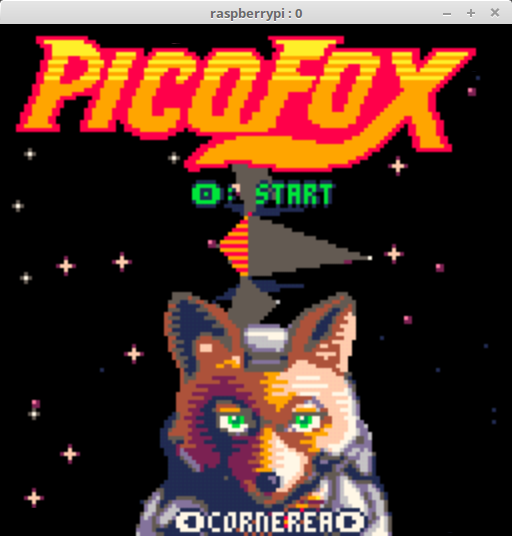

+++
showonlyimage = false
draft = false
image = "img/VNC-Server-PICO-8.jpg"
date = "2019-01-02"
title = "VNC - Virtual Network Computing"
writer = "Martin Strohmayer"
categories = ["Raspberry Pi"]
keywords = ["VNC", "Remote control", "PICO-8", "dispmanx"]
weight = 1
+++


Wer sich gerne per Remote Control auf die grafische Oberfläche des Raspberry Pi verbinden möchte, kann dazu einen speziell angepassten VNC-Server benutzen.
<!--more-->

## Grundsätzliches

Virtual Network Computing, kurz VNC ist ein Dienst bei dem der grafische Oberfläche eines entfernten Computers auf einem anderen angezeigt wird. Die Tastatur- und Mauseingabeneingaben werden vom lokalen an den entfernten Computer übertragen.  
VNC verwendet das Remote Framebuffer Protocol und ist damit plattformunabhängig benutzbar. Für den Raspberry Pi ist eine eigens angepasste Version verfügbar, die per Dispmanx API direkt GPU Funktionen nutzt.


## Installation

```
sudo -i
apt-get install libvncserver-dev libconfig++-dev libgles2-mesa-dev libegl1-mesa-dev 
cd /usr/src/
git clone https://github.com/patrikolausson/dispmanx_vnc.git
cd dispmanx_vnc
make
cp dispmanx_vncserver /usr/local/bin/
```

"/etc/systemd/system/dmxvnc.service":
```
[Unit]
Description=Dispmanx VNC

[Service]
Type=simple
User=root
ExecStart=/usr/local/bin/dispmanx_vncserver 
StandardOutput=null
StandardError=syslog

[Install]
WantedBy=multi-user.target
```

```
exit
```

Danach kann der Dienst mit ``systemctl enable dmxvnc`` aktiviert werden. Dann könnte man den Dienst mit ``service dmxvnc start`` starten oder einen Neustart durchführen.  
Sollte man später das Programm direkt verwenden, also ohne Kompilierung, werden folgenden Runtime Bibliotheken benötigt:

```
sudo apt-get install libvncserver1 libconfig++9v5 libgles2-mesa libegl1
```

## VNC Viewer (Client)

Es gibt eine Vielzahl an VNC Viewern, z. B. xvnc4viewer der mit dem Aufruf ``apt-get install xvnc4viewer`` installiert wird. Ein VNC Viewer auf Java Basis ist direkt portabel und kann auf allen Plattformen verwendet werden. Ich kann hier TigerVNC empfehlen, den dieser Client kann auch den Bildschirm vergrößern. Er wird für alle Plattformen und auch für Java auf [GitHub](https://github.com/TigerVNC/tigervnc/releases) zur Verfügung gestellt.  

Die Verbindung zur Raspberry Pi erfolgt über den Namen 'raspberrypi.local' und dem Port 5900.

 

Wenn man die Taste 'Options...' drückt, kann man bei den Einstellungen für die Bildschirmauflösung 'Screen', den Zoomfaktor eingeben. Mit dem Raspberry Pi funktioniert dies allerdings nur bis maximal 200 %.
 
 

Dann kann die grafische Oberfläche des Raspberry Pi direkt angezeigt und bedient werden. Man könnte z. B. ein PICO-8 Spiel programmieren oder testen.




## Blog Referenzen

[PICO-8 Konsole mit WaveShare LCD HAT](../wavesharelcdhat)  


