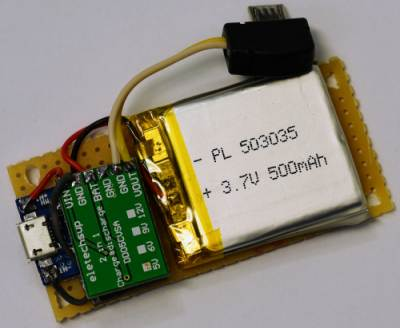
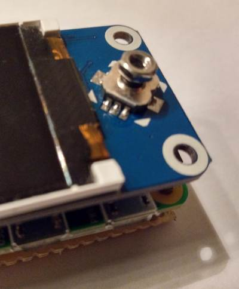
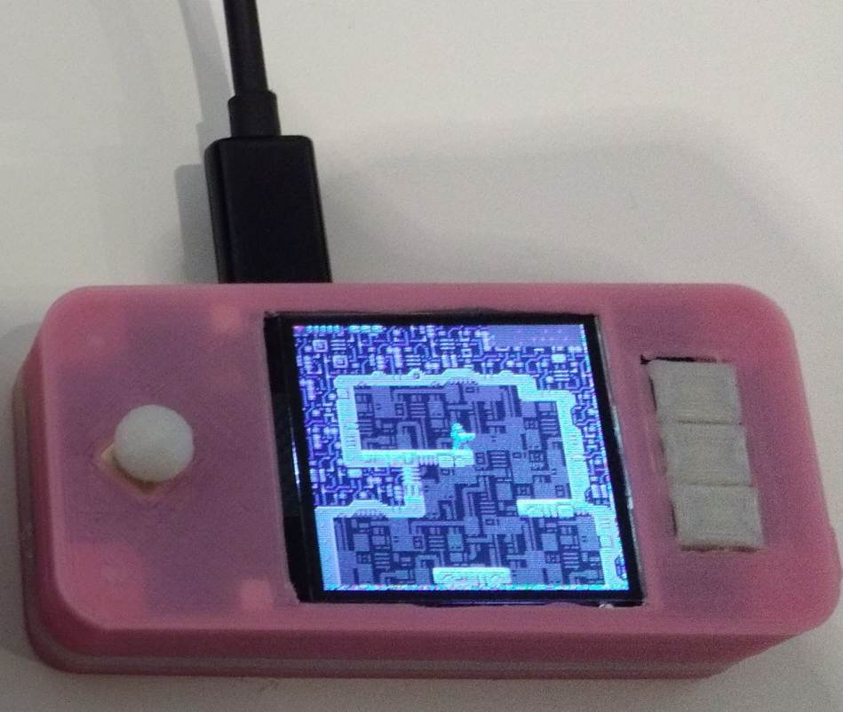

+++
showonlyimage = false
draft = false
image = "img/WaveShareLCDHAT2.jpg"
date = "2018-12-26"
title = "PICO-8 Handheld-Spielkonsole mit Waveshare LCD HAT"
writer = "Martin Strohmayer"
categories = ["Raspberry Pi Zero"]
keywords = ["Retro", "PICO-8", "Waveshare", "Konsole", "LCD"]
weight = 1
+++

Um nur 15 Euro kann man sich ein 1,44 Zoll LCD HAT von Waveshare für den Raspberry Pi Zero kaufen. Wie der Zufall es will, kann man damit sehr einfach eine PICO-8 Handheld-Spielkonsole selbst bauen. Das 128x128 große Display, das Steuerkreuz und die drei Tasten sind genau die passenden Teile für PICO-8. 
<!--more-->

## Grundsätzliches

PICO-8 ist eine erfundene „Fantasy Console“ die auch am Raspberry Pi Zero emuliert werden kann. Die Auflösung beträgt 128x128 Pixel. Es wird mit einem D-PAD, 2 Aktionstasten und einer Menütaste gesteuert. Es gibt eine Oberfächer, "splore" genannt mit der man auf eine Vielzahl von Community Spiele direkt Zugriff hat.  
Von Waveshare gibt es eine 1,44 Zoll LCD HAT für den Raspberry Pi Zero. Man kann ihn z. B. bei [semaf electronics](https://electronics.semaf.at/144inch-LCD-display-HAT-for-Raspberry-Pi) für 15 Euro kaufen. Diese Aufsetzplatine hat ein 1,44 Zoll 128x128 SPI-TFT Display, ein Steuerkreuz mit Push-Funktion und 3 Tasten. Diese Teile sind so mit dem GPIOs verbunden, dass alles direkt angesprochen werden kann.  
Mit etwas Konfigurationsarbeit lässt sich daraus recht einfach eine PICO-8 Spielkonsole bauen. 
 
## Was ist zu erwarten?

Bevor nun die Begeisterung und die Erwartungshaltung zu sehr steigen, muss man sich die Vor- und Nachteile dieses Projekts klarmachen.  
Der Vorteil ist, mit nur 15 Euro kann man sich so eine PICO-8 Spielkonsole selbst zusammenbauen ohne Lötarbeit und Wissen über Elektronik.  
Es gibt aber einige Nachteile bei der Nutzung. Es fehlt an Musikausgabe, was den Spielpass trübt.  
Das Steuerkreuz führt bereits nach wenigen Sekunden zu Schmerzen im linken Daumen. Ein kleiner Steuerknüppel (3D-Druck) als Aufsatz, kann hier Verbesserung bringen.  
Die Plattform kann nur eingeschränkt mobil als Handheld genutzt werden.

Ich habe mir teilweise für die Probleme eine Lösung überlegt, allerdings ganz zufrieden konnte ich mit der Plattform nicht werden. Einzig der einfache und günstige Zusammenbau begeistert.

## Installation

Aus Hardwaresicht muss der HAT einfach auf den Raspberry Pi Zero aufgesteckt werden und mit den beiliegenden Distanzbolzen angeschraubt werden. Danach kann man die Anpassung der Software ausgehend vom Raspbian bzw. Raspberry Pi OS Lite Image in Angriff nehmen.

### Display (fbcp-ili9341)

Zur Aktivierung des Displays muss man das SPI-Bus TFT-LCD einbinden. Hierfür bietet sich das Projekt [fbcp-ili9341](https://github.com/juj/fbcp-ili9341) an. 
Es kopiert den Inhalt der Grafikkarte auf das Display und skaliert es entsprechend um. Es wird bei der Programm Erstellung bzw. Kompilierung entsprechend parametriert. Für das Waveshare Display gibt es bereits eine Unterstützung ("-DWAVESHARE_ST7735S_HAT=ON"). So sind die Anschlüsse und der Kontroller des Display bereits korrekt konfiguriert (BL=24, RST=27, DC=25) und man muss nur noch ein paar wenige Parameter anpassen.
Die SPI-Taktfrequenz wird aus dem System Takt als der "core_freq" gebildet. Typischerweise liegt sie beim Raspberry Pi Zero auf 250 MHz. Bei Übertaktung aber oft auf 500 MHz. Mit dem Befehl ``vcgencmd measure_clock core`` kann die aktuelle Frequenz ermittelt werden. Bei 250 MHz werden mit dem Divisor 8 also ca. 31 MHz erzeugt. Bei übertaktung auf 500 MHz sind dann immer noch ca. 63 MHz möglich. Bei den Optimierungsparametern (DSINGLE_CORE_BOARD und DARMV6Z) wird alles für den Raspberry Pi Zero gesetzt. Die Statistikanzeige (DSTATISTICS) wird mit Wert 0 abgeschaltet. Optional kann man hier 1 angeben damit FPS (Bilder pro Sekunde) links oben angezeigen werden. Bei Wert 2 wird auch noch eine Kurve des Werts angezeigt. Beim letzten Parameter (DDISPLAY_ROTATE_180_DEGREES) wird noch eine Drehung um 180 ° abgeschaltet.

```
sudo apt-get install cmake
cd ~
git clone https://github.com/juj/fbcp-ili9341.git
cd fbcp-ili9341
mkdir build
cd build
cmake -DWAVESHARE_ST7735S_HAT=ON -DSPI_BUS_CLOCK_DIVISOR=8 -DSINGLE_CORE_BOARD=ON -DARMV6Z=ON -DSTATISTICS=1 -DDISPLAY_ROTATE_180_DEGREES=OFF ..
make -j
sudo cp ./fbcp-ili9341 /usr/local/bin
 ```

Die HDMI Ausgabe kann noch entsprechend angepasst werden. In dem Fall würde ich den Videomodus 256x256 empfehlen, dieser wird automatisch auf 128x128 heruntergerechnet und damit geglättet. Man könnte aber auch 128x128 direkt definieren. Die Anweisungen für dise speziellen HDMI-Grafikmodi wurden bereits vordefiniert und können von Git-Hub heruntergeladen werden. 

```
cd /boot/
sudo wget https://raw.githubusercontent.com/GrazerComputerClub/rpi-boot/master/Video-128x128.txt
sudo wget https://raw.githubusercontent.com/GrazerComputerClub/rpi-boot/master/Video-256x256.txt
```

Später genig es einfach diese in der config.txt Datei zu referenzieren.

"/boot/config.txt":
```
# Waveshare 1.44inch LCD HAT
include Video-256x256.txt
```

Nun muss der Dienst für "fbcp-ili9341" eingerichtet und gestartet werden.  

```
sudo nano /etc/systemd/system/fbcp-ili9341.service
```

```
[Unit]
Description=fbcp-ili9341 Service

[Service]
Type=simple
User=root
Nice=-5
ExecStart=/usr/local/bin/fbcp-ili9341

[Install]
WantedBy=multi-user.target
```

```
sudo systemctl enable fbcp-ili9341
sudo service fbcp-ili9341 start
service fbcp-ili9341 staus
```

### Tasten

Nun müssen noch die Tasten entsprechend der PICO-8 Tastaturbelegung konfiguriert werden. Dazu wird der Overlay 'gpio-key' verwendet, um GPIO Eingänge Tastatureingaben zuweisen zu können. Auch zu diesem Thema gibt es bereits ein Kapitel. Damit das einfacher wird, habe ich auch hierfür bereits eigene Sub-Konfigurationsdateien erstellt. Nach dem Download muss die Datei mit 'include' in der Konfigurationsdatei "config.txt" referenziert werden.


```
cd /boot/
wget https://raw.githubusercontent.com/GrazerComputerClub/rpi-boot/master/WS_TFT_HAT_Keys_Pico8.txt
```

"/boot/config.txt":
```
# Waveshare 1.44inch LCD HAT - keys
include WS_TFT_HAT_Keys_Pico8.txt
```

### PICO-8

PICO-8 ist eine kommerzielle Software von Lexaloffle, es kann von [hier](https://www.lexaloffle.com/pico-8.php?#getpico8) bezogen werden.
Nach dem Download der Raspberry Pi Version, muss das Zip-Archiv auf die Bootpartition kopiert und entpackt werden. 

```
cd /boot
sudo unzip ~/pico-8_0.2.1b_raspi.zip 
```

Nun muss PICO-8 nach dem Boot automatisch gestartet werden. Dies kann über die "rc.local" Datei erfolgen. Am Ende des Scripts muss die Zeile "exit 0" erhalten bleiben! Der folgenden Block muss also davor eingefügt werden.

```
sudo nano /etc/etc/rc.local
```

```
if [ -f "/boot/pico-8/pico8" ] ; then
  cd /boot/pico-8/
  # Start PICO-8 with user pi and splore screen
  sudo -H -u pi /boot/pico-8/pico8 -splore &
fi
```

Nun kann das System neu gestartet werden. Damit ist die PICO-8 Handheld-Spielkonsole spielbereit.

## Akku Erweiterung

Um eine mobile Nutzung möglich zu machen, erstellte ich noch einen Platine mit einem kleinen Lithium-Polymer-Akku mit 500 mAh. Dieser wurde an die Ladeelektronikplatine TP4056 angeschlossen. Die Platine kann unterhalb des Raspberry Pi Zeros angeschraubt werden.  
Mit diesem Akku konnte das System (Raspberry Pi Zero 1.3 und Waveshare HAT) für ca. 90 Minuten betrieben werden. Als PICO-8 Referenzspiel wurde [PicoFox](https://www.lexaloffle.com/bbs/?tid=28067) benutzt.

 


## Steuerkreuz

Da das Steuerkreuz ohne Modifikation nicht schmerzfrei verwendet werden kann, habe ich eine M2.5 Mutter aufgeschraubt. Damit kann man es besser anfassen aber
 die Spielsteuerung ist nicht optimal. 

 

## Gehäuse

Alternativ könnte man sich auch ein 3D-Druck-Gehäuse erstellen. Bei Thinigverse findet man das [1.3 Inches RetroPie Zero](https://www.thingiverse.com/thing:3328994) Gehäuse von moononournation. Es ist eigentlich für den kleineren 1,3 Zoll LCD HAT (240x240) von Waveshare vorgesehen, aber mit einem Taschenmesser kann der Displayausschnitt leicht vergrößert werden.

 


## Verlinkungen 


[Waveshare 1.44inch LCD HAT product page](https://www.waveshare.com/wiki/1.44inch_LCD_HAT)  
[Thinigverse 3D-Druck Gehäuse](https://www.thingiverse.com/thing:3328994) 
  


<!--
## Referenzen

[PICO-8](../pico-8/)  
[SPI TFT LCD - Teil 1](../spi-tft-lcd)  
[SPI TFT LCD - Teil 2](../spi-tft-lcd2)  
[Device Tree](../device-tree)  
[GPIO-Eingang als Tastaturtaste](../gpio-tasten)  
[Hotkeys zuweisen ohne X11](../hotkeys-zuweisen-ohne-x11)  
-->
