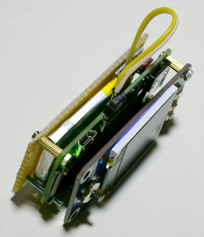

+++
showonlyimage = false
draft = false
image = "img/WaveShareLCDHAT.jpg"
date = "2018-12-28"
title = "PICO-8 Konsole mit WaveShare LCD HAT"
writer = "Martin Strohmayer"
categories = ["Raspberry Pi"]
keywords = ["Retro", "PICO-8", "Waveshare", "Konsole", "LCD"]
weight = 1
+++

Um nur 14 Euro kann man sich ein 1,44 Zoll LCD HAT von WaveShare für den Raspberry Pi Zero kaufen. Wie der Zufall es will, kann man damit sehr einfach eine PICO-8 Konsole selbst bauen. Das 128x128 große Display, das Steuerkreuz und die 3 Tasten sind genau die passenden Teile für PICO-8. 
<!--more-->

## Grundsätzliches

PICO-8 ist eine erfundene „Fantasy Console“ die auch am Raspberry Pi Zero emuliert werden kann. Die Auflösung beträgt 128x128 Pixel. Es wird mit einem D-PAD, 2 Aktionstasten und einer Menütaste gesteuert. Es gibt eine Operfäche, "splore" genannt mit der man auf eine Vielzahl von Community Spiele direkt Zugriff hat.  
Von WaveShare gibt es eine 1,44 Zoll LCD HAT für den Raspberry Pi Zero. Man kann ihn z. B. bei [semaf electronics](https://electronics.semaf.at/144inch-LCD-display-HAT-for-Raspberry-Pi) für 14 Euro kaufen. Dieses Aufsetzplatine hat ein 1,44 Zoll 128x128 SPI-TFT Display, ein Steuerkreuz mit Push-Funktion und 3 Tasten. Diese Teile sind so mit dem GPIOs verbunden, dass alles direkt angesprochen werden kann.  
Mit etwas Konfigurationsarbeit lässt sich daraus recht einfach eine PICO-8 Spielkonsole bauen. 
 
## Was ist zu erwarten?

Bevor nun die Begeisterung und die Erwartungshaltung zu sehr steigt, muss man sich die Vor- und Nachteile dieses Projekts klarmachen.  
Der Vorteil ist, mit nur 14 Euro kann man sich so eine PICO-8 Spielkonsole selbst zusammenbauen ohne Lötarbeit und Wissen über Elektronik.  
Es gibt aber einige Nachteile bei der Nutzung. Es fehlt an Musikausgabe, was den Spielpass trübt.  
Das Steuerkreuz führt bereits nach wenigen Sekunden zu Schmerzen im linken Daumen. Ein kleiner Steuerknüppel als Aufsatz, könnte hier vielleicht helfen.  
Die Plattform kann nicht mobil als Handheld genutzt werden. 

Ich habe mir teilweise für die Probleme eine Lösung überlerlegt, allerdings ganz zufrieden konnte ich mit der Plattform nicht werden. Einzig der einfach und günstige Zusammenbau begeistert.

## Installation

Aus Hardwaresicht muss der HAT einfach auf den Raspberry Pi Zero aufgesteckt werden und mit den beiliegenden Distanzbolzen angeschraubt werden. Danach kann man die Anpassung der Software ausgehend vom Raspbian Lite Image in Angriff nehmen.

### Display

Zur Aktivierung des Displays muss man das SPI-TFT-LCD in den Kernel einbinden. Hierfür habe ich bereits einen Devicetree Overlay erstellt, es kann einfach in "/boot/overlays/" abgelegt werden und wird dann in der Konfigurationsdatei "config.txt" geladen. Nun muss noch ein angepasster HDMI Video Mode aktiviert werden. Dafür habe ich eigene Sub-Konfigurtionsdateien erstellt. In dem Fall würde ich den Videomodus 256x256 empfehlen, dieser wird automatisch auf 128x128 runtergerechnet und damit geglättet.

```
cd /boot/overlays
wget https://github.com/GrazerComputerClub/rpi-boot/raw/master/overlays/WaveshareLCDHAT.dtbo
cd /boot/
wget https://raw.githubusercontent.com/GrazerComputerClub/rpi-boot/master/Video-128x128.txt
wget https://raw.githubusercontent.com/GrazerComputerClub/rpi-boot/master/Video-256x256.txt
```

"/boot/config.txt":
```
# Waveshare 1.44inch LCD HAT
dtoverlay=WaveshareLCDHAT
include Video-256x256.txt
```

Nun muss der "fbcp" Dienst installiert und gestarten werden. Die wurde bereits im einem Blog Post beschrieben, hier nochmal die Kurzfassung.

**Installation:**  
```
sudo -i
apt-get install cmake 
cd /usr/src
git clone https://github.com/tasanakorn/rpi-fbcp
cd rpi-fbcp/
mkdir build
cd build/
cmake ..
make
install fbcp /usr/local/bin/fbcp
exit
```

**systemd-Service:**  
"/etc/systemd/system/fbcp.service":
```
[Unit]
Description=fbcp Service

[Service]
Type=simple
User=pi
WorkingDirectory=/home/pi
ExecStart=/usr/local/bin/fbcp

[Install]
WantedBy=multi-user.target
```

**Autostart via udev:**  
"/etc/udev/rules.d/80-fbcp.rules":
```
SUBSYSTEM=="graphics" ACTION=="add" ENV{DEVNAME}=="/dev/fb1", RUN+="/bin/systemctl start fbcp"
```

### Tasten

Nun müssen noch die Tasten entsprechend der PICO-8 Tastaturbelegung konfiguriert werden. Dazu wird der Overlay 'gpio-key' verwendet, um GPIO Eingänge Tastaureingaben zuweisen zu können. Auch zu diesem Thema gibt es bereits einen Blog Post. Damit das einfacher wird, habe ich auch hierfür bereits eigene Sub-Konfigurtionsdateien erstellt. Nach dem Download muss die Datei mit 'include' in der Konfigurationsdatei "config.txt" referenziert werden.


```
cd /boot/
wget https://raw.githubusercontent.com/GrazerComputerClub/rpi-boot/master/WS_TFT_HAT_Keys_Pico8.txt
```

"/boot/config.txt":
```
# Waveshare 1.44inch LCD HAT - keys
include WS_TFT_HAT_Keys_Pico8.txt
```

### PICO-8

PICO-8 ist eine kommerzielle Software von Lexaloffle, es kann von [hier](https://www.lexaloffle.com/pico-8.php?#getpico8) bezogen werden.
Nach dem Download der Raspberry Pi Version, muss das Zip-Archiv auf die Bootpartition kopiert und entpackt werden. 

```
cd /boot
unzip pico-8_0.1.11g_raspi.zip 
```

Nun muss PICO-8 nach dem Boot automatisch gestartet werden. Dies kann über die "rc.local" Datei erfolgen. Am Ende des Scripts muss die Zeile "exit 0" erhalten bleiben! Der folgenden Block muss also davor eingefügt werden.

"/etc/rc.local":
```
if [ -f "/boot/pico-8/pico8" ] ; then
  sleep 2
  cd /boot/pico-8/
  # Start PICO-8 with user pi and splore screen
  sudo -H -u pi /boot/pico-8/pico8 -splore &
fi
```

Nun kann das System neu gestartet werden und fertig ist die PICO-8 Spielkonsole.

## Akku Erweiterung

Um eine mobile Nutzung möglich zu machen, erstellte ich noch einen Platine mit einem kleinen Lithium Akku mit 500 mAh. Dieser wurde an die Ladeelektronikplatine TP4056 angeschlossen. Die Platine kann unterhalb der Raspberry Pi Zero angeschraubt werden.  
Mit diesem Akku konnte das System (Raspberry Pi Zero 1.3 und WaveShare HAT) für etwas mehr als eine Stunde betrieben werden. Als PICO-8 Referenzspiel wurde PicoFox benutzt.  

 


## Steuerkreuz

Da das Steuerkreuz ohne modifikation nicht schmerzfrei verwendet werden kann, habe ich eine M2.5 Mutter aufgeschraubt. Damit kann man es besser anfassen aber
 die Spielstuerung ist nicht optimal.

 


## Blog Referenzen

[PICO-8](../pico-8/)  
[SPI TFT LCD - Teil 1](../spi-tft-lcd)  
[SPI TFT LCD - Teil 2](../spi-tft-lcd2)  
[Devicetree](../device-tree)  
[GPIO-Eingang als Tastaturtaste](../gpio-tasten)  
[Hotkeys zuweisen ohne X11](../hotkeys-zuweisen-ohne-x11)  


