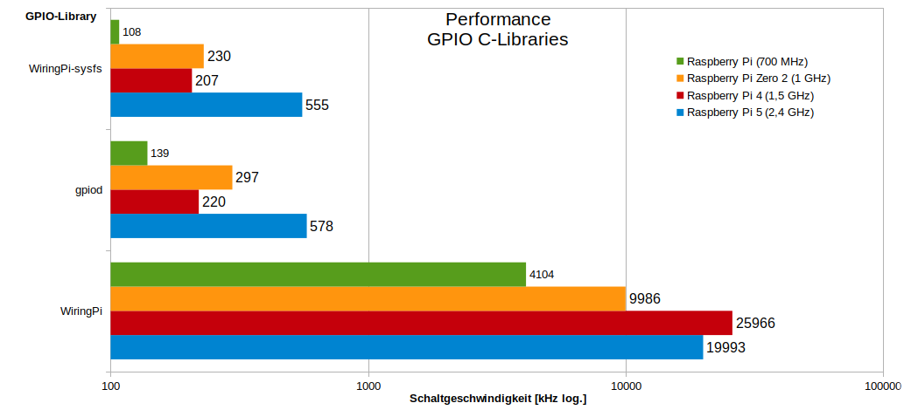

+++
showonlyimage = false
draft = false
image = "img/WiringPi.png"
date = "2024-03-07"
title = "WiringPi Library"
writer = "Martin Strohmayer"
categories = ["Raspberry Pi", "Programmierung"]
keywords = ["WiringPi", "GPIO"]
weight = 1
Version = "Bullseye K5 & K6"
+++

WiringPi ist einer C-Library für den Zugriff auf GPIOs des Raspberry Pi. Leider wurde es aus dem Raspberry Pi OS entfernt. zum Glück wird sie aber noch gewartet und kann manuell installiert werden.
<!--more-->

## Beschreibung 

WiringPi ist eine C-Bibliothek für den Zugriff auf Funktionen der GPIOs des Raspberry Pi Computers. Sie wird unter der GNU LGPLv3 Lizenz angeboten. Ursprünglich wurde sie von Gordon Henderson entwickelt. 
Er hat sich allerdings inzwischen vom Projekt zurückgezogen. Dadurch würde es leider auch aus dem Raspberry Pi OS (ab Bullseye) entfernt. 
Früher konnte man zumindest eine ältere Version mit ``apt install wiringpi`` installieren, aber das geht nun nicht mehr.  
Das ist sehr unverständlich den WiringPi wurde nach wie vor weiter gewartet und für die neueren Raspberry Pi Produkte wie z. B. Pi 400 und Zero 2 angepasst. 
Der frei verfügbare Sourcecode steht bei Git-Hub unter https://github.com/WiringPi/WiringPi zur Verfügung.  
Ende Oktober 2023 sah es so aus als ob das Projekt erneut aufgegeben wird, denn es wurde auf Archivestatus gestellt. 
Dies lag daran, dass Raspberry Pi OS Bookworm und der Raspberry Pi 5 released wurden. 
Es schien so als würde niemand die Zeit aufbringen um die nötigen Anpassungen zu machen https://github.com/WiringPi/WiringPi/issues/80.  

Dieser Zustand war für uns nicht annehmbar und so Übernahmen wir das Git-Hub Projekt 2024 und veröffentlichten die Version 3.0 am 29.2.2024. 
Nun konnte die Library wieder für alle Raspberry Pi Versionen in Bookworm verwendet werden und auch die wichtigsten Funktionen wurden für den Raspberry Pi 5 implementiert. 
Dies war besonders aufwendig, da die GPIOs nun nicht mehr vom Boradcom SOC direkt sondern von RP1-Chip betrieben wurden. 
Der RP1 IC ist eine Eigenentwicklung der Raspberry Pi Foundation und ist per PCIe-Bus 2.0 am SOC angebunden. 
Unsere Implementierung war also Neuland und die erste Library die per Direkt Memory Access die GPIOs ansprechen kann. 
Gegenüber der sonst empfohlenen gpiod-Librays erreicht die WiringPi Library eine enorm gesteigerte Performance!  

Die aktuelle Version wird als Release Version auf Git-Hub zur Verfügung gestellt. Optional kann man es sich aber auch selbst erstellen (z. B. für Buster oder Bullseye).

## Kompilierung 
```
sudo apt install git
git clone https://github.com/WiringPi/WiringPi.git
cd WiringPi
./build debian
mv debian-template/wiringpi_3.0_armhf.deb  .
sudo apt install ./wiringpi_3.0_armhf.deb 
```


## Installation 

Für die aktuellen Raspberry Pi OS Version kann man sich das Debian-Paket für die Architektur armhf (32-Bit) und arm64 (64-Bit) direkt von Git-Hub https://github.com/WiringPi/WiringPi/releases herunterladen. 

```
wget https://github.com/WiringPi/WiringPi/releases/download/3.0/wiringpi_3.0_armhf.deb
sudo apt install ./wiringpi_3.0_armhf.deb
```

## Verwendung


WiringPi enthält nicht nur die C-Bibliothek, auch das Kommandozeilenprogramm ``gpio`` wird mit ausgeliefert. 
Es kann genutzt werden, um von der Konsole oder einem Shell-Skript aus auf die GPIOs zugreifen zu können. 
Standardmäßig wird eine eigene WiringPi-Nummerierung für die Pins verwendet. 
Wenn man allerdings den Parameter ``-g`` hinzufügt, werden die BCM-Nummern verwendet. 
Früher musste das Programm mit root-Rechten bzw. über sudo gestartet werden. 
Dies ist inzwischen nicht mehr nötig. Mit dem Befehl ``gpio readall`` kann der aktuelle Status der GPIOs ausgegeben werden.

**Pi 5:**
```
gpio -v
```
```
gpio version: 3.0
Copyright (c) 2012-2024 Gordon Henderson and contributors
This is free software with ABSOLUTELY NO WARRANTY.
For details type: gpio -warranty

Raspberry Pi Details:
  Type: Pi 5, Revision: 00, Memory: 4096MB, Maker: Sony 
  * Device tree is enabled.
  *--> Raspberry Pi 5 Model B Rev 1.0
  * This Raspberry Pi supports user-level GPIO access.
```

```
gpio readall
```
```
 +-----+-----+---------+------+---+---Pi 5---+---+------+---------+-----+-----+
 | BCM | wPi |   Name  | Mode | V | Physical | V | Mode | Name    | wPi | BCM |
 +-----+-----+---------+------+---+----++----+---+------+---------+-----+-----+
 |     |     |    3.3v |      |   |  1 || 2  |   |      | 5v      |     |     |
 |   2 |   8 |   SDA.1 |   -  | 0 |  3 || 4  |   |      | 5v      |     |     |
 |   3 |   9 |   SCL.1 |   -  | 0 |  5 || 6  |   |      | 0v      |     |     |
 |   4 |   7 | GPIO. 7 |   -  | 0 |  7 || 8  | 0 |  -   | TxD     | 15  | 14  |
 |     |     |      0v |      |   |  9 || 10 | 0 |  -   | RxD     | 16  | 15  |
 |  17 |   0 | GPIO. 0 |   -  | 0 | 11 || 12 | 0 |  -   | GPIO. 1 | 1   | 18  |
 |  27 |   2 | GPIO. 2 |   -  | 0 | 13 || 14 |   |      | 0v      |     |     |
 |  22 |   3 | GPIO. 3 |   -  | 0 | 15 || 16 | 0 |  -   | GPIO. 4 | 4   | 23  |
 |     |     |    3.3v |      |   | 17 || 18 | 0 |  -   | GPIO. 5 | 5   | 24  |
 |  10 |  12 |    MOSI | ALT0 | 0 | 19 || 20 |   |      | 0v      |     |     |
 |   9 |  13 |    MISO | ALT0 | 0 | 21 || 22 | 0 |  -   | GPIO. 6 | 6   | 25  |
 |  11 |  14 |    SCLK | ALT0 | 0 | 23 || 24 | 1 | OUT  | CE0     | 10  | 8   |
 |     |     |      0v |      |   | 25 || 26 | 1 | OUT  | CE1     | 11  | 7   |
 |   0 |  30 |   SDA.0 |   IN | 1 | 27 || 28 | 1 | IN   | SCL.0   | 31  | 1   |
 |   5 |  21 | GPIO.21 |   -  | 0 | 29 || 30 |   |      | 0v      |     |     |
 |   6 |  22 | GPIO.22 |   -  | 0 | 31 || 32 | 0 |  -   | GPIO.26 | 26  | 12  |
 |  13 |  23 | GPIO.23 |   -  | 0 | 33 || 34 |   |      | 0v      |     |     |
 |  19 |  24 | GPIO.24 |   -  | 0 | 35 || 36 | 0 |  -   | GPIO.27 | 27  | 16  |
 |  26 |  25 | GPIO.25 |   -  | 0 | 37 || 38 | 0 |  -   | GPIO.28 | 28  | 20  |
 |     |     |      0v |      |   | 39 || 40 | 0 |  -   | GPIO.29 | 29  | 21  |
 +-----+-----+---------+------+---+----++----+---+------+---------+-----+-----+
 | BCM | wPi |   Name  | Mode | V | Physical | V | Mode | Name    | wPi | BCM |
 +-----+-----+---------+------+---+---Pi 5---+---+------+---------+-----+-----+
```

**Pi 1 B:**

```
gpio -v
```
```
gpio version: 3.0
Copyright (c) 2012-2024 Gordon Henderson and contributors
This is free software with ABSOLUTELY NO WARRANTY.
For details type: gpio -warranty

Raspberry Pi Details:
  Type: Model B, Revision: 00, Memory: 256MB, Maker: Egoman 
  * Device tree is enabled.
  *--> Raspberry Pi Model B Rev 1
  * This Raspberry Pi supports user-level GPIO access.
```

```
gpio readall
```
```
+-----+-----+---------+------+---+-Model B1-+---+------+---------+-----+-----+
 | BCM | wPi |   Name  | Mode | V | Physical | V | Mode | Name    | wPi | BCM |
 +-----+-----+---------+------+---+----++----+---+------+---------+-----+-----+
 |     |     |    3.3v |      |   |  1 || 2  |   |      | 5v      |     |     |
 |   0 |   8 |   SDA.1 |   IN | 1 |  3 || 4  |   |      | 5v      |     |     |
 |   1 |   9 |   SCL.1 |   IN | 1 |  5 || 6  |   |      | 0v      |     |     |
 |   4 |   7 | GPIO. 7 |   IN | 1 |  7 || 8  | 1 | ALT0 | TxD     | 15  | 14  |
 |     |     |      0v |      |   |  9 || 10 | 1 | ALT0 | RxD     | 16  | 15  |
 |  17 |   0 | GPIO. 0 |   IN | 0 | 11 || 12 | 0 | IN   | GPIO. 1 | 1   | 18  |
 |  21 |   2 | GPIO. 2 |   IN | 0 | 13 || 14 |   |      | 0v      |     |     |
 |  22 |   3 | GPIO. 3 |   IN | 0 | 15 || 16 | 0 | IN   | GPIO. 4 | 4   | 23  |
 |     |     |    3.3v |      |   | 17 || 18 | 0 | IN   | GPIO. 5 | 5   | 24  |
 |  10 |  12 |    MOSI |   IN | 0 | 19 || 20 |   |      | 0v      |     |     |
 |   9 |  13 |    MISO |   IN | 0 | 21 || 22 | 0 | IN   | GPIO. 6 | 6   | 25  |
 |  11 |  14 |    SCLK |   IN | 0 | 23 || 24 | 1 | IN   | CE0     | 10  | 8   |
 |     |     |      0v |      |   | 25 || 26 | 1 | IN   | CE1     | 11  | 7   |
 +-----+-----+---------+------+---+----++----+---+------+---------+-----+-----+
 | BCM | wPi |   Name  | Mode | V | Physical | V | Mode | Name    | wPi | BCM |
 +-----+-----+---------+------+---+-Model B1-+---+------+---------+-----+-----+
```

## Performance

### GPIO

**Pi 1 B (700 MHz):**

```
sudo apt update
sudo apt install git
git clone https://github.com/GrazerComputerClub/Benchmark.git
cd Benchmark/src
make
make bench && make pybench
```

```
unknown model (old style revision code 2)
gpiod GPIO speed test program (using line 24)
toggle   8 million times ...
    8100000 toggle took 63.931 s, Time per toggle 7.893 us, Freq 0.127 MHz 

lgpio GPIO speed test program (using GPIO 24)
unknown model (old style revision code 2)
toggle   6 million times ...
    6000000 toggle took 60.489 s, Time per toggle 10.081 us, Freq 0.099 MHz 

pigpio GPIO speed test program (using GPIO 24)
toggle  95 million times ...
   95000000 toggle took 59.555 s, Time per toggle 0.627 us, Freq 1.595 MHz 

WiringPi GPIO speed test program (using GPIO 24)
toggle  240 million times ...
   240000000 toggle took 65.535 s, Time per toggle 0.273 us, Freq 3.662 MHz 

WiringPi GPIO speed test program (using GPIO 24 via sysfs)
execute: gpio export 24 out
toggle   6 million times ...
    6700000 toggle took 63.861 s, Time per toggle 9.531 us, Freq 0.105 MHz 
execute: gpio export 24 in
execute: gpio unexport 24
./gpio_gpiozero.py && echo  && ./gpio_libgpiod.py && echo  && ./gpio_libgpiod2.py && echo  && ./gpio_RPi.GPIO.py 
gpiozero toggle 105000 times at <gpiozero.LED object on pin GPIO24, active_high=True, is_active=False>

gpiozero:	  1768 toggles per second (took 59.382 sec)

gpiod toggle 430000 times at 'gpiochip0:24 /GPIO24/' (single line function)

gpio:	  7101 toggles per second (took 60.554 sec)

gpiod toggle 1050000 times at gpiochip0['gpiochip0:24 /GPIO24/'] (multi line function)

gpiod:	 13947 toggles per second (took 75.284 sec)

RPi.GPIO toggle 3900000 times at GPIO 24

RPi.GPIO:	 65337 toggles per second (took 59.690 sec)
```


Ergebnisse GPIO C-Libraries mit Architektur armhf.  

 


### SPI

Enable SPI with ``sudo raspi-config``:  
 * 3 Interface Options  
 * I4 SPI  
 * [Yes]

<!--
```
gcc spi_bench_adc.c -o spi_bench_adc -Wall -lwiringPi
./spi_bench_adc
```
-->

```
gcc spi_bench_dac-vectorgaming.c -o spi_bench_dac-vectorgaming -Wall -lwiringPi -lm
./spi_bench_dac-vectorgaming
```

```
WiringPi SPI speed (vector gaming) test program
open device '/dev/spidev0.0' (6 MHz) ...
Pong test:
  1000 frames took 17.551 s, dots per frame 150, Time per dot 117 us, fps 57 
Space Invaders test:
  300 frames took 22.767 s, dots per frame 650, Time per dot 117 us, fps 13 
```


