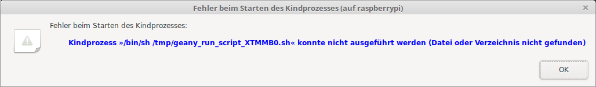
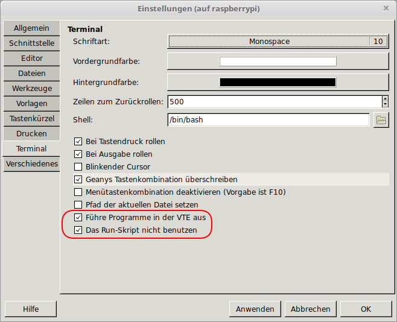

+++
showonlyimage = false
draft = false
image = "img/geany.png"
date = "2019-11-30"
title = "Geany mit GTK2"
writer = "Martin Strohmayer"
categories = ["Raspberry Pi Zero", "Raspberry Pi"]
keywords = ["geany", "GTK", "GTK2", "GTK3", "VTE", "theme"]
weight = 1
+++

Ab Debian 10 Buster wird Geany mit GTK3 bereitgestellt. Deshalb kann es sinnvoll sein, die alte Version mit GTK2 auf der langsamen Raspberry Pi Zero zu installieren.
<!--more-->

## Beschreibung ##

Beim Wechsel von Raspbian mit Basis Debian 9 Stretch auf Raspbian mit Debian 10 Buster gab es auch einen Wechsel bei der Entwicklungsumgebung Geany. Statt der Version 1.29 mit GTK2, wird nun die Version 1.33 mit GTK3 zur Verfügung gestellt. GTK ist eine Bibliothek für die grafische Benutzeroberflächen (GUI) mit der Fenster, Dialog und sonstige Anzeigeelemente erzeugt werden. Leider ist die Performance von GTK3 auf der Raspberry Pi Zero merklich schlechter als bei GTK2. Falls man die alte Version als zusätzliches Programm bereitstellen möchte, hier eine Anleitung.

## Installation ##

<!--
Wird ein externes Terminal Programm benutzt so können die kleinen Terminals sterm und lilyterm installiert werden. Die Umschaltung des standard X-Terminals erfolgt mit dem Befehl ``sudo update-alternatives --config x-terminal-emulator``.
-->

### Geany 1.33 GTK3

```
sudo apt-get install geany stterm libvte9 libvte-2.91-0
```

### Geany 1.29 GTK2 

```
mkdir geany
cd geany
wget http://mirror.inode.at/raspbian/raspbian/pool/main/g/geany/geany_1.29-1_armhf.deb
unp geany_1.29-1_armhf.deb
unp data.tar.xz
sudo cp usr/bin/geany /usr/bin/geany-gtk2
sudo mkdir /usr/lib/arm-linux-gnueabihf/geany-gtk2/
sudo cp -rv usr/lib/arm-linux-gnueabihf/* /usr/lib/arm-linux-gnueabihf/geany-gtk2/
mkdir common
cd common 
wget http://mirror.inode.at/raspbian/raspbian/pool/main/g/geany/geany-common_1.29-1_all.deb
unp geany-common_1.29-1_all.deb
unp data.tar.xz
sudo cp usr/share/geany/geany.gtkrc /usr/share/geany/

sudo apt-get install libfreetype6 libfontconfig1 libgtk2.0-0 libpangoft2-1.0-0
```

<!--
Error nur exe:
GTK+ 2.x symbols detected. Using GTK+ 2.x and GTK+ 3 in the same process is not supported


ldd /usr/bin/geany-gtk2 
  libgeany.so.0 => /lib/arm-linux-gnueabihf/libgeany.so.0 (0xb6cd8000)

ldd /usr/bin/geany
	libgeany.so.0 => /lib/arm-linux-gnueabihf/libgeany.so.0 (0xb6d58000)
-->


### Geany 1.33 GTK2 erstellen 

Die Geany Version 1.33 mit der GTK2 Bibliothek kann selbst erstellt werden. Dies ist allerdings ein aufwendiger Prozess.
Würde man das resultierende Debian Paket dann installieren wird die GTK3 Version ersetzt. Wir kopieren aber wieder die erzeugten Dateien zusätzlich
auf das Raspbian System.  

Zuerst besorgt man sich den Source-Code des Debian Paketes. Dann benötigt man noch alle Abhängigkeiten des Paketes und die GTK2 Development Library.
Nun muss man den Source-Code entpacken. In der Datei "debian/rules" muss der Parameter "--enable-gtk3" entfernt werden. Danach kann das Paket neu erzeugt werden. Nun kopieren wir das neue Programm und die Bibliothekdateien in eine neue Datei bzw. Verzeichnis.

geany-gtk2.patch:
```
--- geany-1.33/debian/rules.old	2019-11-27 21:55:31.871256842 +0100
+++ geany-1.33/debian/rules	2019-11-28 22:27:55.832759732 +0100
@@ -10,7 +10,7 @@
 	NOCONFIGURE=1 dh_autoreconf ./autogen.sh
 
 override_dh_auto_configure:
-	dh_auto_configure -- --enable-vte --enable-the-force --enable-gtk3
+	dh_auto_configure -- --enable-vte --enable-the-force 
 	sed -i -r 's,^sys_lib_dlsearch_path_spec="(.*)$$,sys_lib_dlsearch_path_spec="/usr/lib /lib \1,' $(CURDIR)/libtool
 
 override_dh_auto_install:
```

<!--
pkg-config --libs gtk+-2.0
-lgtk-x11-2.0 -lgdk-x11-2.0 -lpangocairo-1.0 -latk-1.0 -lcairo -lgdk_pixbuf-2.0 -lgio-2.0 -lpangoft2-1.0 -lpango-1.0 -lgobject-2.0 -lglib-2.0 -lfontconfig -lfreetype
-->

```
sudo su -c "grep '^deb ' /etc/apt/sources.list | sed 's/^deb/deb-src/g' > /etc/apt/sources.list.d/deb-src.list"
sudo apt update
sudo apt install build-essential fakeroot devscripts
sudo apt-get build-dep geany
sudo apt-get install libgtk2.0-dev libgdk-pixbuf2.0-dev libatk1.0-dev libcairo2-dev libgio2.0-cil-dev libfreetype6-dev libpango1.0-dev
mkdir build
cd build
apt-get source geany
patch -p0 -i geany-gtk2.patch
cd geany-1.33
debuild -uc -us -b
sudo cp usr/bin/geany /usr/bin/geany-gtk2
sudo mkdir /usr/lib/arm-linux-gnueabihf/geany-gtk2/
sudo cp -rv usr/lib/arm-linux-gnueabihf/* /usr/lib/arm-linux-gnueabihf/geany-gtk2/
cd ..
```

## Start ##

Bei Aufruf der GTK2 version muss man die Pfad für die Bibliothek setzen damit nicht die GTK3 Bibliothek geladen wird. 

**Aufruf geany mit GTK2:**
```
LD_LIBRARY_PATH=/usr/lib/arm-linux-gnueabihf/geany-gtk2/ geany-gtk2
```

Bei einem alias Eintrag können die zwei Version direkt gestartet werden. 

**Alias für Aufruf "~/.bash_aliases":**
```
alias geany-gtk2="LD_LIBRARY_PATH=/usr/lib/arm-linux-gnueabihf/geany-gtk2/ geany-gtk2"
alias geany-gtk3="/usr/bin/geany"
```

Mit dem Aufruf geany kann dann je nach Systemleistung die GTK2 oder GTK3 Version gestartet werden.

**Alias für Aufruf "~/.profile":**

```
function geany() { 
	if [ `cat /proc/cpuinfo | grep -e "^processor" | wc -l` = 1 ]; then 
    echo "start geany with GTK 2 (slow single core cpu)" 
		geany-gtk2 "$@"
	else 
		geany-gtk3 "$@"
	fi
}
```

Optischer Vergleich der beiden Versionen siehe Titelbild (GTK2 Clearlooks theme links, GTK3 rechts).


## Einstellungen ##

Nach der Installation gab es beim Starten eines Programms immer das Problem, dass das Terminal Programm mit dem entwickelten Programm nicht ausgeführt werden konnte.

 


Das Problem kann gelöst werden indem man den internen Terminal für das Ausführen des Programms benutzt. 

Bearbeiten -> Einstellungen bzw. <kbd>Strg</kbd>+<kbd>Alt</kbd>+<kbd>P</kbd> , Reiter Terminal  
Die Optionen "Führe Programme in der VTE aus" und "Das Run-Skript nicht benutzen" müssen aktiviert werden.

 


## Performancevergleich GTK3 zu GTK2 ##

Folgende Zeit wurde ohne exakte Messung ermittelt und sind deshalb nur als Richtwert zu sehen. 

### Raspberry Pi Zero

| *Aktion*     | *GTK3 (Sek.)* | *GTK2 (Sek.)* |
|:-------------|--------|--------|
| Start        | 8     | 4      |
| Fenster öffnen: Kommandos zum Erstellen konfigurieren | 2  | 1 |
| Fenster öffnen: Einstellungen                         | 7 | 2 |
| Beenden        | 2    | 1      |


### Raspberry Pi 2

| *Aktion*     | *GTK3 (Sek.)* | *GTK2 (Sek.)* |
|:-------------|---------------|---------------|
| Start        | 4             | 2             |
| Fenster öffnen: Kommandos zum Erstellen konfigurieren | 1 | 1 |
| Fenster öffnen: Einstellungen                         | 3 | 1 |
| Beenden      | 1             | 1             |

<!--
### Raspberry Pi 3

| *Aktion*     | *GTK3 (Sek.)* | *GTK2 (Sek.)* |
|:-------------|--------|--------|
| Start        | 3      | 2      |
| Fenster öffnen: Kommandos zum Erstellen konfigurieren | 1 | 1 |
| Fenster öffnen: Einstellungen                         | 4 | 1 |
| Beenden      | 1      | 1      |
-->


<!--
Fehler reparieren funktioniert nicht!:
/usr/lib/arm-linux-gnueabihf/gdk-pixbuf-2.0
sudo ./gdk-pixbuf-query-loaders --update-cache
sudo update-mime-database /usr/share/mime
sudo gtk-update-icon-cache -fv /usr/share/icons/hicolor/ /usr/share/icons/Adwaita/
sudo apt-get install papirus-icon-theme
-->

# Style für GTK2 ändern

<!-- gtk-theme-switch gtk2-engines-cleanice gtk2-engines-magicchicken 
gtk-theme-switch2

cat gtk-icon-theme-name="breeze" >> /home/pi/.gtkrc-2.0

-->

Die Optik der alten GTK2 Version schaut in der default Konfiguration recht altbacken aus. Eine anderes Theme wie z.B. "Clearlooks" gibt dem Programm einen 
 modernen Look.

```
sudo apt-get install gtk-theme-switch gtk2-engines
gtk-theme-switch2
```
/home/pi/.gtkrc-2.0:
```
# -- THEME AUTO-WRITTEN BY gtk-theme-switch2 DO NOT EDIT
include "/usr/share/themes/Clearlooks/gtk-2.0/gtkrc"

include "/home/pi/.gtkrc-2.0.mine"

# -- THEME AUTO-WRITTEN BY gtk-theme-switch2 DO NOT EDIT
```

<!--
sudo apt-get install lxappearance 
lxappearance

/home/pi/.gtkrc-2.0:
```
# DO NOT EDIT! This file will be overwritten by LXAppearance.
# Any customization should be done in ~/.gtkrc-2.0.mine instead.

include "/home/pi/.gtkrc-2.0.mine"
gtk-theme-name="Clearlooks"
gtk-icon-theme-name="hicolor"
gtk-font-name="Noto Sans 9"
gtk-cursor-theme-size=24
gtk-toolbar-style=GTK_TOOLBAR_BOTH_HORIZ
gtk-toolbar-icon-size=GTK_ICON_SIZE_LARGE_TOOLBAR
gtk-button-images=0
gtk-menu-images=1
gtk-enable-event-sounds=0
gtk-enable-input-feedback-sounds=0
gtk-xft-antialias=1
gtk-xft-hinting=1
gtk-xft-hintstyle="hintslight"
gtk-xft-rgba="rgb"
```

-->

## Youtube Video Review ##

[](https://www.youtube.com/watch?v=NLOSguwMeAI)

