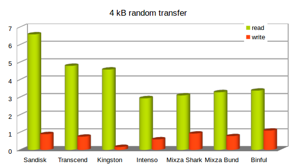
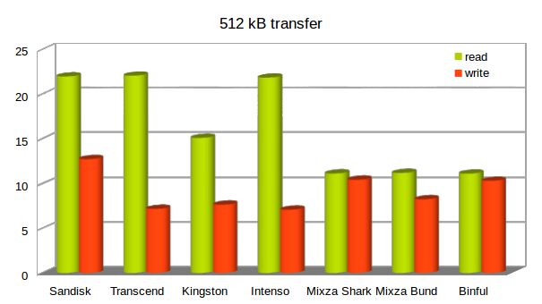

+++
showonlyimage = false
draft = false
image = "img/sdcards.jpg"
date = "2019-12-25"
title = "SD-Karte für Raspberry Pi"
writer = "Martin Strohmayer"
categories = ["GC2", "Raspberry Pi"]
keywords = ["SD", "microSD", "iozone", "benchmark", "Sandisk", "Transcend", "Kingston", "Intenso", "Mixza", "Binful", "Rondaful" ]
weight = 1
+++

Immer wider steht man vor der Frage. Welche SD-Karte soll im Raspberry Pi zum Einsatz kommen. Zahlen sich die teuren Karte aus, sind Karten aus China eine Option? Ein Benchmark von verschiedenen SD-Karten kann einen Anhaltspunkt geben. 
<!--more-->

## Beschreibung ##

Die SD-Karte hat einen wesentlichen Anteil an der Performance der Raspberry Pi, immerhin läuft das gesamt Betriebssystem auf der Karte. Langsame SD-Karten führen zu einer merklichen Verzögerung. Doch schnellere Karten sind auch um einiges teurer. Wenn man viele System ausrüsten muss und hierfür ein begrenztes Budget zur Verfügung hat, ist guter Rat teuer. Dieser Benchmark soll eine Orientierungshilfe bieten.  
So nebenbei konnten auch billige China Karten auf ihre Performance überprüft werden.   
Es wurde die Performance auf einem Raspberry Pi 2 ermittelt, der in Zukunft beim GC2 Raspjamming eingesetzt werden soll. Hier stehen vorrangig Intenso und Transcend Karten zur verfügung. Bei den älteren Raspberry Pi Zero Leihmaterialien sind Binful und Mixza Karten verfügbar.  


## Installation und Vorbereitung ##

Leider ist das Benchmark-Programm iozone nicht in Raspbian vorhanden. Deshalb muss die aktuelle Version heruntergeladen und kompiliert werden. Bei der GC2 Image Raspjamming wird das Programm in Zukunft bereits vorinstalliert sein. Bei anderen Distributionen wie z. B. Mint kann es mit "sudo apt-get install iozone3" installiert werden.

```
wget http://www.iozone.org/src/current/iozone3_488.tar
cat iozone3_488.tar | tar -x
cd iozone3_488/src/current
make linux-arm
cp iozone /usr/local/bin
```

Das Dateisystem benutzt eine Blockgroße, es kann mit "blockdev" ausgelesen werden. Sie beträgt bei der SD-Karte mit ext4-Formatierung 4K, darum wurde auch dieser Wert für den Test mit zufälligen Zugriff (random read/write) gewählt. Damit sollten die Ergebnisse nahe an der Realität liegen.

```
sudo blockdev --getbsz /dev/mmcblk0p2 
```
```
4096
```

Vor dem Test wurden einige Dienste der Raspjamming Distribution beendet, um die Messdaten nicht zu verfälschen. 

```
sudo service dmxvnc stop
sudo service blockly-gpio stop
sudo service mcp3202 stop
sudo service lighttpd stop
```

Bei den Intenso Karten gab es Probleme, diese haben nicht korrekt gebootet was in weiter Folge zu einem Absturz geführt hat. Durch das Umschalten auf den alten Treiber für den Kartenslot, konnte das Problem behoben werden und der Test normal durchgeführt werden. In der Konfigurationsdatei „config.txt“ muss dazu folgender Eintrag eingefügt werden.

```
dtoverlay=mmc
```


## Ergebnisse - Raspberry Pi 2 ##

Es wurden zwei Test mit zwei Blockgrößen für den Vergleichstest gewählt. Einmal zufälliges lesen und schreiben mit 4K und lesen und schreiben mit 512 KB. Beim zweiten Test sollte man recht nahe an die maximale Transferraten kommen. 

```
iozone -s 32M -e -I -r 4k -r 512k -i 0 -i 1 -i 2
```

-e  Include flush (fsync,fflush) in the timing calculations  
-I  Use VxFS VX_DIRECT, O_DIRECT,or O_DIRECTIO for all file operations  
<!-- a  Auto mode -->
-s #  file size in Kb  
-i #  Test to run (0=write/rewrite, 1=read/re-read, 2=random-read/write  


### Sandisk Ulta 8GB Class 10 ###

```
                                                             random    random  
              kB  reclen    write  rewrite    read    reread    read     write 
           32768       4     1724     1897     6788     6791     6748      920 
           32768     512    13032    13156    22507    22508    22503     2927 
```

### Transcend 8GB Class 10 ###

```
                                                             random    random  
              kB  reclen    write  rewrite    read    reread    read     write   
           32768       4     1112     1197     6229     6230     4910      772   
           32768     512     7337     8654    22598    22602    22572     5709   
```

### Kingston 8GB Class 10 ###

```
                                                             random    random    
              kB  reclen    write  rewrite    read    reread    read     write   
           32768       4     1153     1167     6015     6008     4692      171   
           32768     512     7816     7178    15467    15470    15392     1252   
```

### Intenso 8GB Class 10 (mmc Treiber) ###

```
                                                             random    random   
              kB  reclen    write  rewrite    read    reread    read     write   
           32768       4     1013     1058     4265     4271     3016      615  
           32768     512     7241     7495    22375    22381    22145     7051  
```

### Mixza Tohaoll 16 GB Class 10 (Shark Edition) ###

```
                                                            random    random    
              kB  reclen    write  rewrite    read    reread    read     write  
           32768       4     1050     1048     3185     3193     3183      953  
           32768     512    10676    10699    11385    11388    11385    10682  
```
### Mixza Tohaoll 16 GB Class 10 (Bund) ###

```
                                                            random    random    
              kB  reclen    write  rewrite    read    reread    read     write  
           32768       4     1005     1178     4026     4038     3370      803  
           32768     512     8437     8755    11452    11454    11424     9904  
```

### Binful 16 GB Class 10 ###

```
                                                             random    random   
              kB  reclen    write  rewrite    read    reread    read     write    
           32768       4     1258     1276     3559     3561     3462     1128  
           32768     512    10381    10657    11382    11384    11382    10616  
```

## Zusammenfassung/Vergleich und Auswertung ##

 
**4K - read/write random:**

| *Marke*     | *read* | *write* |
|:------------|-------:|--------:|
| Sandisk     | 6748   | 920     |
| Transcend   | 4910   | 772     |
| Kingston    | 4692   | 171     |
| Intenso     | 3016   | 615     |
| Mixza Shark | 3183   | 953     |
| Mixza Bund  | 3370   | 803     |
| Binful      | 3462   | 1128    |

 

**512K - read/write:**

| *Marke*     | *read* | *write* |
|:------------|-------:|--------:|
| Sandisk     | 22507   | 13032  |
| Transcend   | 22598   | 7337   |
| Kingston    | 15467   | 7816   |
| Intenso     | 22375   | 7241   |
| Mixza Shark | 11385   | 10676  |
| Mixza Bund  | 11452   | 8437   |
| Binful      | 11382   | 10556  |

 


Die meisten Karten habe ein akzeptable Geschwindigkeit. Ausreißer ist vor allem die Kingston 8 GB Class 10 Karte, die beim 4 KByte Block wesentlich langsamer ist als alle anderen Karten. Die China Karten schlagen sich in dieser Disziplin recht gut und sind im Fall Binful sogar führend.  
Weniger beeindruckend sind die China Karten bei der Lesegeschwindigkeit mit 512 KByte. Hier sind sie mit rund 11 MB/s meist halb so schnell als die namhaften Hersteller. Die Kingston Karte bildet mit nur 15 statt 22 MB/s das schlusslicht bei den EU Karten.
Insgesamt schneidet die Sandisk Ultra Karte am besten ab. Sie ist aber auch die teuerste. Die Transcend ist möglicherweise ein günstigere Alternative.
China Karten sind nicht schlecht, können also auch überzeugen bis auf die 512 KB Leseschwäche. Allerdings sind China Karte ein eigenes Thema, dem sich das nächste Kapitel widmet.

 
## China SD Karten ##

Durch einige Käufe von SD-Karten von Aliexpress aus China, habe ich Erfahrungswerte erlangt, die ich hier teilen möchte.  
Bei den China Produkten gibt es Marken die nur kurzzeitig verfügbar sind und dann im nächsten Jahr verschwunden sind. Das sind z.B. Rondaful, KingStick und Binful. Diese Marken sind deshalb wenig vertrauensvoll, auch wenn Binful im Test durchaus ordentlich funktioniert hat. Kaufen kann man diese Marke nun nicht mehr.  
Bei der Marke KingStick gab es viele SD-Karten die zwar einwandfrei am Laptop gelesen und geschrieben werden konnten, sie haben aber im Raspberry Pi nicht gebootet. Dabei gab es innerhalb der selben Bestellung funktionierende und welche die einfach nicht starten wollten. In einem Orange Pi Einplatinencomputer konnte sie aber erfolgreich eingesetzt werden. Einige Zeit später ist eine dieser Karten im Raspberry Pi Slot durchgebrannt. Zum Glück ohne Folgeschäden für den Raspberry Pi. Bei einem Verbrauchstest kam es zu überhörter Stromaufnahme, die Schlussendlich auf die Kingstick Karte zurückzuführen war. Mit der Transcend Karte war der Leerlauf-Verbrauch dann normal.  
Die Marke Rondaful war der totale Reinfall, diese wurde als Class 10 verkauft und schaffte gerade mal 2-3 MB/s. Da war es schon kaum mehr von Relevanz, dass der Raspberry Pi auch nicht gebootet hat.  
Nach längerer Suche hat sich dann die Marke Mixza als offensichtlich bekannte China Marke herausgestellt. Die Karten sind langfristig vorhanden. Es gibt immer wieder Serien die z. B. das Tier des chinesischen Sternzeichens (Affe, Hahn usw.) zeigen. Manchmal einen Weihnachtsmann oder auch die Haifisch Edition, die ich vorrangig erworben habe. Eine nette Idee, auf die man in Europa offensichtlich nicht kommt. Die Geschwindigkeiten sind ok, wie man am Test sieht.   
Allerdings kaufte ich einmal die bunden Mixza Karten. Hier musste ich eine Enttäuschung erleben, denn mindestens 2 von 5 Stück waren kaum verwendbar, weil sie extrem langsam waren. Eine Karte hatte nur eine Speicherkapazität von 8 GB anstatt der aufgedruckten 16 GB. Wie solche Fehler passieren können ist mir schleierhaft und rückt den Hersteller in ein schlechtes Licht.  
Zusammengefasst kann beim SD-Karten Kauf in China folgendes schiefgehen:

* Falsche Angabe bei Speicherkapazität
* Falsche Angabe bei Geschwindigkeitsklasse
* Schlechte Performance
* Erhöhter Stromverbrauch
* Nicht kompatibel mit Raspberry Pi
* Marke bzw. Hersteller nur kurzfristig verfügbar 

Wer nach dieser Zusammenfassung noch in China kaufen will, kennt nun das Risiko. Wenn überhaupt, dann sollte man bei einem renommierten Hersteller wie Mixza bleiben und im offiziellen Mixza Store kaufen. Ich würde aber sagen, lasst es und wartet auf ein Angebot von lokalen Shops!

